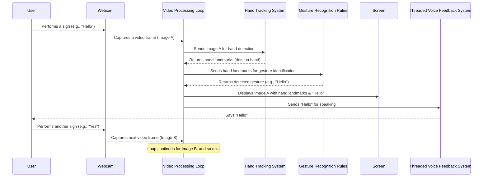

# Chapter 1: Real-time Video Processing Loop

Welcome to the exciting world of Smart Sign Language Detection! In this first chapter, we're going to dive into the very "heart" of our application: the **Real-time Video Processing Loop**.

## What Problem Does it Solve?

Imagine you're trying to communicate using sign language, and you want your computer to understand what you're saying *as you're saying it*. You wouldn't want to sign something, wait five minutes, and then get a response, right? You need instant feedback!

This is where the Real-time Video Processing Loop comes in. Its job is to constantly watch, analyze, and react to your hand movements, making sure our sign language detector is always paying attention and responding immediately.

Think of it like a **conveyor belt** that never stops running in a factory.

## The Conveyor Belt Analogy

Imagine a factory that makes custom pizzas based on your hand gestures.

1.  **Capture a Slice:** A camera *constantly* takes pictures (frames) of your hands. This is like the conveyor belt picking up a raw pizza base.
2.  **Send for Inspection:** This picture (frame) is immediately sent to a special station to check for specific hand shapes.
3.  **Identify the Gesture:** Another station looks at the hand shapes and figures out what "sign" you're making (e.g., "Hello," "Yes," "Thank You").
4.  **Display and Respond:** The result is shown on a screen, and maybe a speaker even says the word out loud. Then, the conveyor belt quickly moves to pick up the *next* raw pizza base (the next video frame) and repeats the entire process!

This continuous, rapid cycle is exactly what our "Real-time Video Processing Loop" does for sign language detection. It's the engine that keeps everything moving, ensuring smooth and instant feedback.

## How Does Our Project Use This Loop?

Our `main.py` file contains the core of this processing loop. It uses a library called `OpenCV` (short for Open Source Computer Vision Library) to talk to your webcam and display images on your screen.

Let's look at the basic steps:

### Step 1: Set Up the Camera

First, we need to tell our program to use your computer's webcam.

```python
import cv2

# Initialize webcam
cap = cv2.VideoCapture(0)
cap.set(cv2.CAP_PROP_FRAME_WIDTH, 640)  # Set width
cap.set(cv2.CAP_PROP_FRAME_HEIGHT, 480) # Set height
```

*   `import cv2`: This line brings in the OpenCV library, which helps us work with cameras and images.
*   `cv2.VideoCapture(0)`: This command connects to your default webcam (the `0` usually means the first camera detected).
*   `cap.set(...)`: These lines adjust the width and height of the video we capture, making it a standard size.

### Step 2: The Never-Ending Loop

Now for the "loop" part! This is where our conveyor belt starts running.

```python
while cap.isOpened():
    ret, frame = cap.read()
    if not ret:
        break
    # ... more processing steps will go here ...
    
    # Exit on 'q' key press
    if cv2.waitKey(1) & 0xFF == ord('q'):
        break
```

*   `while cap.isOpened()`: This is the heart of our loop. It means, "as long as the camera is successfully open and working, keep doing the following steps."
*   `ret, frame = cap.read()`: This is where we capture a single image (called a "frame") from the webcam. `ret` tells us if the capture was successful, and `frame` is the actual image data.
*   `if not ret: break`: If we fail to get a frame (e.g., camera disconnected), we stop the loop.
*   `if cv2.waitKey(1) & 0xFF == ord('q'): break`: This part checks if you've pressed the 'q' key on your keyboard. If you do, the loop stops, allowing you to exit the application.

### Step 3: Processing and Displaying Each Frame

Inside this loop, for every single frame captured, we do a series of actions:

1.  **Prepare the Frame:** The raw image from the camera needs to be converted into a format that our [Hand Tracking System](02_hand_tracking_system_.md) can understand.

    ```python
    # Convert the frame to RGB (different color format)
    image = cv2.cvtColor(frame, cv2.COLOR_BGR2RGB)
    image.flags.writeable = False # Tells system not to write to it directly
    ```

2.  **Send to Hand Tracking:** This prepared image is then passed to the [Hand Tracking System](02_hand_tracking_system_.md) (which we'll explore in the next chapter). This system will find any hands in the picture and tell us where all the finger joints are.

    ```python
    # Process the frame with MediaPipe Hands (our tracking system)
    results = hands.process(image)
    ```

3.  **Recognize Gestures & Get Feedback:** If hands are found, their positions are sent to the [Gesture Recognition Rules](03_gesture_recognition_rules_.md) to figure out what sign you're making. The detected sign is then spoken out loud using the [Threaded Voice Feedback System](04_threaded_voice_feedback_system_.md) and [Text-to-Speech (TTS) Engine](05_text_to_speech__tts__engine_.md).

    ```python
    if results.multi_hand_landmarks:
        # ... (code to identify specific gestures like "Hello", "Yes", etc.) ...
        phrase = "Hello" # Example: let's say "Hello" was detected
        
        # Speak the detected gesture
        if phrase:
            speak_gesture(phrase)
    ```
    This `speak_gesture(phrase)` function uses a separate process (a "thread") to speak, so the main video loop doesn't get slowed down.

4.  **Display Results:** Finally, the detected phrase and the visual markers of your hands are drawn back onto the video frame, and the frame is shown on your screen.

    ```python
    # Draw hand landmarks (visual dots/lines on your hands)
    for landmarks in landmarks_list:
        mp_drawing.draw_landmarks(image, landmarks, mp_hands.HAND_CONNECTIONS)

    # Display the phrase on screen
    cv2.putText(image, f"Phrase: {phrase}", (10, 50), 
                cv2.FONT_HERSHEY_SIMPLEX, 1, (0, 255, 0), 2)

    # Show the frame with everything drawn on it
    cv2.imshow('Sign Language Detection', image)
    ```

## Under the Hood: The Loop in Action

Let's visualize this continuous process using a simple diagram:



This diagram shows how each part of our system constantly works together, passing information back and forth within the never-ending video processing loop.

## Conclusion

You've just learned about the "heartbeat" of our Smart Sign Language Detection project: the **Real-time Video Processing Loop**. This loop constantly captures video, processes it, and provides instant feedback, just like a constantly running conveyor belt. It's what makes "real-time" detection possible!

In the next chapter, we'll zoom in on the second crucial part of this loop: the [Hand Tracking System](02_hand_tracking_system_.md). We'll learn how our program actually "sees" and understands the position of your hands and fingers.

[Next Chapter: Hand Tracking System](02_hand_tracking_system_.md)

---

Generated by [AI Codebase Knowledge Builder]