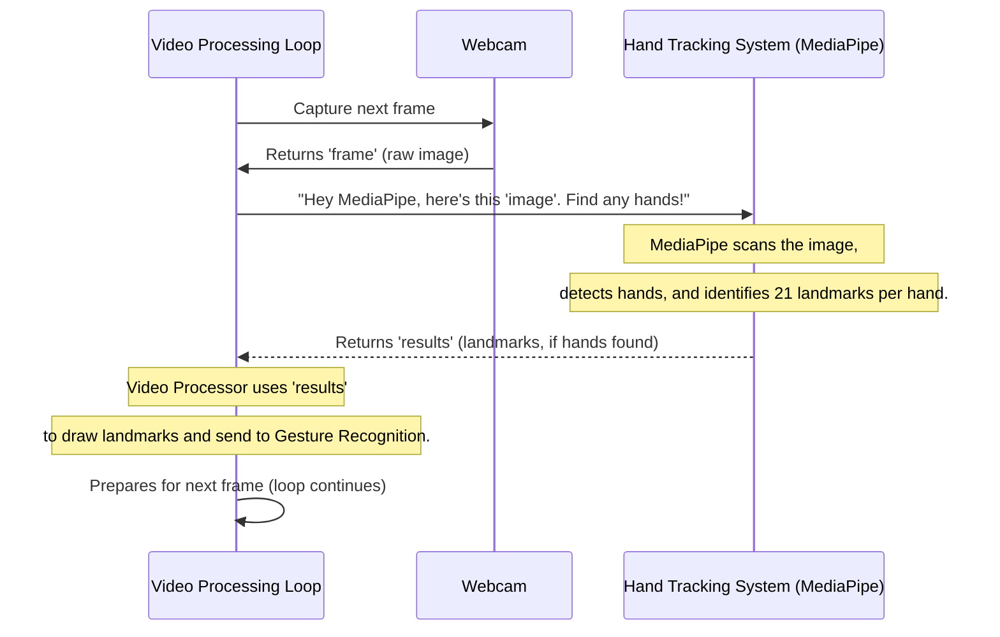

# Chapter 2: Hand Tracking System

Welcome back to the Smart Sign Language Detection journey! In the previous chapter, we learned about the **[Real-time Video Processing Loop](01_real_time_video_processing_loop_.md)**, which acts as the never-ending conveyor belt, constantly bringing new video frames into our system. Now, it's time to equip our conveyor belt with its "eyes."

## What Problem Does it Solve?

Imagine you're signing "Hello" in front of your webcam. To your computer, that's just a bunch of colored pixels! It doesn't inherently know that those pixels form a hand, let alone *where* your fingers are or if your palm is open.

This is where the **Hand Tracking System** comes in. Its job is to be the project's **"eyes."** It looks at those raw video frames and precisely identifies where hands are, then marks out all the crucial points on them. It transforms a blurry image of a hand into structured, digital information that the computer can actually understand.

Think of it like a **digital detective** whose sole job is to find hands in a crowd and then carefully draw dots on all the important parts: the tip of each finger, each knuckle, and the center of the palm.

## Meet MediaPipe: Our Smart Assistant for Hands

Our project uses a super powerful tool called **MediaPipe** (developed by Google) for hand tracking. MediaPipe is like that digital detective we just talked about. It's incredibly good at spotting hands and giving us very precise information about them, all in real-time.

### Key Concepts

1.  **Video Feed**: This is the stream of images (frames) coming from your webcam, constantly provided by our [Real-time Video Processing Loop](01_real_time_video_processing_loop_.md).
2.  **Hand Detection**: MediaPipe first scans the entire image to figure out if there are any hands present. If it finds one (or two!), it draws a box around it.
3.  **Landmarks**: Once a hand is detected, MediaPipe goes a step further. It identifies **21 specific, important points** on each hand. These points, called "landmarks," include the tips of your fingers, your knuckles, and the base of your palm. Each landmark has an X, Y, and Z coordinate, telling us its exact position in the 3D space captured by the camera.

    Imagine putting 21 tiny, invisible sensors on your hand:
    *   4 on each finger (tip, and 3 knuckles)
    *   4 on your thumb (tip, and 3 joints)
    *   5 on your palm

    These 21 points together form a kind of "skeleton" of your hand that the computer can read.

## How Our Project Uses Hand Tracking

Let's look at how our `main.py` file uses MediaPipe to "see" your hands.

### Step 1: Prepare the MediaPipe Assistant

First, we need to tell our program to use MediaPipe for hands.

```python
import mediapipe as mp

# Initialize MediaPipe Hands
mp_hands = mp.solutions.hands
hands = mp_hands.Hands(max_num_hands=2, min_detection_confidence=0.7)
mp_drawing = mp.solutions.drawing_utils # Tool to draw landmarks on screen
```

*   `import mediapipe as mp`: This line imports the MediaPipe library.
*   `mp_hands = mp.solutions.hands`: This gets the specific "hand tracking" part of MediaPipe.
*   `hands = mp_hands.Hands(...)`: This creates our "MediaPipe Hand Tracking Assistant."
    *   `max_num_hands=2`: We tell it to look for up to two hands at a time.
    *   `min_detection_confidence=0.7`: This means MediaPipe has to be at least 70% sure it's found a hand before it reports it.
*   `mp_drawing`: This is a helper tool from MediaPipe that makes it easy to draw the detected landmarks directly onto our video frame, so we can see them!

### Step 2: Asking the Assistant to Find Hands in a Frame

Inside our [Real-time Video Processing Loop](01_real_time_video_processing_loop_.md), for every video frame, we convert it to the right color format (RGB) and then pass it to our `hands` assistant.

```python
# Convert the frame to RGB (different color format)
image = cv2.cvtColor(frame, cv2.COLOR_BGR2RGB)
image.flags.writeable = False # Tell MediaPipe not to write on the original image

# Process the frame with MediaPipe Hands
results = hands.process(image)
```

*   `image = cv2.cvtColor(frame, cv2.COLOR_BGR2RGB)`: MediaPipe prefers images in an RGB color format, so we convert our `frame` from Chapter 1 (which is BGR).
*   `image.flags.writeable = False`: This is a small optimization to make MediaPipe work faster.
*   `results = hands.process(image)`: This is the core line! We give our `hands` assistant the `image` and ask it to `process` it. MediaPipe then does all its magic, finds hands, and calculates their landmarks. The "answer" it gives us is stored in the `results` variable.

### Step 3: Getting the "Answer" and Drawing it

The `results` variable holds all the information MediaPipe found. We check if any hands were detected, and if so, we can access their landmarks.

```python
if results.multi_hand_landmarks:
    # Get a list of all detected hands' landmarks
    landmarks_list = results.multi_hand_landmarks

    # Draw hand landmarks on the image for visual feedback
    for landmarks in landmarks_list:
        mp_drawing.draw_landmarks(image, landmarks, mp_hands.HAND_CONNECTIONS)
```

*   `if results.multi_hand_landmarks:`: This checks if MediaPipe actually found any hands. If it did, `multi_hand_landmarks` will not be empty.
*   `landmarks_list = results.multi_hand_landmarks`: This gives us a list. If one hand is detected, the list has one item. If two hands, two items. Each item is a collection of those 21 landmark points for a single hand.
*   `for landmarks in landmarks_list:`: We loop through each hand that was found.
*   `mp_drawing.draw_landmarks(...)`: Here, we use our `mp_drawing` helper to draw circles on each of the 21 landmarks and lines connecting them, making a visual "skeleton" of the hand on our screen. `mp_hands.HAND_CONNECTIONS` tells the drawing utility how to connect the dots to form a hand outline.

After this step, our `image` now has cool dots and lines drawn on the hands! This image is then shown on the screen by the [Real-time Video Processing Loop](01_real_time_video_processing_loop_.md). More importantly, the `landmarks_list` (the precise X, Y, Z coordinates of each finger joint) is now ready to be sent to the **[Gesture Recognition Rules](03_gesture_recognition_rules_.md)** to figure out what sign you're making!

## Under the Hood: The Detective's Work

Let's trace how the "Hand Tracking System" works within our main video loop.

When a video frame comes in:

1.  The `frame` is captured by the webcam (from [Real-time Video Processing Loop](01_real_time_video_processing_loop_.md)).
2.  It's converted from BGR to RGB, a color format MediaPipe prefers.
3.  This RGB `image` is handed over to our `hands.process()` function.
4.  MediaPipe uses its smart AI models to scan the image.
    *   First, it quickly identifies a rectangle around any potential hands.
    *   Then, it zooms in on these rectangles and precisely predicts the 21 key landmarks on each hand.
5.  It packages up these landmark coordinates (X, Y, Z for each of the 21 points) into the `results` variable.
6.  The `results` are sent back to our main loop, which can then read these coordinates and draw them on the screen.

Here's a simple diagram to visualize this:



This sequence shows how the [Real-time Video Processing Loop](01_real_time_video_processing_loop_.md) continuously feeds images to MediaPipe, which then provides the structured hand data back.

## Conclusion

You've now uncovered the secret behind how our project "sees" your hands! The **Hand Tracking System**, powered by MediaPipe, is the crucial step that turns raw video pixels into meaningful data: the precise locations of 21 key points on your hands. This digital "skeleton" of your hand is exactly what we need for the next exciting step: figuring out what sign you're actually making!

In the next chapter, we'll learn how to take these hand landmarks and translate them into recognized sign language gestures using clever **[Gesture Recognition Rules](03_gesture_recognition_rules_.md)**.

[Next Chapter: Gesture Recognition Rules](03_gesture_recognition_rules_.md)

---

Generated by [AI Codebase Knowledge Builder]