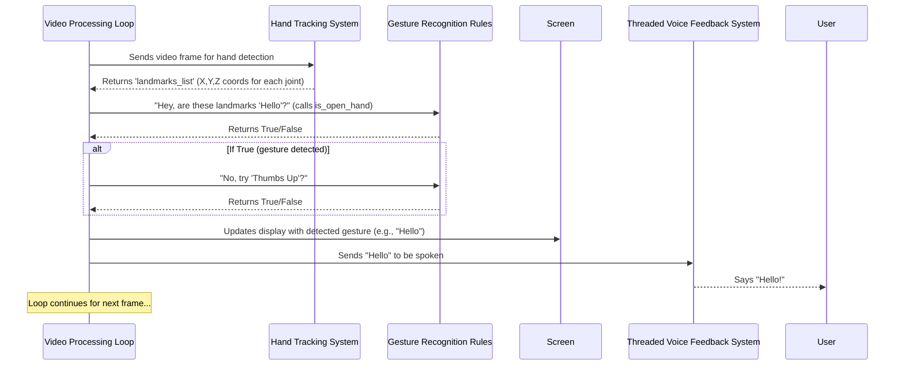

# Chapter 3: Gesture Recognition Rules

Welcome back to our sign language detection journey! In the previous chapter, we powered up our project with the **[Hand Tracking System](02_hand_tracking_system_.md)**. We saw how it acts as our project's "eyes," precisely identifying your hands and marking 21 key points (landmarks) on each. Now, we have all this fantastic data: the exact digital "skeleton" of your hand.

But having a skeleton isn't enough to understand a sign, is it? We need to interpret it!

## What Problem Does it Solve?

Imagine you have a detailed drawing of a hand with dots on all the joints. That's great information, but how do you know if that hand is making a "Hello" sign or a "Thumbs Up"? The computer just sees numbers (X, Y, Z coordinates for each dot); it doesn't understand the *meaning* behind the hand shape.

This is where **Gesture Recognition Rules** come in! Think of this as the project's **"dictionary" of signs**. It's the brain that takes the raw landmark data from the [Hand Tracking System](02_hand_tracking_system_.md) and translates it into actual, recognized gestures like "Hello," "Yes," or "I Love You."

Its job is to define specific logical rules for each sign. For example, a rule for "Thumbs Up" might be: "Is the thumb pointing upwards, while other fingers are curled?"

## Key Concepts

To understand how our project recognizes gestures, let's break it down:

1.  **Landmark Data**: This is the input we get from the [Hand Tracking System](02_hand_tracking_system_.md). It's a list of 21 points for each detected hand, with each point having an `x`, `y`, and `z` coordinate. The `y` coordinate is especially useful for checking if a finger is extended (pointing up/down) or bent.
2.  **Logical Rules**: These are the "if this, then that" statements we write. For example, "IF the tip of the index finger is higher than its knuckle, THEN the index finger is extended."
3.  **Gesture Functions**: For each specific gesture we want to recognize (like "Hello" or "Thumbs Up"), we create a special function. This function contains all the logical rules needed to identify *that particular gesture*. It takes the landmark data as input and returns `True` if the gesture is being performed, or `False` otherwise.

## How Our Project Uses These Rules

After the [Hand Tracking System](02_hand_tracking_system_.md) finds your hands and their landmarks, our [Real-time Video Processing Loop](01_real_time_video_processing_loop_.md) passes this data to our **Gesture Recognition Rules**.

Here's a simplified look at how `main.py` uses these functions:

```python
# ... (inside the main video processing loop) ...

    # Initialize phrase as empty
    phrase = ""

    if results.multi_hand_landmarks:
        landmarks_list = results.multi_hand_landmarks

        # ... (code to draw landmarks) ...

        # Detect gestures using our custom rules
        if len(landmarks_list) == 1: # If only one hand is detected
            if is_open_hand(landmarks_list[0]):
                phrase = "Hello"
            elif is_thumbs_up(landmarks_list[0]):
                phrase = "Yes"
            # ... more single-hand gestures ...
        elif len(landmarks_list) == 2: # If two hands are detected
            if is_thank_you(landmarks_list):
                phrase = "Thank You"
            # ... more two-hand gestures ...
            
        # Speak the detected gesture (covered in next chapter)
        if phrase:
            speak_gesture(phrase)

# ... (rest of the loop) ...
```

In this code:
*   `if results.multi_hand_landmarks:`: We first check if any hands were actually found by the [Hand Tracking System](02_hand_tracking_system_.md).
*   `landmarks_list = results.multi_hand_landmarks`: This gives us a list of landmark data, one item for each hand.
*   `if len(landmarks_list) == 1:`: We check if it's a single-hand gesture.
*   `if is_open_hand(landmarks_list[0]): phrase = "Hello"`: Here, we call our `is_open_hand` function, passing it the landmark data for the first hand (`landmarks_list[0]`). If this function returns `True` (meaning the hand is open), we set the `phrase` to "Hello."
*   `elif is_thumbs_up(landmarks_list[0]): phrase = "Yes"`: If it wasn't an open hand, we check if it's a "Thumbs Up" gesture.
*   This pattern continues, trying to match the hand shape against different gesture rules.
*   If a `phrase` is found, it's sent to the [Threaded Voice Feedback System](04_threaded_voice_feedback_system_.md) to be spoken.

## Under the Hood: How a Gesture Function Works

Let's zoom in on one of these "gesture functions" to see how it uses the landmark data to make a decision. We'll look at the `is_thumbs_up` function as an example.

### Step-by-Step Logic for "Thumbs Up"

1.  **Receive Landmark Data**: The function gets the `landmarks` for a single hand. This `landmarks` object contains all 21 points.
2.  **Identify Key Points**: To check for "Thumbs Up," we mainly care about the thumb's tip and its base joint (knuckle). Each landmark has a unique number (index).
    *   Thumb Tip: Landmark `4`
    *   Thumb IP (knuckle): Landmark `3`
3.  **Apply Logical Rule**: We compare the `y` (vertical) coordinate of the thumb tip (`4`) with the `y` coordinate of its knuckle (`3`).
    *   In computer vision, a smaller `y` value usually means "higher up" on the screen.
    *   So, if `thumb_tip.y < thumb_ip.y`, it means the thumb tip is *above* the knuckle, indicating it's extended upwards.
4.  **Return Decision**: If the rule is met, the function returns `True`. Otherwise, it returns `False`.

### Code Example: `is_thumbs_up`

Here's the actual function from `main.py`:

```python
# Function to check if thumb is up
def is_thumbs_up(landmarks):
    thumb_tip = landmarks.landmark[4]  # Get the 4th landmark (thumb tip)
    thumb_ip = landmarks.landmark[3]   # Get the 3rd landmark (thumb knuckle)
    
    # Check if the thumb tip is higher (smaller y-coordinate) than its knuckle
    return thumb_tip.y < thumb_ip.y
```

*   `landmarks.landmark[4]`: This accesses the data for the 4th landmark (the thumb tip).
*   `thumb_tip.y`: This gives us the vertical position of the thumb tip.
*   `thumb_tip.y < thumb_ip.y`: This is the core logical rule! It checks if the thumb tip is visually above its knuckle. If true, the thumb is likely "up."

Similarly, for `is_open_hand`, we check if the tips of the other four fingers (index, middle, ring, pinky) are all higher than their respective middle knuckles. The project has many such functions, each with its own set of rules, like `is_i_love_you` or `is_goodbye`, checking different combinations of finger extensions and positions.

### The Flow of Gesture Recognition

Let's visualize how the hand tracking data flows into the gesture recognition process:



This diagram shows how the `GestureRecognizer` sits in between the `HandTracker` and the feedback systems, acting as the crucial interpreter of your hand movements.

## Conclusion

You've now learned how our project gives meaning to your hand movements! The **Gesture Recognition Rules** are like the project's dictionary, using simple logical comparisons of landmark coordinates to identify specific hand signs. Each gesture gets its own set of rules, ensuring that when the [Hand Tracking System](02_hand_tracking_system_.md) "sees" your hand, our system can "understand" what sign you're making.

With gestures now recognized, the next logical step is to communicate that back to the user! In the next chapter, we'll dive into the **[Threaded Voice Feedback System](04_threaded_voice_feedback_system_.md)**, which makes our project speak the detected signs out loud without slowing down the video.

[Next Chapter: Threaded Voice Feedback System](04_threaded_voice_feedback_system_.md)

---

Generated by [AI Codebase Knowledge Builder]