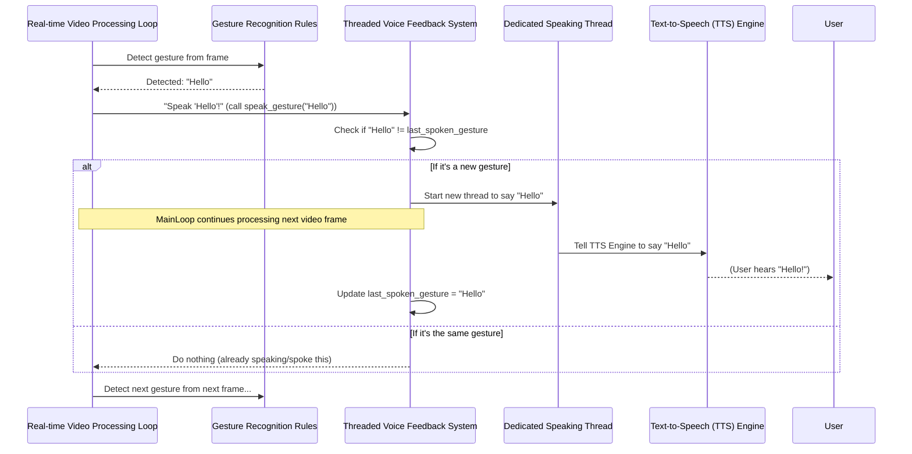

# Chapter 4: Threaded Voice Feedback System

Welcome back, future sign language detection master! In the previous chapter, **[Gesture Recognition Rules](03_gesture_recognition_rules_.md)**, we learned how our project interprets your hand movements and identifies specific signs like "Hello" or "Yes." Now that our system understands what you're signing, the next crucial step is to *tell you* what it recognized!

## What Problem Does it Solve?

Imagine you're making a "Hello" sign. Our project quickly detects it. What happens next? It needs to say "Hello!" But what if saying that word takes a moment?

If our project tried to speak the word "Hello" *while* it was also trying to keep track of your hands in the video, it would be like trying to juggle and sing at the same time – one of them would likely get messed up or slow down! Your video feed might freeze or stutter every time it speaks, making the experience clunky and frustrating.

This is where the **Threaded Voice Feedback System** comes to the rescue! It's like having a **dedicated "speaker" person** working alongside the "hand-watcher" person. The hand-watcher can continue to analyze your movements smoothly, while the speaker can take its time to say the word out loud, without ever interrupting the main show.

This system ensures:
1.  **Smooth Video**: Your hand tracking and video display remain continuous and responsive.
2.  **Efficient Communication**: The project speaks clearly and without delays in the main process.
3.  **Natural Feedback**: It avoids repeating the same gesture over and over if you hold a sign, making the voice feedback less annoying.

## Key Concepts

To understand how this system works, let's look at its two main tricks:

1.  **Threads**: Think of a thread as a small, independent task that your computer can run *at the same time* as other tasks. Our main program (the [Real-time Video Processing Loop](01_real_time_video_processing_loop_.md)) runs in one thread. When we need to speak, we launch a *new, separate thread* specifically for speaking. This new "speaking thread" can then say the word without making the main video thread wait. It's like having two chefs in a kitchen, one preparing ingredients and the other baking a cake simultaneously.
2.  **`last_spoken_gesture`**: This is a simple variable that remembers the *last thing* the system spoke. Before speaking a new gesture, our system checks: "Is this gesture different from the last one I spoke?" If it's the same (e.g., you're still holding the "Hello" sign), it won't speak again. This prevents annoying repetitions.

## How Our Project Uses This System

After the [Gesture Recognition Rules](03_gesture_recognition_rules_.md) identify a gesture, the `main.py` file calls a special function named `speak_gesture`.

Let's look at where this happens in our main loop:

```python
# ... (inside the main video processing loop) ...

    # Initialize phrase as empty
    phrase = ""

    if results.multi_hand_landmarks:
        # ... (code to draw landmarks and detect gestures, setting 'phrase') ...
        phrase = "Hello" # Example: let's say "Hello" was detected

        # Speak the detected gesture
        if phrase:
            speak_gesture(phrase) # <--- This is where the magic happens!

# ... (rest of the loop) ...
```

*   `if phrase:`: This checks if a gesture was actually recognized and a `phrase` (like "Hello" or "Yes") was set.
*   `speak_gesture(phrase)`: This is the important call! We pass the recognized `phrase` to our `speak_gesture` function, which then handles the speaking in a smart, non-blocking way.

## Under the Hood: The Speaker's Work

Let's dive into the `speak_gesture` function itself. This is where the "threading" and "no repetition" logic lives.

### Step-by-Step Logic

1.  **Receive Gesture**: The `speak_gesture` function gets the recognized `gesture` (e.g., "Hello").
2.  **Check for Repetition**: It first compares this `gesture` with the `last_spoken_gesture` (which remembers what was said most recently).
3.  **If Different**: If the current gesture is *different* from the last one spoken (or if nothing has been spoken yet), it proceeds to speak.
    *   It defines a small, temporary function called `speak` that contains the actual commands to tell the [Text-to-Speech (TTS) Engine](05_text_to_speech__tts__engine_.md) to say the word.
    *   It then **starts a new thread** and tells this new thread to run that `speak` function.
    *   Crucially, it *updates* `last_spoken_gesture` to remember what it just started speaking.
4.  **If Same**: If the current gesture is *the same* as `last_spoken_gesture`, the function simply does nothing and returns immediately. This is how it avoids repetitive announcements.

### Visualization of the Threaded Process



This diagram shows how the `MainLoop` can immediately move on to process the next video frame even while the `SpeakingThread` is busy saying the detected gesture.

### Code Example: `speak_gesture` Function

Here's the core `speak_gesture` function from `main.py`:

```python
import threading # We need this for threads
import pyttsx3   # And this for text-to-speech

# Initialize text-to-speech engine (more on this in Chapter 5!)
engine = pyttsx3.init()

# Variable to store the last spoken gesture (global because it's shared)
last_spoken_gesture = ""

# Function to speak the detected gesture in a separate thread
def speak_gesture(gesture):
    global last_spoken_gesture # Tell Python we're changing the global variable
    
    # Only speak if the gesture is new
    if gesture != last_spoken_gesture:
        # This small function does the actual speaking
        def speak():
            engine.say(gesture)    # Tell the TTS engine what to say
            engine.runAndWait()    # Make the TTS engine speak it out loud
            
        # Start a new thread to run the 'speak' function
        threading.Thread(target=speak).start()
        
        # Remember this gesture so we don't repeat it
        last_spoken_gesture = gesture
```

*   `import threading`: This line brings in Python's built-in threading capabilities.
*   `global last_spoken_gesture`: This is important! It tells Python that when we refer to `last_spoken_gesture` inside this function, we mean the one defined *outside* the function, not a new local variable.
*   `if gesture != last_spoken_gesture:`: This is our repetition prevention rule.
*   `def speak():`: This defines a simple, temporary function that contains the actual text-to-speech commands.
    *   `engine.say(gesture)`: This tells our [Text-to-Speech (TTS) Engine](05_text_to_speech__tts__engine_.md) (initialized by `pyttsx3.init()`) what word or phrase to say.
    *   `engine.runAndWait()`: This command actually makes the engine *speak* the phrase and waits for it to finish.
*   `threading.Thread(target=speak).start()`: This is the magic line for threading!
    *   `threading.Thread(...)`: Creates a new thread.
    *   `target=speak`: Tells the new thread *which function to run* (our `speak` function).
    *   `.start()`: Immediately begins running that function in the new, separate thread.
*   `last_spoken_gesture = gesture`: After starting the speaking process, we update this variable so that the system remembers what was just spoken.

This setup allows our `MainLoop` to continue processing video frames, detecting hands, and recognizing gestures without being held up by the voice output.

## Conclusion

You've just learned how our project "speaks" without interrupting its main job of watching your hands! The **Threaded Voice Feedback System** uses clever techniques like separate "threads" and a `last_spoken_gesture` tracker to provide smooth, natural, and efficient voice feedback. It's a prime example of how to make real-time applications responsive and user-friendly.

But what about the actual "voice" itself? How does `engine.say()` actually turn text into spoken words? That's what we'll explore in the next chapter, where we dive into the **[Text-to-Speech (TTS) Engine](05_text_to_speech__tts__engine_.md)**!

[Next Chapter: Text-to-Speech (TTS) Engine](05_text_to_speech__tts__engine_.md)

---

Generated by [AI Codebase Knowledge Builder]