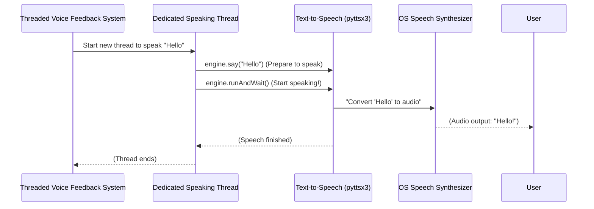

# Chapter 5: Text-to-Speech (TTS) Engine

Welcome to the grand finale of our project's core components! In our last chapter, [Threaded Voice Feedback System](04_threaded_voice_feedback_system_.md), we learned how to make our project "speak" without slowing down the video, using clever techniques like separate threads and preventing repetitive announcements. But that chapter ended with a question: How does the system actually turn the text "Hello" into the *sound* of "Hello"?

This is where the **Text-to-Speech (TTS) Engine** comes into play!

## What Problem Does it Solve?

Our project now knows *what* sign you're making, and it knows *when* to announce it. But without a voice, it's like a person who understands everything but can't speak. Imagine the computer identifying your "Hello" sign perfectly, but then... nothing happens. It can't tell you what it recognized!

The **Text-to-Speech (TTS) Engine** is the project's **"voice."** Its job is to be the final step in our communication chain: it takes the written word (like "Hello" or "Thank You") and magically converts it into spoken audio that you can hear. When a gesture is recognized by our [Gesture Recognition Rules](03_gesture_recognition_rules_.md), this engine generates the corresponding audio feedback, allowing the application to "speak" the interpreted sign directly to you.

Think of it like a **digital narrator** inside your computer. You give it a script (the recognized gesture text), and it reads it out loud for everyone to hear.

## Key Concepts

Our project uses a friendly Python library called `pyttsx3` for its Text-to-Speech capabilities. Let's break down how it works:

1.  **`pyttsx3` Library**: This is our special tool for turning text into speech. A great thing about `pyttsx3` is that it works *offline*, meaning you don't need an internet connection for your computer to talk. It uses the speech synthesizers already built into your operating system (like Windows Narrator or macOS VoiceOver, but controlled by our Python code).
2.  **Initializing the Engine**: Before our digital narrator can speak, we need to "wake it up" or "initialize" it. This sets up the speech synthesizer that `pyttsx3` will use.
3.  **`engine.say()`**: This command is like writing down the words you want the narrator to speak. You tell the engine *what* to say.
4.  **`engine.runAndWait()`**: This is the command that makes the narrator actually *speak* the words you told it to say. It starts the speech and waits until it's finished before moving on.

## How Our Project Uses This Engine

Our `main.py` file uses `pyttsx3` to power the voice feedback. You saw glimpses of it in [Chapter 4: Threaded Voice Feedback System](04_threaded_voice_feedback_system_.md).

### Step 1: Waking Up the Digital Narrator

First, at the beginning of our program, we initialize the `pyttsx3` engine. This only needs to happen once.

```python
import pyttsx3 # Bring in the Text-to-Speech library

# Initialize text-to-speech engine
engine = pyttsx3.init()
```

*   `import pyttsx3`: This line makes the `pyttsx3` library available to our code.
*   `engine = pyttsx3.init()`: This creates our `engine` object. Think of `engine` as our "digital narrator" or "speaker." When this line runs, `pyttsx3` connects to your computer's built-in speech system, getting it ready to convert text to audio.

### Step 2: Telling the Narrator What to Say and When

Later, within the `speak_gesture` function (which runs in its own separate thread, as we learned in [Chapter 4: Threaded Voice Feedback System](04_threaded_voice_feedback_system_.md)), we use the `engine` object to actually vocalize the detected gesture.

```python
# ... (inside the speak_gesture function, specifically within the 'speak' nested function) ...

        def speak():
            engine.say(gesture)    # Tell the TTS engine what to say
            engine.runAndWait()    # Make the TTS engine speak it out loud
            
# ... (rest of the speak_gesture function) ...
```

*   `engine.say(gesture)`: Here, `gesture` is the text we want to speak (e.g., "Hello," "Yes"). This line tells our `engine` (our digital narrator) *what* words to prepare for speaking. It's like writing the script.
*   `engine.runAndWait()`: This command is crucial! It tells the `engine` to *actually start speaking* the words it just prepared with `say()`. It will then wait until the entire phrase has been spoken out loud before the code continues. Since this `speak()` function is running in a separate thread (thanks to the [Threaded Voice Feedback System](04_threaded_voice_feedback_system_.md)), it won't block our main video processing loop.

## Under the Hood: The Narrator in Action

Let's visualize how the TTS Engine works within our feedback system.

When our [Threaded Voice Feedback System](04_threaded_voice_feedback_system_.md) decides it's time to speak a new gesture:

1.  The `speak_gesture` function launches a new, separate thread to handle the speaking.
2.  Inside this new thread, the `speak()` function is called with the gesture text (e.g., "Hello").
3.  The `speak()` function tells the `pyttsx3` engine: "Hey, prepare to say 'Hello'!" (`engine.say("Hello")`).
4.  Then, it tells the engine: "Okay, now *actually speak* 'Hello' and don't stop until you're done!" (`engine.runAndWait()`).
5.  The `pyttsx3` engine takes "Hello," processes it using your computer's speech synthesizer, and sends the audio to your speakers or headphones.
6.  You hear "Hello!"

Here's a simple diagram to visualize this process:



This diagram illustrates how `pyttsx3` acts as an intermediary, taking our text and passing it to the operating system's powerful speech capabilities, which then generate the audible voice.

### Code Implementation (from `main.py`)

Here's the relevant code from `main.py` that ties it all together:

```python
import pyttsx3 # For Text-to-Speech

# Initialize text-to-speech engine
# This line runs once when the program starts
engine = pyttsx3.init() 

# ... (other parts of the code) ...

# Function to speak the detected gesture in a separate thread
def speak_gesture(gesture):
    global last_spoken_gesture 
    if gesture != last_spoken_gesture: 
        def speak():
            # These two lines are the core of TTS!
            engine.say(gesture)    # 1. Tell the engine what text to speak
            engine.runAndWait()    # 2. Make the engine actually speak it
            
        # This starts the 'speak' function in a new, separate thread
        threading.Thread(target=speak).start()
        
        last_spoken_gesture = gesture
```

As you can see, the `pyttsx3.init()` call happens once globally, setting up the speech system. Then, inside our `speak_gesture` function (which ensures unique and non-blocking speaking), `engine.say(gesture)` and `engine.runAndWait()` are called to convert the recognized `gesture` text into audible speech.

## Conclusion

You've now reached the end of our journey through the core components of the Smart Sign Language Detection project! The **Text-to-Speech (TTS) Engine**, powered by `pyttsx3`, is the project's friendly voice. It's the final piece that takes all the hard work from video capture, hand tracking, and gesture recognition, and translates it into clear, spoken feedback.

Our project now has:
*   A heartbeat ([Real-time Video Processing Loop](01_real_time_video_processing_loop_.md))
*   Eyes ([Hand Tracking System](02_hand_tracking_system_.md))
*   A brain to understand gestures ([Gesture Recognition Rules](03_gesture_recognition_rules_.md))
*   A smart system to deliver messages ([Threaded Voice Feedback System](04_threaded_voice_feedback_system_.md))
*   And finally, a voice to speak them out loud (Text-to-Speech Engine)!

You now have a complete understanding of how our Smart Sign Language Detection project works from end to end! Congratulations on completing this tutorial.

---

Generated by [AI Codebase Knowledge Builder]