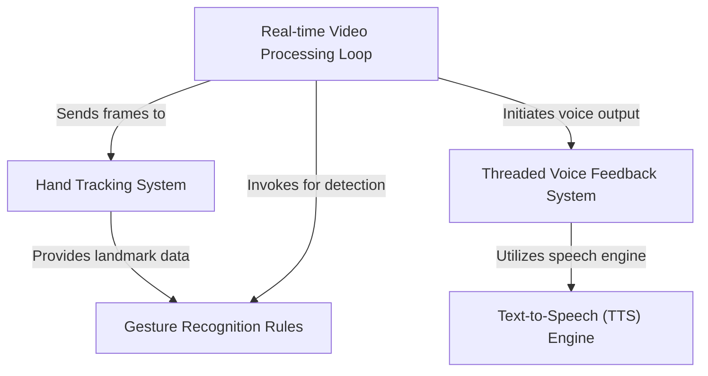

# Tutorial: Smart_Sign_language_detection

This project enables *real-time sign language detection* using a webcam. It employs **MediaPipe for hand tracking** to identify gestures, interprets them with defined rules, and provides **audio feedback** through a text-to-speech engine without interrupting the main processing.

**Source Repository:** [https://github.com/Dr-Westworld/Smart_Sign_language_detection](https://github.com/Dr-Westworld/Smart_Sign_language_detection)

## Chapters

1. [Real-time Video Processing Loop
](01_real_time_video_processing_loop_.md)
2. [Hand Tracking System
](02_hand_tracking_system_.md)
3. [Gesture Recognition Rules
](03_gesture_recognition_rules_.md)
4. [Threaded Voice Feedback System
](04_threaded_voice_feedback_system_.md)
5. [Text-to-Speech (TTS) Engine
](05_text_to_speech__tts__engine_.md)

---

Generated by [AI Codebase Knowledge Builder]