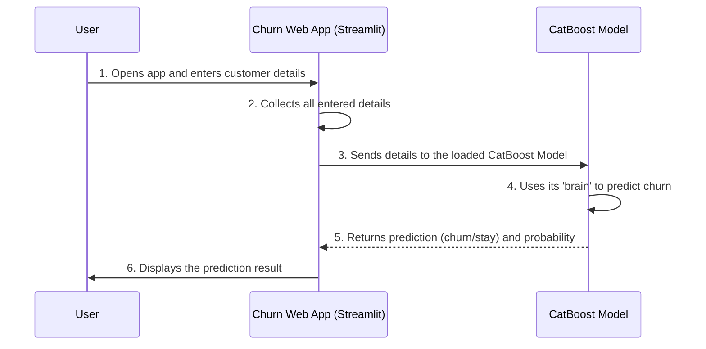

# Chapter 1: Churn Prediction Web Application

Welcome to the exciting world of predicting whether customers will stay with a company or leave! This first chapter introduces you to a friendly tool called the **Churn Prediction Web Application**.

### Why Do We Need This?

Imagine you work for a phone company (a "Telco"). You have many customers, and some of them might decide to switch to another company – this is called **churn**. Losing customers means losing money, so businesses want to know *who* might churn *before* they actually leave.

We can use powerful tools like Machine Learning (ML) to build models that predict churn. But here's a problem: these ML models are often hidden behind complex code. How can a marketing manager, who might not be a coding expert, easily use such a model to check on a customer?

That's where the **Churn Prediction Web Application** comes in! It's like an easy-to-use online calculator for churn.

**Our Goal for This Chapter:** To understand what this web application is, how to use it, and get a peek at how it works behind the scenes.

### What is the Churn Prediction Web Application?

Think of it as a user-friendly website. You open it in your web browser, and it presents you with a simple form. You enter details about a customer (like their age, how long they've been a customer, their monthly bill), and with a click of a button, it instantly tells you if that customer is likely to churn, and how confident it is in that prediction.

This application makes a powerful machine learning model accessible to everyone, without needing to write a single line of code!

### How to Use the Churn Prediction Web Application

Using the application is very straightforward, much like filling out any online form.

1.  **Open the Application:** You would open a web browser and navigate to the application's address.
2.  **Enter Customer Details:** You'll see various fields, dropdowns, and sliders, each representing a piece of information about a customer. You select or type in the relevant details.
3.  **Get Prediction:** After filling in all the details, you click a "Predict Churn" button.
4.  **View Results:** The application then displays the prediction: either "This customer is likely to churn" or "This customer is likely to stay," along with a percentage showing the probability.

Here's a simplified look at how you might interact with parts of the input form in code (using a tool called Streamlit, which we'll see more of soon):

```python
# Part of the application's input form
import streamlit as st # Streamlit is a tool to easily build web apps

gender = st.selectbox("Gender", ['Female', 'Male'])
tenure = st.slider("Tenure (months)", 0, 72, 12)
MonthlyCharges = st.slider("Monthly Charges", 0.0, 150.0, 70.0)

# ... many more input fields ...

if st.button("🔍 Predict Churn"):
    # When this button is clicked, the prediction happens
    pass # We'll see the prediction logic next!
```
This code snippet shows how a "Gender" dropdown, a "Tenure" slider (for how many months a customer has stayed), and a "Monthly Charges" slider are created. When the "Predict Churn" button is pressed, the application moves on to calculate the churn risk.

And here's how the prediction might look on your screen after you click the button:

```python
# Part of the application's output display
# ... (after prediction is made) ...

prediction = 1 # Example: model predicted churn (1 means churn, 0 means no churn)
probability = 0.75 # Example: 75% probability of churn

prob_percent = probability * 100
if prediction == 1:
    st.error(f"⚠️ This customer is likely to churn (Probability: {prob_percent:.2f}%)")
else:
    st.success(f"✅ This customer is likely to stay (Probability: {prob_percent:.2f}%)")
```
If the model thinks a customer will churn, you'll see a warning message like "⚠️ This customer is likely to churn (Probability: 75.00%)". If not, a success message like "✅ This customer is likely to stay (Probability: 25.00%)".

### How Does It Work Under the Hood?

Let's quickly peek at what happens behind the scenes when you use the web application.



This simple flow shows that the Web Application acts as a messenger between you and the smart [CatBoost Model Training](03_catboost_model_training_.md) model. It collects your inputs, talks to the model, and then presents the model's answer back to you.

### Diving into the Code (Simplified)

The core logic for our web application is found in `streamlit_app.py`. Let's break down some key parts.

First, we need to import the tools we'll use: `streamlit` for building the web app and `CatBoostClassifier` for our prediction model.

```python
# From file: streamlit_app.py
import streamlit as st # This is our web app builder
import pandas as pd    # Used to organize data, like a spreadsheet
from catboost import CatBoostClassifier # Our prediction model type

# Set up the basic page title and layout
st.set_page_config(page_title="Churn Predictor", layout="wide")
st.title("📊 Telco Customer Churn Prediction (CatBoost)")
```
Here, we tell Streamlit to set up our webpage with a title. `st.title` makes the big heading you see at the top of the app.

Next, the application needs to get its "brain"—the trained CatBoost model. This model has already learned from past customer data.

```python
# From file: streamlit_app.py
@st.cache_resource # This makes sure the model is loaded only once, saving time
def load_model():
    model = CatBoostClassifier()
    # This line loads the pre-trained model from a file!
    model.load_model("models/catboost_churn_model.cbm")
    return model

model = load_model()
```
The `load_model()` function is super important. It brings our intelligent prediction model into the application. We'll learn much more about how models are saved and loaded in the next chapter: [Model Persistence and Loading](02_model_persistence_and_loading_.md).

Then, we create the input form, where you enter customer details.

```python
# From file: streamlit_app.py
st.subheader("📥 Enter Customer Details")

col1, col2 = st.columns(2) # Organize inputs into two columns for a cleaner look

with col1: # This block creates inputs in the first column
    gender = st.selectbox("Gender", ['Female', 'Male'])
    SeniorCitizen = st.selectbox("Senior Citizen", ['No', 'Yes'])
    tenure = st.slider("Tenure (months)", 0, 72, 12)
    # ... many more input fields are created similarly ...
```
`st.selectbox` creates a dropdown menu, and `st.slider` creates a slider where you can drag to select a number. There are many more such inputs in the actual `streamlit_app.py` file to cover all the customer details.

Once you've filled out the form, all those individual inputs need to be gathered into one structured piece of data that the model can understand. We use `pandas` (imported as `pd`) to create a `DataFrame`, which is like a single row of a spreadsheet.

```python
# From file: streamlit_app.py
SeniorCitizen_bin = 1 if SeniorCitizen == "Yes" else 0 # Convert 'Yes'/'No' to 1/0

input_data = pd.DataFrame([{
    'gender': gender,
    'SeniorCitizen': SeniorCitizen_bin,
    'Partner': Partner, # 'Partner' and others come from the web form too
    'Dependents': Dependents,
    'tenure': tenure,
    # ... all other customer details go here ...
    'MonthlyCharges': MonthlyCharges,
    'TotalCharges': TotalCharges
}])
```
This `input_data` DataFrame is exactly what our CatBoost model expects to receive for making a prediction.

Finally, when you click the "Predict Churn" button, the application uses the loaded model to make a prediction and then displays the result.

```python
# From file: streamlit_app.py
if st.button("🔍 Predict Churn"):
    prediction = model.predict(input_data)[0] # Ask the model: will this customer churn?
    probability = model.predict_proba(input_data)[0][1] # Ask: how likely is it?

    st.markdown("---") # Just a line to separate sections
    prob_percent = probability * 100
    if prediction == 1:
        st.error(f"⚠️ This customer is likely to churn (Probability: {prob_percent:.2f}%)")
    else:
        st.success(f"✅ This customer is likely to stay (Probability: {prob_percent:.2f}%)")
```
`model.predict(input_data)` gives us a simple answer (0 for stay, 1 for churn), while `model.predict_proba(input_data)` gives us the likelihood as a percentage. Based on these, the application shows you a clear, easy-to-understand message.

### Conclusion

In this chapter, we've explored the **Churn Prediction Web Application**. We learned that it's a user-friendly interface that brings complex machine learning predictions to life, making it easy for anyone to input customer details and instantly get a churn prediction. This powerful tool acts as a bridge between the business user and the intelligent models built by data scientists.

But how did this web application get its "brain" – the prediction model – in the first place? And how is that model saved and loaded so easily? We'll dive into those questions in the next chapter!

[Next Chapter: Model Persistence and Loading](02_model_persistence_and_loading_.md)

---

Generated by [AI Codebase Knowledge Builder]