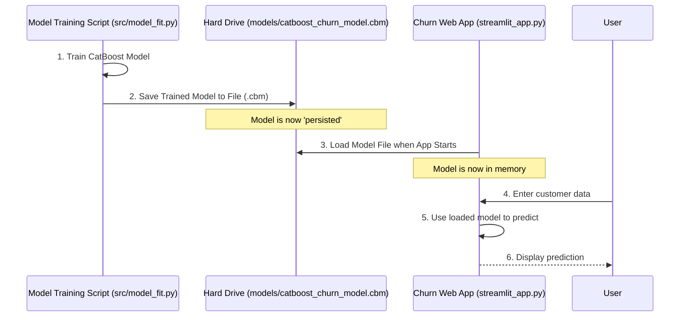

# Chapter 2: Model Persistence and Loading

Welcome back! In [Chapter 1: Churn Prediction Web Application](01_churn_prediction_web_application_.md), we explored our user-friendly web application that helps predict customer churn. We saw how you input customer details and instantly get a prediction. But we briefly touched upon a magical line of code that loads the "brain" of our application—the trained CatBoost model.

Now, it's time to uncover that magic! This chapter is all about **Model Persistence and Loading**.

### Why Do We Need to Save Our Model?

Imagine you've just spent hours, days, or even weeks building and perfecting a magnificent sandcastle on the beach. You wouldn't want the tide to wash it away, forcing you to rebuild it every single day, right? You'd want to find a way to save it, maybe by taking a picture, or somehow moving it to a safe place.

It's the same with our churn prediction model! Training a machine learning model, especially a powerful one like CatBoost, takes a lot of computational effort and time.

*   **You train it once:** You feed it tons of past customer data, and it learns complex patterns to predict churn.
*   **You want to use it many times:** Once trained, you want your web application (or any other tool) to use this learned "brain" over and over again, without going through the entire training process every single time a new customer's details are entered.

This is where **Model Persistence** comes in. It's the fancy term for saving your trained model to a file on your computer's hard drive. Then, when your application needs to make a prediction, it can simply **load** that saved model from the file back into its memory.

### What is Model Persistence?

Model Persistence means taking your trained model (which is currently just living in your computer's temporary memory while your training script runs) and writing it down into a permanent file. Think of it like saving a document in Microsoft Word or taking a photo with your phone. Once saved, it stays there even if you close your program or turn off your computer.

The main benefit? **Reusability!** You can:
*   Use the model in different applications (like our web app).
*   Share the model with others.
*   Load it later to make new predictions without re-training.

### What is Model Loading?

Model Loading is the opposite of persistence. It means reading that saved model file from your hard drive and bringing it back into your computer's memory so your program can use it. Our web application does exactly this when it starts up. It reads the model, and *then* it's ready to make predictions for any customer you enter.

### How Our Project Uses Model Persistence and Loading

Let's look at how our `Telco-churn` project saves and loads the CatBoost model.

#### 1. Saving the Trained Model (Persistence)

After the CatBoost model is thoroughly trained (a process we'll dive into in [Chapter 3: CatBoost Model Training](03_catboost_model_training_.md)), we need to save its learned "brain."

Here's how it generally looks in the training script (`src/model_fit.py`):

```python
# From file: src/model_fit.py (Simplified)
from catboost import CatBoostClassifier

# Imagine our CatBoost model has finished its training...
# (We'll learn about training in Chapter 3!)
final_model = CatBoostClassifier(iterations=100) # This is our trained 'brain'
# For this example, let's pretend 'final_model' is already fully trained.

# This line saves the model's 'brain' to a file!
final_model.save_model("models/catboost_churn_model.pkl")
```
In this snippet, `final_model.save_model(...)` is the key part. It takes our `final_model` (which has learned to predict churn) and saves all its internal settings and learned patterns into a file named `catboost_churn_model.pkl` inside a `models` folder.

A `.pkl` file is a common way in Python to "pickle" (save) almost any Python object. CatBoost also has its own specialized file format, `.cbm`, which is often more efficient for CatBoost models. While our `src/model_fit.py` shows saving to `.pkl`, our web application specifically loads the `.cbm` format because it's optimized for CatBoost models.

#### 2. Loading the Saved Model (Loading)

Now, let's see how our web application (from `streamlit_app.py`) brings this saved model back to life:

```python
# From file: streamlit_app.py (Simplified)
import streamlit as st
from catboost import CatBoostClassifier

# This special function loads our model
@st.cache_resource # This tells Streamlit to load the model only once!
def load_model():
    model = CatBoostClassifier()
    # This line loads the pre-trained model from its file!
    model.load_model("models/catboost_churn_model.cbm")
    return model

# We call the function to get our model
model = load_model()
```
Here's what's happening:
*   `CatBoostClassifier()`: We first create an empty CatBoost model object. Think of it as an empty shell.
*   `model.load_model("models/catboost_churn_model.cbm")`: This is the crucial line! It tells the empty `model` object to read all the learned information from the `catboost_churn_model.cbm` file. After this line, our `model` variable is no longer an empty shell; it's the full, intelligent, trained churn prediction model!
*   `@st.cache_resource`: This is a Streamlit trick. It ensures that the `load_model()` function runs only *once* when the application starts, no matter how many times users interact with it. This saves a lot of time and makes the app fast.

### The Flow: Training, Saving, and Loading

Let's visualize the entire process:



As you can see, the training happens once. The trained model is saved. Then, the web application only needs to load that saved file to be fully functional and make predictions for any user interaction. This separation makes our system efficient and powerful!

### Conclusion

In this chapter, we've learned about **Model Persistence** (saving our trained model) and **Model Loading** (bringing it back into memory). This powerful concept allows us to train complex machine learning models once and then reuse them indefinitely in applications like our web interface, saving immense time and computational resources.

Now that we understand how models are saved and loaded, let's rewind and see *how* these models are actually trained in the first place!

[Next Chapter: CatBoost Model Training](03_catboost_model_training_.md)

---

Generated by [AI Codebase Knowledge Builder]