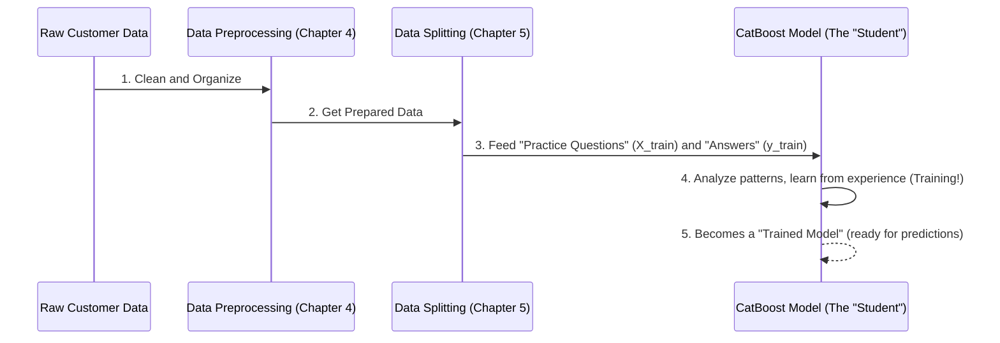

# Chapter 3: CatBoost Model Training

Welcome back! In [Chapter 1: Churn Prediction Web Application](01_churn_prediction_web_application_.md), we saw our web application in action, predicting whether customers might leave. Then, in [Chapter 2: Model Persistence and Loading](02_model_persistence_and_loading_.md), we learned how that application loads a pre-trained "brain" (our CatBoost model) from a file.

But how did that "brain" get so smart in the first place? How did it learn to predict churn? That's what this chapter is all about: **CatBoost Model Training**.

### Why Do We Need to Train a Model?

Imagine you want to teach a new doctor how to diagnose a specific illness. You wouldn't just give them a blank book and expect them to know everything. Instead, you'd give them:
1.  **Many patient records:** These records contain symptoms (like fever, cough, etc.) and the actual diagnosis (e.g., "Flu" or "Not Flu").
2.  **A learning process:** The doctor would study these records, identify patterns, and learn which symptoms often lead to which diagnosis.

Our churn prediction model needs the same kind of "education"! It needs to learn from past customer data so it can accurately predict future churn. This learning process is called **Model Training**.

**The problem we're solving:** Without training, our CatBoost model would be like a doctor who has never seen a patient – completely clueless. Training gives it the experience and knowledge to make informed predictions.

### What is CatBoost Model Training?

This is the core "learning phase" for our model. Think of it as:

1.  **The "Student"**: Our CatBoost Classifier model is the student. It's designed to be very good at finding patterns.
2.  **The "Textbook"**: This is our prepared customer data. It contains information (like how long a customer has been with the company, their monthly bill, what kind of contract they have) and, most importantly, whether they *actually churned* or *stayed* in the past.
3.  **The "Teacher"**: The training process itself is the teacher. We feed the data to the CatBoost model. The model then repeatedly analyzes the "features" (customer details like tenure, charges) and compares them to the "churn outcomes" (whether they left or stayed).
4.  **The "Learning"**: Through this repeated analysis, the CatBoost model builds an internal "map" or "representation" of the data. It learns, for example, that customers with short tenures and high monthly charges might be more likely to churn.

The goal is for the model to learn these complex patterns so well that when it sees a *new* customer (one it hasn't seen before), it can use its learned knowledge to predict their likelihood of churning.

### How Our Model Learns: A Simple View

Let's simplify the learning process:

1.  **Gathering Ingredients (Data)**: First, we need lots of historical customer data. This data needs to be clean and organized, a step called [Data Preprocessing](04_data_preprocessing_.md).
2.  **Splitting for Practice and Test**: We then divide this data into two main parts: a "training set" (for practice) and a "testing set" (to check if it learned well). This is covered in [Data Splitting](05_data_splitting_.md).
3.  **Introducing CatBoost**: We use a powerful type of model called `CatBoostClassifier`. It's known for being very good with different kinds of data, especially data with categories (like 'Male'/'Female' or 'Yes'/'No' for services).
4.  **The `fit` Method**: This is the magical instruction that tells the CatBoost model to start learning from the practice data. When we call `model.fit()`, the model "studies" all the customer details and their corresponding churn outcomes.

Here's a simplified look at the core idea of training:



### Diving into the Code: Training with CatBoost

In our project, the main script for training the model is `src/train.py` (or `src/model_fit.py` which uses optimized parameters from `src/hyperparam_tuning.py`). Let's look at the essential steps to train our CatBoost model.

First, we need to import `CatBoostClassifier`, which is the specific type of model we're using:

```python
# From file: src/train.py (Simplified)
from catboost import CatBoostClassifier # Our smart learning algorithm

# ... (Imagine our data X and y are already loaded and prepared) ...
# X holds customer details (features), y holds churn outcomes (target)
```
This line brings the `CatBoostClassifier` tool into our script, making it available for use.

Next, after our data has been [prepared](04_data_preprocessing_.md) and [split into training and testing sets](05_data_splitting_.md), we create an empty CatBoost model and then tell it to start learning:

```python
# From file: src/train.py (Simplified)

# X_train are the customer details for practice
# y_train are the actual churn outcomes for practice
# categorical_cols tells CatBoost which columns contain categories (like 'Gender')

# 1. Create an empty CatBoost model
cat_model = CatBoostClassifier(verbose=0, random_state=42)

# 2. Tell the model to learn from our training data!
cat_model.fit(X_train, y_train, cat_features=categorical_cols)

print("CatBoost Model has been successfully trained!")
```
Let's break down these two crucial lines:

1.  `cat_model = CatBoostClassifier(verbose=0, random_state=42)`:
    *   `CatBoostClassifier()`: This creates a new, empty CatBoost model. It's like giving an empty notebook to our "student."
    *   `verbose=0`: This just means "don't print too much during training," keeping our screen clean.
    *   `random_state=42`: This is like setting a specific "starting point" for the student, so if we train the model again with the same data, it will learn in the exact same way and give the exact same results. It helps make our experiments repeatable.

2.  `cat_model.fit(X_train, y_train, cat_features=categorical_cols)`:
    *   `.fit()`: This is the command that starts the training! It tells the `cat_model` to learn.
    *   `X_train`: This is our "practice questions" – all the customer features (tenure, charges, etc.) from the training set.
    *   `y_train`: This is the "correct answers" – the actual churn outcomes (0 for stay, 1 for churn) that correspond to `X_train`. The model learns by seeing `X_train` and trying to predict `y_train`, then adjusting itself when it makes mistakes.
    *   `cat_features=categorical_cols`: This is a very cool feature of CatBoost. We tell it which columns in `X_train` are categorical (like 'gender' or 'contract type'). CatBoost is especially good at handling these types of features directly, often giving better results than other models that need more manual preparation for categories.

Once `cat_model.fit()` finishes, `cat_model` is no longer an empty shell; it's a fully **trained model** that has learned patterns from our data and is ready to make predictions! This is the "brain" that our web application loads in [Chapter 2: Model Persistence and Loading](02_model_persistence_and_loading_.md).

### What Happens During `fit()`?

Behind the scenes, the CatBoost algorithm (a type of "gradient boosting" algorithm) works iteratively:

1.  **Starts simple**: It makes initial, rough predictions based on the data.
2.  **Finds mistakes**: It compares its predictions to the actual `y_train` (the correct answers) and identifies where it made errors.
3.  **Learns from mistakes**: It then builds *another* small "tree" (like a decision rule) to specifically correct the mistakes of the previous predictions.
4.  **Combines knowledge**: It adds this new "tree" to its existing knowledge.
5.  **Repeats**: This process repeats many, many times (often hundreds or thousands of times), with each new "tree" trying to improve the overall prediction accuracy.

This iterative learning makes CatBoost incredibly powerful at capturing complex relationships in the data. The settings that control how many times it repeats, how fast it learns, and the complexity of its "trees" are called [Hyperparameter Optimization](06_hyperparameter_optimization_.md).

### Conclusion

In this chapter, we've demystified **CatBoost Model Training**. We learned that training is the crucial learning phase where our CatBoost model studies historical customer data (features and churn outcomes) to identify complex patterns. The `model.fit()` command is where this learning happens, transforming an empty model into an intelligent predictor. This trained model then becomes the "brain" that powers our churn prediction web application.

But before we can even begin to train a model, we need to make sure our data is in perfect shape. That's what we'll explore next!

[Next Chapter: Data Preprocessing](04_data_preprocessing_.md)

---

Generated by [AI Codebase Knowledge Builder]