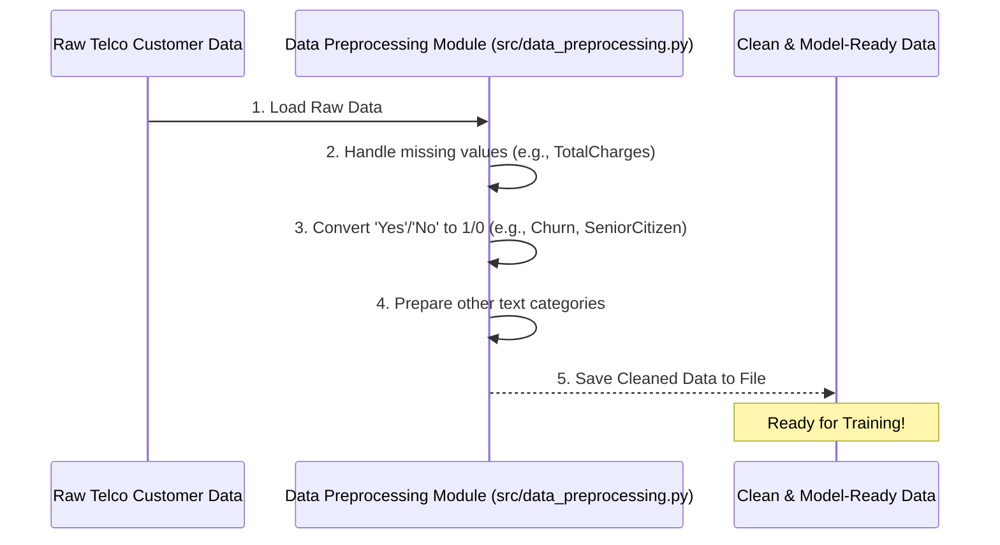

# Chapter 4: Data Preprocessing

Welcome back! In [Chapter 3: CatBoost Model Training](03_catboost_model_training_.md), we learned how our CatBoost model "studies" past customer data to become smart enough to predict churn. But before a student can study a textbook, the textbook needs to be written clearly and organized, right?

The same goes for our customer data! Before we feed any data to our smart CatBoost model, it needs to be perfectly prepared. This crucial step is called **Data Preprocessing**.

### Why Do We Need Data Preprocessing?

Imagine you're baking a cake. You wouldn't just throw raw eggs, flour straight from the bag, and whole sticks of butter into a bowl. You'd crack the eggs, measure the flour, soften the butter, and maybe sift the dry ingredients. You *prepare* your ingredients so they can be mixed properly and turn into a delicious cake.

Our machine learning model is similar to the cake recipe. It can't understand raw, messy customer data directly.
*   **Problem**: Raw customer data often contains text (like 'Yes'/'No', 'Male'/'Female'), missing values, or numbers that are actually categories (like a 'SeniorCitizen' column that might be '0' or '1' but represents 'No' or 'Yes'). The model expects numbers in a specific format to learn efficiently.
*   **Solution**: **Data Preprocessing** is like preparing our ingredients. It takes raw customer data and transforms it into a clean, structured format that the machine learning model can understand and learn from.

The goal is to turn our messy, real-world customer information into something the CatBoost model can easily digest and learn patterns from.

### What is Data Preprocessing?

Data Preprocessing involves several key steps to get our data ready:

1.  **Handling Missing Information**: Sometimes, data is incomplete. For example, a customer might have `TotalCharges` missing if they just joined. We need a strategy to fill these gaps.
2.  **Converting Text to Numbers**: Machine learning models primarily work with numbers. Textual answers like 'Yes'/'No' or 'Fiber optic' need to be converted into numerical codes (e.g., 1 or 0).
3.  **Mapping Our Target**: Our `Churn` column, which is what we want to predict, also starts as 'Yes' or 'No'. We need to convert this into 0s and 1s, where 1 typically means "Churn" (the event we're interested in) and 0 means "Stay".
4.  **Formatting Data for CatBoost**: While many models need *all* text categories converted to numbers, CatBoost is special! It's very good at handling text categories directly, as long as we tell it which columns are text during training. This saves us some work!

### How Our Project Uses Data Preprocessing

In our Telco-churn project, data preprocessing is done once, right after we load the raw data, and *before* we split it for training. This ensures that both our training and testing data are in the correct format.

The main script that handles these preprocessing steps is `src/data_preprocessing.py`.

Let's visualize the process:



### Diving into the Code: Preprocessing in Action

Let's look at key snippets from `src/data_preprocessing.py` to see how these steps are done in code.

First, we need to load our raw customer data:

```python
# From file: src/data_preprocessing.py
import pandas as pd
from sklearn.preprocessing import LabelEncoder # A tool for converting text to numbers

# Load the raw customer data from a CSV file
df = pd.read_csv("data/WA_Fn-UseC_-Telco-Customer-Churn.csv")

# Remove customerID column - it's just an identifier, not useful for prediction
df = df.drop('customerID', axis=1)

print("Raw data loaded. Shape:", df.shape)
```
Here, we use `pandas` (a popular Python tool for handling data, like a super-smart spreadsheet) to load our data. We also immediately remove the `customerID` because it's just a unique label for each customer and doesn't help the model predict churn.

#### 1. Handling `TotalCharges`

The `TotalCharges` column can sometimes be tricky. If a customer has just joined, their total charges might be empty or a space. We need to handle this:

```python
# From file: src/data_preprocessing.py (Simplified)

# Convert 'TotalCharges' to numbers, forcing errors to become 'Not a Number'
df['TotalCharges'] = pd.to_numeric(df['TotalCharges'], errors='coerce')

# Fill any 'Not a Number' values with 0 (assuming new customers start with 0 total charges)
df['TotalCharges'] = df['TotalCharges'].fillna(0)

print("TotalCharges handled for missing values.")
```
`pd.to_numeric` tries to turn the column into numbers. If it finds something it can't convert (like a blank space), `errors='coerce'` tells it to turn that into `NaN` (Not a Number). Then, `fillna(0)` replaces all `NaN` values with `0`.

#### 2. Mapping the Target (Churn)

Our target variable, `Churn`, needs to be '0' or '1' so the model knows what to predict:

```python
# From file: src/data_preprocessing.py (Simplified)

# Convert 'Yes'/'No' in the 'Churn' column to 1/0
df['Churn'] = df['Churn'].map({'No': 0, 'Yes': 1})

print("Churn target variable mapped to 0/1.")
```
`df['Churn'].map({'No': 0, 'Yes': 1})` goes through the `Churn` column and changes every 'No' to 0 and every 'Yes' to 1. Simple and effective!

#### 3. Preparing Other Categorical Features

Many columns in our dataset are categories (like `gender`, `Contract`, `InternetService`). For many machine learning models, these need to be converted to numbers. CatBoost is special because it can handle these *text values directly* if we tell it which columns are categorical during training (as we saw in [Chapter 3: CatBoost Model Training](03_catboost_model_training_.md) with `cat_features`).

However, sometimes it's also useful to convert simple 'Yes'/'No' columns to numbers upfront, especially when CatBoost is specifically told to treat integer-encoded columns as categorical. For example:

```python
# From file: src/data_preprocessing.py (Simplified)

# Convert 'Yes'/'No' in 'Partner' to 1/0
df['Partner'] = df['Partner'].map({'No': 0, 'Yes': 1})

# Do the same for 'Dependents'
df['Dependents'] = df['Dependents'].map({'No': 0, 'Yes': 1})

# Example for more complex categories using LabelEncoder
# (While CatBoost can handle strings, for consistency or certain workflows,
#  we might encode them. Here, we'll demonstrate for one column.)
# le = LabelEncoder()
# df['gender'] = le.fit_transform(df['gender']) # Male/Female -> 0/1

print("Selected categorical features converted to 0/1 where applicable.")
```
We use `.map()` again for 'Partner' and 'Dependents'. For columns like 'gender', we *could* use `LabelEncoder` to convert 'Female' and 'Male' to numbers (like 0 and 1). In our `streamlit_app.py`, CatBoost receives string categories directly, showcasing its flexibility, but during training (as seen in `src/hyperparam_tuning.py`), the columns *are* often integer-encoded first and then marked as categorical for CatBoost. This flexibility is a strength of CatBoost.

Finally, after all these cleaning and transformation steps, we save our perfectly prepared data into a new CSV file:

```python
# From file: src/data_preprocessing.py (Simplified)

# Save the cleaned data to a new CSV file
df.to_csv("cleaned_telco_churn.csv", index=False)

print("Data Preprocessing complete! Cleaned data saved to 'cleaned_telco_churn.csv'.")
```
This `cleaned_telco_churn.csv` file is now the "textbook" our CatBoost model will study! It's perfectly organized and ready for the next steps.

### Conclusion

In this chapter, we explored **Data Preprocessing**, the essential step of preparing our raw customer data for machine learning. We learned that it's like preparing ingredients for a cake, involving tasks such as handling missing values, converting text to numbers, and specifically mapping our churn outcome to 0s and 1s. This ensures our CatBoost model gets clean, understandable data to learn from, making its predictions more accurate.

Now that our data is sparkling clean and organized, the next step is to divide it strategically so our model can practice and then be properly tested.

[Next Chapter: Data Splitting](05_data_splitting_.md)

---

Generated by [AI Codebase Knowledge Builder]