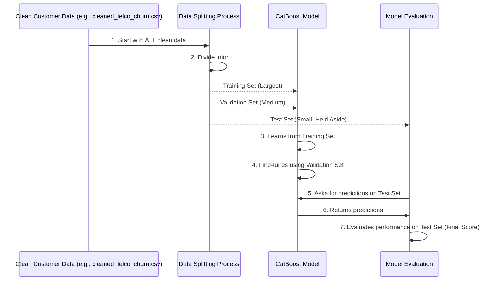

# Chapter 5: Data Splitting

Welcome back! In [Chapter 4: Data Preprocessing](04_data_preprocessing.md), we learned how to clean and prepare our raw customer data, turning it into a perfectly organized "textbook" for our CatBoost model. Now that our data is sparkling clean, the next crucial step is to divide it wisely. This process is called **Data Splitting**.

### Why Do We Need Data Splitting?

Imagine a student preparing for a big exam. If the student only studies the exact questions that will be on the test, they might get a perfect score, but does that truly mean they understand the subject? Not necessarily! They might have just memorized the answers.

To truly know if the student (our CatBoost model) has learned the subject (the patterns of customer churn), we need:

1.  **Study Materials (Training Set)**: Data the student *can* see and learn from.
2.  **Practice Questions (Validation Set)**: Data the student can use to test themselves and fine-tune their study methods *before* the real exam. This helps them improve.
3.  **Unseen Exam Questions (Test Set)**: Data the student has *never* seen before, used for a final, fair assessment of their true knowledge.

The problem we're solving with data splitting is ensuring that our model's performance is accurately measured on data it hasn't seen during its learning process. If we evaluate the model on the same data it learned from, it's like letting the student cheat – the results won't tell us how well it will perform in the real world on new, unknown customers.

### What is Data Splitting?

Data splitting is the process of dividing our entire customer dataset into distinct parts, each with a specific purpose:

*   **Training Set (for Learning)**: This is the largest portion of our data. Our CatBoost model will "study" this data, looking for patterns and relationships between customer features (like `tenure`, `MonthlyCharges`) and the `Churn` outcome. This is where the model learns its "rules."
*   **Validation Set (for Fine-Tuning)**: This set is used *during* the training process to make small adjustments and improve the model. Think of it as practice tests the student takes to see where they need to focus more, without seeing the final exam questions. We use this set to optimize certain settings of our model, a process called [Hyperparameter Optimization](06_hyperparameter_optimization.md).
*   **Test Set (for Final Evaluation)**: This is a portion of the data that the model *never* sees during training or validation. It's kept completely separate until the very end. We use this set for a final, unbiased check of the model's performance, just like a final exam. This helps us ensure the model generalizes well to new, unseen customers.

### The Splitting Process

Here's how we typically split our data:



### How Our Project Uses Data Splitting

In our `Telco-churn` project, we use a powerful tool from the `scikit-learn` library called `train_test_split`. This function makes it easy to divide our data.

First, we need to separate our customer features (the `X` data, like `gender`, `tenure`, `MonthlyCharges`) from our target variable (the `y` data, which is `Churn`).

Let's assume our `cleaned_telco_churn.csv` (from [Chapter 4: Data Preprocessing](04_data_preprocessing.md)) has been loaded and prepared into `X` and `y`:

```python
import pandas as pd
from sklearn.model_selection import train_test_split

# Load our cleaned data
df = pd.read_csv("cleaned_telco_churn.csv")

# X contains all the customer details (features)
X = df.drop(columns=['Churn'])

# y contains only the 'Churn' outcome (what we want to predict)
y = df['Churn']

print("Data separated into features (X) and target (y).")
```
After this step, `X` holds all the information the model will use to make a prediction, and `y` holds the correct answers for the model to learn from.

#### Basic Two-Way Split (Train and Test)

The most common way to split data is into a training set and a test set. This is a good starting point for many projects.

```python
# From file: src/train.py (Simplified)

# Split data into 80% for training and 20% for testing
X_train, X_test, y_train, y_test = train_test_split(X, y, test_size=0.2, random_state=42)

print(f"Training set size: {X_train.shape[0]} customers")
print(f"Testing set size: {X_test.shape[0]} customers")
```

Let's break down this important line:
*   `train_test_split(X, y, ...)`: This is the function that performs the split. It takes our features (`X`) and target (`y`) as input.
*   `test_size=0.2`: This tells the function to allocate 20% of the data to the test set, meaning the remaining 80% goes to the training set.
*   `random_state=42`: This is like setting a specific "shuffle" pattern. If you use the same `random_state` value, you'll get the exact same split every time you run the code. This is crucial for making your experiments repeatable!
*   The function returns four new sets:
    *   `X_train`: Features for training.
    *   `X_test`: Features for testing.
    *   `y_train`: Churn outcomes for training.
    *   `y_test`: Churn outcomes for testing.

#### Three-Way Split (Train, Validation, and Test)

For more robust model development, especially when doing [Hyperparameter Optimization](06_hyperparameter_optimization.md), we often need a separate validation set. We can achieve a 3-way split by applying `train_test_split` twice:

```python
# Conceptual example for a 3-way split
# (Not directly from a single project file but illustrates the concept)

# Step 1: Split into Training (e.g., 70%) and a temporary set (e.g., 30%)
X_train_full, X_temp, y_train_full, y_temp = train_test_split(X, y, test_size=0.3, random_state=42, stratify=y)

# Step 2: Split the temporary set into Validation (15%) and Test (15%)
X_val, X_test, y_val, y_test = train_test_split(X_temp, y_temp, test_size=0.5, random_state=42, stratify=y_temp)

print(f"Training set size: {X_train_full.shape[0]} customers")
print(f"Validation set size: {X_val.shape[0]} customers")
print(f"Test set size: {X_test.shape[0]} customers")
```
*   `stratify=y`: This is important, especially when dealing with imbalanced datasets (like churn, where fewer customers churn than stay). `stratify=y` ensures that the proportion of churned vs. non-churned customers is roughly the same in all the split sets as it is in the original dataset. This prevents a situation where, for example, your test set accidentally ends up with very few churn cases, making evaluation difficult.

In our project, the `src/hyperparam_tuning.py` script specifically creates a training and validation set for tuning:

```python
# From file: src/hyperparam_tuning.py (Simplified)

# X and y are already defined from the cleaned data
# ...

# One-time holdout split for training and validation for tuning
X_train, X_val, y_train, y_val = train_test_split(X, y, stratify=y, test_size=0.2, random_state=42)

print(f"For hyperparameter tuning: Training set size: {X_train.shape[0]}")
print(f"For hyperparameter tuning: Validation set size: {X_val.shape[0]}")
```
Here, `X_train` and `y_train` are used for the main model training, and `X_val` and `y_val` are used to measure the model's performance during the tuning process to find the best settings. The final, unseen test set would be kept completely separate from this process to provide an unbiased final evaluation, as discussed in [Chapter 7: Model Evaluation](07_model_evaluation.md).

### Conclusion

In this chapter, we've uncovered the critical concept of **Data Splitting**. We learned that by dividing our customer data into training, validation, and test sets, we ensure our CatBoost model learns effectively, can be fine-tuned, and ultimately, its performance is evaluated fairly on completely unseen data. This practice prevents our model from simply memorizing answers and ensures it can truly generalize its knowledge to new customers.

Now that our data is perfectly split into its respective study materials and exam questions, we're ready for the model to start learning and for us to find the optimal settings for it!

[Next Chapter: Hyperparameter Optimization](06_hyperparameter_optimization.md)

---

Generated by [AI Codebase Knowledge Builder]