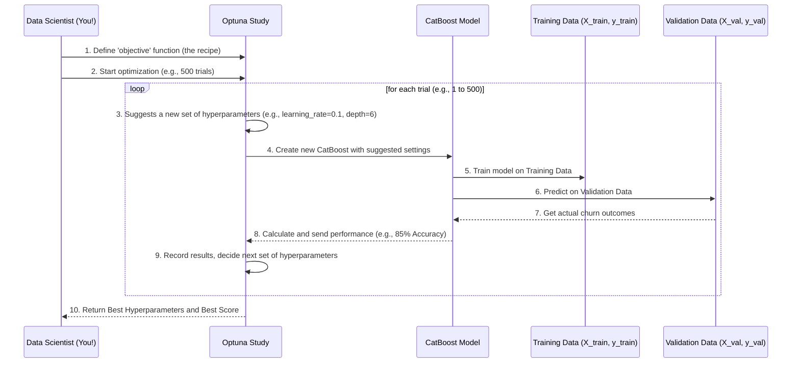

# Chapter 6: Hyperparameter Optimization

Welcome back! In [Chapter 5: Data Splitting](05_data_splitting.md), we learned the vital step of dividing our customer data into training, validation, and testing sets. This ensures our CatBoost model has dedicated data to learn from (training), fine-tune its settings (validation), and finally, be fairly evaluated (testing).

Now, imagine you've just given your CatBoost model a great textbook and a set of practice questions. It's ready to learn! But how exactly does it learn best? Does it need to study very quickly, or take its time? Should it focus on broad patterns or tiny details?

This chapter is all about answering these questions through **Hyperparameter Optimization**.

### Why Do We Need Hyperparameter Optimization?

Think of our CatBoost model as a skilled chef trying to perfect a new recipe. The chef has many ingredients (our customer data) and a goal (predicting churn). But a recipe also has **settings** – like the oven temperature, how long to bake, or the exact amount of each spice. These settings aren't learned during cooking; they are decided *before* cooking starts.

In machine learning, these pre-set configurations for our model are called **hyperparameters**.
*   **Problem**: Our CatBoost model has many such "knobs" or settings. If we set them incorrectly, our model might not learn well, leading to inaccurate churn predictions. Manually trying out every possible combination of these settings would take a very long time and a lot of guessing!
*   **Solution**: **Hyperparameter Optimization (HPO)** is like having a super-smart assistant chef who systematically tries different combinations of oven temperatures, baking times, and spice amounts. This assistant measures the taste of each version and intelligently suggests new combinations until the perfect recipe (the best-performing model) is found.

Our goal for this chapter is to understand how we automatically find the best settings for our CatBoost model so it predicts churn as accurately as possible, without us having to manually guess.

### What is Hyperparameter Optimization?

Hyperparameter Optimization is the automated process of finding the best combination of settings (hyperparameters) for your machine learning model. Let's break down the key ideas:

1.  **Hyperparameters**: These are the configuration settings of a machine learning model that are set *before* the training process begins. They are *not* learned from the data itself. For our CatBoost model, examples include:
    *   `learning_rate`: How quickly the model adjusts its "brain" after making a mistake. A very high rate might make it jump past the best solution, while a very low rate might make it learn too slowly.
    *   `depth`: How complex the "decision trees" inside CatBoost can be. A deep tree can find very specific patterns but might "over-memorize" the training data; a shallow tree might be too simple.
    *   `iterations`: How many times the model goes through its learning process. More iterations can mean better learning, but also more time and risk of "over-memorizing."

2.  **Optimization**: This refers to the process of searching for the specific set of hyperparameter values that result in the best performance for our model on unseen data (specifically, our validation set from [Chapter 5: Data Splitting](05_data_splitting.md)). "Best performance" usually means the highest accuracy or lowest error.

3.  **Optuna**: This is the "smart assistant chef" (a powerful library in Python) we use for HPO. Instead of randomly guessing or trying every single combination, Optuna uses clever strategies to efficiently explore the possible hyperparameter settings, quickly homing in on the most promising ones.

The purpose of HPO is to make our CatBoost model as robust and effective as possible, predicting churn with the highest accuracy.

### How Our Project Uses Hyperparameter Optimization with Optuna

In our `Telco-churn` project, the `src/hyperparam_tuning.py` script is where the magic of HPO happens. It uses Optuna to systematically search for the best `CatBoostClassifier` hyperparameters.

Here's the general flow:

1.  **Define the "Recipe" (Objective Function)**: We write a special Python function that Optuna can call. This function tells Optuna: "Here's how to build and train a CatBoost model with a given set of hyperparameters, and here's how to measure its performance (e.g., accuracy) on the validation set."
2.  **Let Optuna Experiment**: Optuna repeatedly calls this "recipe" function, each time suggesting a *new* set of hyperparameters.
3.  **Measure and Learn**: After each try, Optuna gets the model's performance score (e.g., accuracy). It uses this information to intelligently decide which hyperparameters to try next, aiming to improve the score.
4.  **Find the Best**: After a certain number of trials, Optuna tells us the best combination of hyperparameters it found and the highest score achieved.

We'll use our `X_train`, `y_train` for training the model in each trial, and `X_val`, `y_val` (from [Chapter 5: Data Splitting](05_data_splitting.md)) to evaluate how well each set of hyperparameters performs.

### Diving into the Code: Optimizing CatBoost

Let's look at the key parts of `src/hyperparam_tuning.py` to understand how we perform Hyperparameter Optimization.

First, we load and prepare our data, which we learned about in [Chapter 4: Data Preprocessing](04_data_preprocessing.md) and [Chapter 5: Data Splitting](05_data_splitting.md). The snippet below shows the data loading and the critical split for tuning:

```python
# From file: src/hyperparam_tuning.py (Simplified)
import optuna
from catboost import CatBoostClassifier
from sklearn.model_selection import train_test_split
from sklearn.preprocessing import LabelEncoder
from sklearn.metrics import accuracy_score
import pandas as pd

# Load and prepare data (simplified from full script)
df = pd.read_csv("cleaned_telco_churn.csv")
df['Churn'] = df['Churn'].map({'No': 0, 'Yes': 1})
X = df.drop(columns=['customerID', 'Churn'])
y = df['Churn']

# Convert categorical features to numbers for consistency
cat_features = X.select_dtypes(include='object').columns.tolist()
for col in cat_features:
    X[col] = LabelEncoder().fit_transform(X[col])

# Split into training and validation sets for Optuna
X_train, X_val, y_train, y_val = train_test_split(
    X, y, stratify=y, test_size=0.2, random_state=42
)
```
Here, we prepare our `X` (customer features) and `y` (churn outcome) data. We also specifically convert text categories into numbers using `LabelEncoder` before splitting. Then, `train_test_split` creates our `X_train`, `y_train` (for model training within each trial) and `X_val`, `y_val` (for evaluating each trial's performance).

Next, we define our `objective` function – this is the "recipe" Optuna uses for each experiment:

```python
# From file: src/hyperparam_tuning.py (Simplified)

def objective(trial):
    # 1. Suggest different hyperparameter values for this trial
    params = {
        'iterations': trial.suggest_int('iterations', 100, 500), # How many learning steps
        'learning_rate': trial.suggest_float('learning_rate', 0.01, 0.4), # How fast it learns
        'depth': trial.suggest_int('depth', 4, 10), # Complexity of decision trees
        'l2_leaf_reg': trial.suggest_float('l2_leaf_reg', 1, 10), # Regularization (prevents over-memorizing)
        'verbose': False # Don't print too much info during training
    }

    # 2. Create a CatBoost model with these suggested parameters
    model = CatBoostClassifier(**params)

    # 3. Train the model using the training data
    # (Note: cat_features are already integer-encoded in X_train, so we omit `cat_features` param here)
    model.fit(X_train, y_train)

    # 4. Make predictions on the validation set
    preds = model.predict(X_val)

    # 5. Return the accuracy score
    return accuracy_score(y_val, preds)
```
In this `objective` function:
*   `trial.suggest_int` and `trial.suggest_float` are Optuna's ways of asking: "Hey, for this trial, pick a number for `iterations` between 100 and 500, or a `learning_rate` between 0.01 and 0.4."
*   `CatBoostClassifier(**params)` creates a new CatBoost model using the parameters Optuna suggested for this specific trial.
*   `model.fit(X_train, y_train)` trains this model using our designated training data.
*   `model.predict(X_val)` uses the trained model to make predictions on the separate validation set.
*   `accuracy_score(y_val, preds)` calculates how accurate these predictions were. Optuna's goal is to maximize this score.

Finally, we tell Optuna to start its optimization process:

```python
# From file: src/hyperparam_tuning.py (Simplified)

# Create an Optuna study, aiming to maximize the accuracy score
study = optuna.create_study(direction='maximize')

# Run 500 trials (experiments) to find the best parameters
study.optimize(objective, n_trials=500)

# Print the best parameters and score found
print("Best params:", study.best_params)
print("Best score:", study.best_value)
```
*   `optuna.create_study(direction='maximize')`: This sets up Optuna's experiment, telling it to try and get the `objective` function's return value (our accuracy score) as high as possible.
*   `study.optimize(objective, n_trials=500)`: This starts the main search. Optuna will call our `objective` function 500 times, each time with different suggested hyperparameters, learning from each result.
*   After 500 trials, `study.best_params` will hold the dictionary of hyperparameter values that led to the highest `study.best_value` (the best accuracy score). These are the "perfect recipe settings" for our CatBoost model!

### How It Works Under the Hood

Let's visualize the process of Optuna finding the best hyperparameters:



In essence, you tell Optuna what to try and how to measure success. Optuna then acts as an intelligent experimenter, running many versions of your model, learning from each attempt, and efficiently guiding itself toward the optimal settings.

### Conclusion

In this chapter, we explored **Hyperparameter Optimization**. We learned that it's like a smart assistant (Optuna) helping our chef (CatBoost model) find the perfect recipe settings (hyperparameters) to achieve the best taste (churn prediction accuracy). By automatically experimenting with different learning rates, tree depths, and other parameters, we ensure our CatBoost model is fine-tuned to be the most robust and effective churn predictor possible.

Now that our CatBoost model has been trained with the best possible settings, the final step is to truly assess how well it performs. We need to measure its overall success on completely new, unseen data.

[Next Chapter: Model Evaluation](07_model_evaluation.md)

---

Generated by [AI Codebase Knowledge Builder]