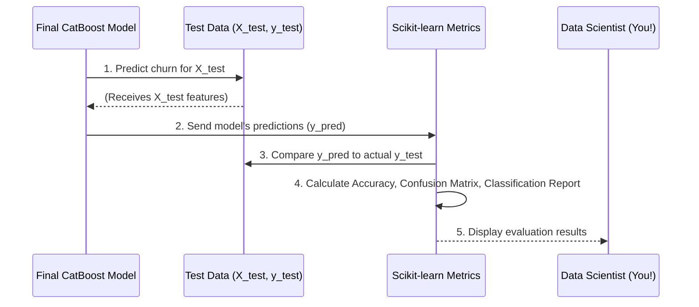

# Chapter 7: Model Evaluation

Welcome back! In [Chapter 6: Hyperparameter Optimization](06_hyperparameter_optimization_.md), we learned how to use smart techniques like Optuna to find the perfect settings for our CatBoost model, making it as effective as possible. Now, our model has been trained with the best "recipe," and it's ready to make predictions.

But how do we know if it's *actually* good at its job? How can we be sure it will perform well on customers it has never seen before?

### Why Do We Need Model Evaluation?

Imagine a student who has studied hard and aced all their practice tests. That's great! But the real test of their knowledge is the *final exam*, which contains questions they've never encountered during practice. This final exam tells us how well they truly understand the subject, not just how well they memorized practice answers.

It's the same with our churn prediction model.
*   **Problem**: After all the training and tuning, we need to know if our CatBoost model is genuinely reliable at predicting churn for *new, unseen* customers. If we just look at how well it did on the data it *trained* on, it might seem perfect, but that doesn't mean it will generalize to the real world.
*   **Solution**: **Model Evaluation** is like giving our model its final exam. We use a completely separate set of data (the "test set" from [Chapter 5: Data Splitting](05_data_splitting_.md)) that the model has never seen. We then use various "grading tools" (metrics) to see how accurately it predicted churn, where it made mistakes, and what its overall strengths and weaknesses are.

The goal is to get a "report card" for our model, so we can trust its predictions and understand its real-world performance before deploying it in our [Churn Prediction Web Application](01_churn_prediction_web_application_.md).

### What is Model Evaluation?

Model Evaluation is the process of quantitatively assessing how well a trained machine learning model performs. It answers questions like:

*   How often does the model make correct predictions?
*   Does it correctly identify customers who *will* churn?
*   Does it avoid falsely accusing loyal customers of churning?

We use several important metrics to get a comprehensive view of our model's performance:

1.  **Accuracy**: This is the simplest metric. It tells us the percentage of total predictions the model got right.
    *   *Analogy*: If a student answers 80 out of 100 questions correctly, their accuracy is 80%.
    *   *Limitation*: High accuracy can be misleading if one outcome (like "no churn") is much more common than the other ("churn").

2.  **Confusion Matrix**: This is a powerful table that breaks down all the correct and incorrect predictions, categorized by the actual outcome and the predicted outcome.
    *   **True Positives (TP)**: The model predicted churn, and the customer *actually* churned. (Correctly identified problem)
    *   **True Negatives (TN)**: The model predicted no churn, and the customer *actually* stayed. (Correctly identified loyal customer)
    *   **False Positives (FP)**: The model predicted churn, but the customer *actually* stayed. (False alarm – we might offer a discount to a loyal customer unnecessarily)
    *   **False Negatives (FN)**: The model predicted no churn, but the customer *actually* churned. (Missed opportunity – we lost a customer we could have saved)
    *   *Analogy*: Imagine a doctor diagnosing flu.
        *   TP: Doctor says "Flu," patient has flu.
        *   TN: Doctor says "No Flu," patient has no flu.
        *   FP: Doctor says "Flu," patient has no flu. (False alarm, unnecessary treatment)
        *   FN: Doctor says "No Flu," patient has flu. (Missed diagnosis, illness worsens)

3.  **Classification Report**: This provides a more detailed breakdown of performance, including **Precision**, **Recall**, and **F1-score** for each outcome (churn/no churn).
    *   **Precision (for churn)**: Out of all the customers the model *predicted would churn*, how many *actually* churned? (Helps avoid false alarms). High precision means when the model says "churn," it's usually right.
    *   **Recall (for churn)**: Out of all the customers who *actually churned*, how many did the model *correctly identify*? (Helps avoid missing actual churners). High recall means the model is good at catching most churners.
    *   **F1-Score**: A balance between Precision and Recall. It's especially useful when you need a good balance of both, or when your classes are imbalanced (e.g., fewer churners than non-churners).

### How Our Project Uses Model Evaluation

In our `Telco-churn` project, after our `CatBoostClassifier` has been trained (as seen in [Chapter 3: CatBoost Model Training](03_catboost_model_training_.md) with optimal hyperparameters from [Chapter 6: Hyperparameter Optimization](06_hyperparameter_optimization_.md)), we use the dedicated **test set** to evaluate its performance.

Let's assume we have our final, best-trained model (let's call it `final_model`) and the unseen `X_test` (customer features) and `y_test` (actual churn outcomes) from [Chapter 5: Data Splitting](05_data_splitting_.md).



This sequence shows that our trained model first makes predictions on the test data. Then, a separate evaluation module (like `scikit-learn` in Python) compares these predictions to the true outcomes (`y_test`) to generate the performance metrics.

### Diving into the Code: Evaluating Our CatBoost Model

The code for evaluating our model is typically found after the model training and saving steps. In our project, both `src/model_fit.py` (for validation set evaluation) and `src/predict_eval.py` (for a final test set evaluation, if separated) would contain similar evaluation logic.

Let's look at a simplified version of how we evaluate the model using `X_test` and `y_test`. First, we need to import the necessary tools from `sklearn.metrics`:

```python
# From file: src/predict_eval.py (Simplified for demonstration)
from sklearn.metrics import accuracy_score, confusion_matrix, classification_report
# Assuming 'final_model' is our best-trained model
# And 'X_test', 'y_test' are our completely unseen test sets

# 1. Get the model's predictions on the test data
y_pred = final_model.predict(X_test)

print("Predictions generated for the test set.")
```
Here, `final_model.predict(X_test)` asks our model to make a churn prediction for each customer in `X_test`. `y_pred` will be a list of 0s (stay) and 1s (churn) based on the model's judgment.

Next, we calculate the different evaluation metrics:

```python
# From file: src/predict_eval.py (Simplified)
# (Continuing from previous snippet)

# 2. Calculate and print Accuracy
accuracy = accuracy_score(y_test, y_pred)
print(f"✅ Accuracy: {accuracy:.4f}")

# 3. Calculate and print the Confusion Matrix
conf_matrix = confusion_matrix(y_test, y_pred)
print("\n✅ Confusion Matrix:")
print(conf_matrix)

# 4. Calculate and print the Classification Report
class_report = classification_report(y_test, y_pred)
print("\n✅ Classification Report:")
print(class_report)
```
Let's break down each part:

*   `accuracy_score(y_test, y_pred)`: This function compares our model's predictions (`y_pred`) to the actual correct answers (`y_test`) and returns the overall accuracy as a number between 0 and 1.
*   `confusion_matrix(y_test, y_pred)`: This creates the 2x2 table that visually summarizes the True Positives, True Negatives, False Positives, and False Negatives. A typical output might look like this (simplified):
    ```
    [[1000   50]  <- Model predicted "Stay" for 1000, "Churn" for 50 (but they stayed)
     [  80  120]] <- Model predicted "Stay" for 80 (but they churned), "Churn" for 120
    ```
    In this example:
    *   True Negatives (TN, top-left): 1000 customers actually stayed, and the model correctly predicted they would stay.
    *   False Positives (FP, top-right): 50 customers actually stayed, but the model *incorrectly* predicted they would churn.
    *   False Negatives (FN, bottom-left): 80 customers actually churned, but the model *incorrectly* predicted they would stay. This is often the most costly error for churn prediction.
    *   True Positives (TP, bottom-right): 120 customers actually churned, and the model correctly predicted they would churn.

*   `classification_report(y_test, y_pred)`: This function generates a nicely formatted text report. It often looks like this (simplified):
    ```
                  precision    recall  f1-score   support

           0       0.93      0.95      0.94      1050  (for 'Stay' / No Churn)
           1       0.71      0.60      0.65       200  (for 'Churn' / Yes Churn)

    accuracy                           0.90      1250
   macro avg       0.82      0.78      0.79      1250
weighted avg       0.90      0.90      0.90      1250
    ```
    *   **`0` (No Churn / Stay)**: For customers who stayed, the model achieved 93% precision (when it said "stay," it was right 93% of the time) and 95% recall (it found 95% of all actual "stayers").
    *   **`1` (Churn / Yes Churn)**: For customers who churned, the model achieved 71% precision (when it said "churn," it was right 71% of the time) and 60% recall (it found 60% of all actual "churners"). This tells us it's better at identifying "stayers" than "churners," and there's room for improvement in catching churners.
    *   `support`: The number of actual occurrences of each class in the `y_test` set.
    *   `accuracy`: The overall accuracy across both classes.

By looking at these metrics, especially the confusion matrix and classification report, we gain a much deeper understanding of our model's strengths and weaknesses than just looking at accuracy alone. For a business trying to prevent churn, minimizing False Negatives (missing actual churners) is often a critical goal, even if it means a slight increase in False Positives.

### Conclusion

In this chapter, we've explored **Model Evaluation**, the crucial final step in building a reliable machine learning model. We learned that it's like getting a comprehensive "report card" for our CatBoost model, assessing its performance on completely unseen data using metrics like accuracy, confusion matrix, and classification report. By understanding these metrics, we can quantify our model's ability to predict churn, identify where it performs well, and pinpoint areas for potential improvement, ensuring we have a trustworthy tool for our Telco churn prediction web application.

---

Generated by [AI Codebase Knowledge Builder]