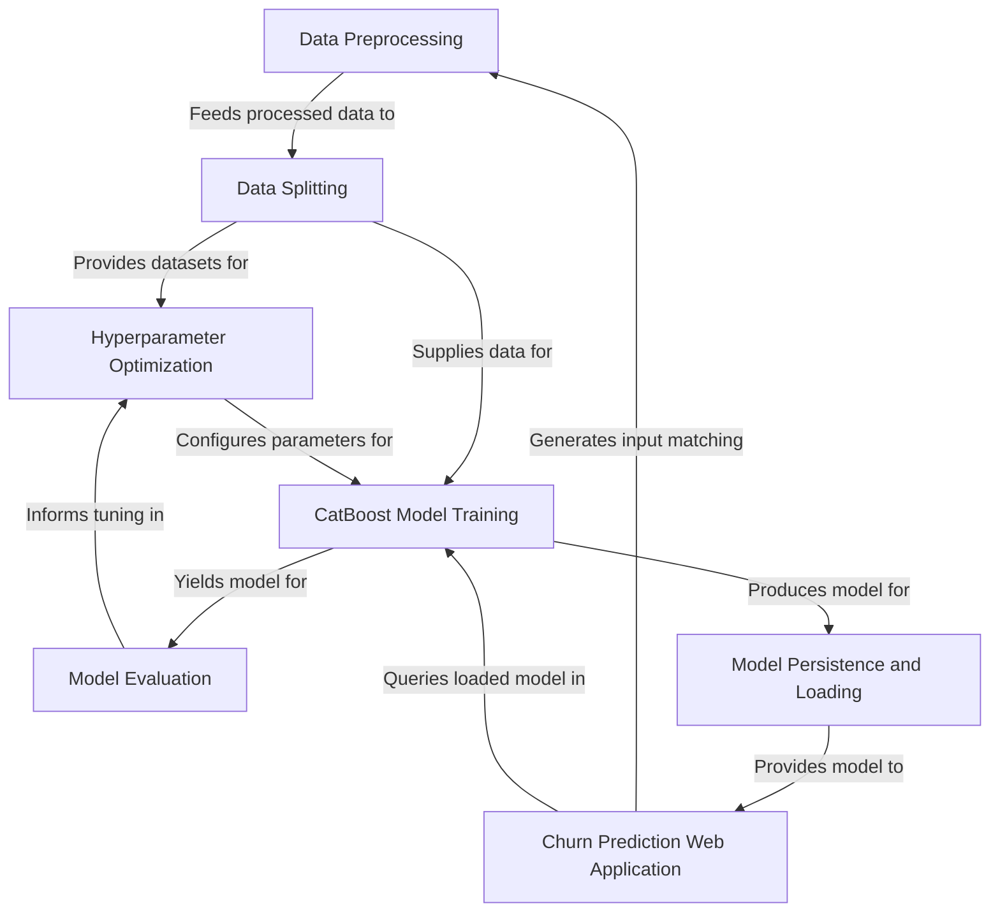

# Tutorial: Telco-churn

This project helps a *Telco company* predict which customers are likely to **churn** (cancel their service). It uses a powerful **CatBoost machine learning model** to learn from past customer data, identifying patterns that lead to churn. The project then provides a user-friendly *web application* where employees can input customer details and instantly see a **churn prediction**, helping the company take proactive measures to retain valuable customers.

**Source Repository:** [https://github.com/Prathamesh282/Telco-churn](https://github.com/Prathamesh282/Telco-churn)

## Chapters

1. [Churn Prediction Web Application
](01_churn_prediction_web_application_.md)
2. [Model Persistence and Loading
](02_model_persistence_and_loading_.md)
3. [CatBoost Model Training
](03_catboost_model_training_.md)
4. [Data Preprocessing
](04_data_preprocessing_.md)
5. [Data Splitting
](05_data_splitting_.md)
6. [Hyperparameter Optimization
](06_hyperparameter_optimization_.md)
7. [Model Evaluation
](07_model_evaluation_.md)

---

Generated by [AI Codebase Knowledge Builder]