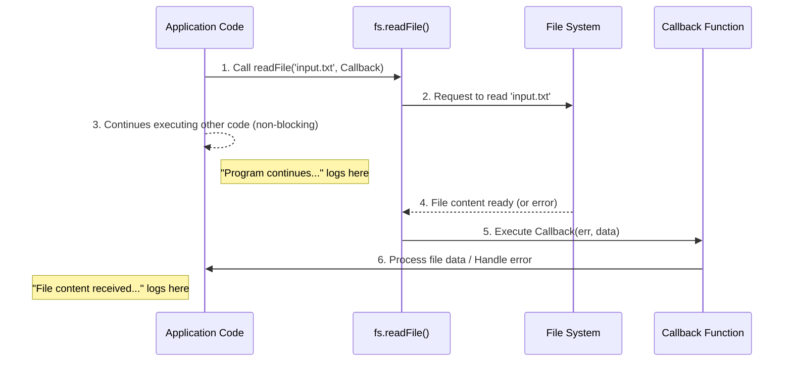

# Chapter 1: Asynchronous JavaScript & Callbacks

Imagine you're at a restaurant. If the restaurant worked *synchronously*, you'd order your food, and then the waiter would stand there, doing nothing else, waiting for your food to be cooked, cooked, brought to your table, and *only then* would they take another customer's order. That would be very slow and inefficient!

In the real world, restaurants work *asynchronously*. You place your order, and the waiter immediately goes to take another customer's order. Meanwhile, the kitchen is preparing your food. When your food is ready, the kitchen calls the waiter, who then delivers it to you. This way, many tasks can happen at the same time, making everything much faster.

## What is Asynchronous JavaScript?

Asynchronous programming in JavaScript allows your program to start a task that might take a long time (like fetching data from the internet, reading a file, or waiting for a timer) and then *continue executing other code* without waiting for that long task to finish. Once the long task completes, it notifies your program, and you can then handle its results.

This is crucial for modern applications:
*   **Web Browsers**: Your webpage doesn't freeze while loading images or data.
*   **Node.js Servers**: Your server can handle thousands of user requests concurrently without getting stuck on one slow operation.

## Introducing Callbacks

A **callback function** is a function that you pass as an argument to another function. The "other function" then "calls back" your callback function at a later point in time, usually when an asynchronous task has completed or an event has occurred.

Think of it as giving someone your phone number (the callback function) and telling them, "Call me when you have the information." You don't wait on the line; you go do other things. When they have the info, they call you back.

### Anatomy of a Callback

Let's look at a simple conceptual example:

```javascript
function performAsyncTask(callbackFunction) {
  console.log("Starting async task...");
  // Simulate a delay (like reading a file or network request)
  setTimeout(() => {
    const data = "Data loaded successfully!";
    callbackFunction(data); // "Call back" with the data
  }, 1000); // Wait for 1 second
}

console.log("Before async task");

performAsyncTask(function(result) {
  console.log("Inside callback:", result);
});

console.log("After async task call (program continues immediately)");
```

When you run this, you'll see:
1.  "Before async task"
2.  "Starting async task..."
3.  "After async task call (program continues immediately)"
4.  *(1 second later)* "Inside callback: Data loaded successfully!"

Notice how "After async task call..." printed *before* the callback executed. This demonstrates the non-blocking nature of asynchronous operations.

## Callbacks in Node.js: Reading Files

In Node.js, the built-in `fs` (File System) module uses callbacks extensively for operations like reading or writing files. This prevents your Node.js server from freezing while it waits for the hard drive to respond.

Here's an example of reading a file asynchronously using `fs.readFile`:

```javascript
const fs = require('fs'); // Import the File System module

console.log("Program started: Reading 'input.txt'...");

// fs.readFile is an asynchronous function
fs.readFile('input.txt', function (err, data) {
  // This function is the CALLBACK
  // It will be executed ONLY AFTER fs.readFile is done
  if (err) {
    console.error("Error reading file:", err);
    return;
  }
  // If no error, 'data' contains the file content
  console.log("File content received:", data.toString());
});

console.log("Program continues: Other tasks can run while file loads.");
```

In this code:
*   `fs.readFile()` takes two main arguments:
    1.  The path to the file (`'input.txt'`).
    2.  The **callback function** `function (err, data) { ... }`.
*   Node.js starts reading `input.txt` and immediately moves on to execute `console.log("Program continues...")`.
*   When the file system finishes reading `input.txt` (which might take milliseconds or more), it invokes the callback function.
*   The callback function receives two arguments:
    *   `err`: An `Error` object if something went wrong (e.g., file not found). It will be `null` if successful.
    *   `data`: The content of the file, typically as a `Buffer` object, if the read was successful.

### Visualizing the Asynchronous Flow

Here's how the `fs.readFile` process works with a callback:



Understanding callbacks is fundamental to working with JavaScript, especially in environments like Node.js, where most I/O operations (like file access or network requests) are asynchronous by default to ensure maximum performance and responsiveness.

---

Generated by [AI Codebase Knowledge Builder]