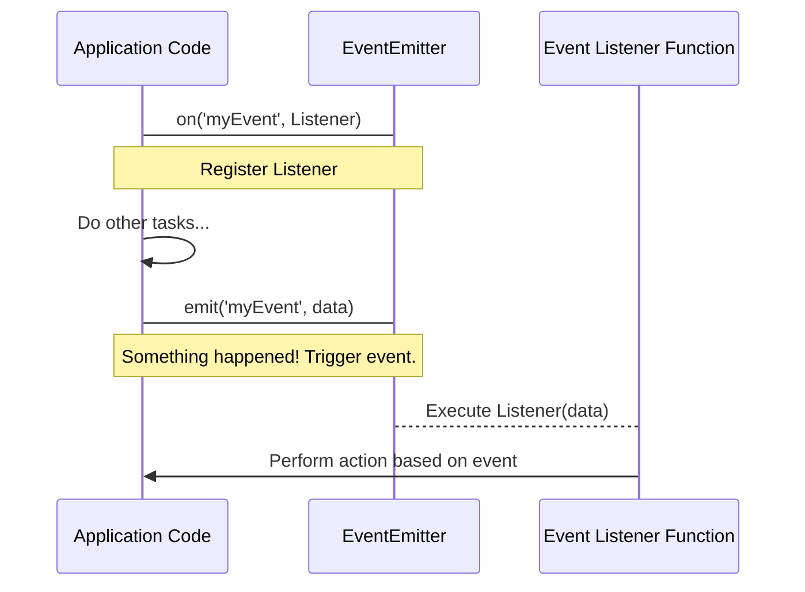

# Chapter 2: Event-Driven Programming (Node.js)

Welcome to Chapter 2! In the previous chapter, we touched upon asynchronous JavaScript. Now, we'll dive into a core concept that makes Node.js incredibly powerful for building responsive and efficient applications: **Event-Driven Programming**.

## What is Event-Driven Programming?

Imagine you're at a coffee shop. You place an order (an "event"). You don't stand there blocking the counter, waiting for your coffee to be made. Instead, you wait for your name to be called (you "listen" for an event), and only then do you react by picking up your coffee.

In programming, Event-Driven Programming means your application is designed to react to specific actions or "events." Instead of following a strict, linear flow, the application waits for things to happen and then executes the relevant code. This is fundamental to Node.js, allowing it to handle many operations concurrently without getting stuck.

Common examples of events:
*   A user clicking a button on a webpage.
*   A web server receiving a new request.
*   A file finishing its read/write operation.
*   Data arriving over a network connection.

## The `events` Module and `EventEmitter`

Node.js provides a built-in `events` module, which offers a powerful tool called `EventEmitter`. Think of `EventEmitter` as a central hub for managing events.

Here's how it works:
1.  **Emit an event:** A part of your code decides that something noteworthy has happened and "emits" a named event (e.g., `'data_received'`, `'user_logged_in'`).
2.  **Listen for an event:** Another part of your code "listens" for that specific named event. When the event is emitted, the predefined function (called a "listener") associated with it automatically executes.

This mechanism helps create responsive applications, much like a server processing multiple requests simultaneously without waiting for one to finish before starting the next.

Let's look at a simple example using the `EventEmitter`:

```javascript
// Import the events module
const EventEmitter = require('node:events');

// Create a new EventEmitter instance
const myEmitter = new EventEmitter();

// 1. Define a listener: What to do when 'greet' event happens
myEmitter.on('greet', (name) => {
  console.log(`Hello, ${name}! Welcome.`);
});

// 2. Emit the 'greet' event
myEmitter.emit('greet', 'Alice');
console.log('Event emitted.');

// You can emit the same event multiple times
myEmitter.emit('greet', 'Bob');
```

**Output:**
```
Hello, Alice! Welcome.
Event emitted.
Hello, Bob! Welcome.
```

In this code:
*   We create `myEmitter`.
*   We use `myEmitter.on('greet', ...)` to tell `myEmitter`: "When you hear a 'greet' event, run this function."
*   We then use `myEmitter.emit('greet', 'Alice')` to trigger the 'greet' event, passing 'Alice' as data. The listener then uses this data.

## How Event-Driven Programming Works (Simplified)



## Why is it important in Node.js?

Node.js is inherently event-driven. Many of its core modules, like the `http` module for building web servers or the `fs` module for file operations, are built upon this paradigm. When an HTTP server receives a request, it emits a `'request'` event. When a file stream has new data, it emits a `'data'` event. This non-blocking nature allows Node.js to handle thousands of concurrent connections efficiently, making it ideal for real-time applications and APIs.

Understanding `EventEmitter` will be crucial as we explore building web servers and more complex applications in the upcoming chapters. It's the engine that drives Node.js's ability to be fast and scalable.

Next, we'll see how Node.js leverages this event-driven model to build powerful web servers using Express.

---

Generated by [AI Codebase Knowledge Builder]