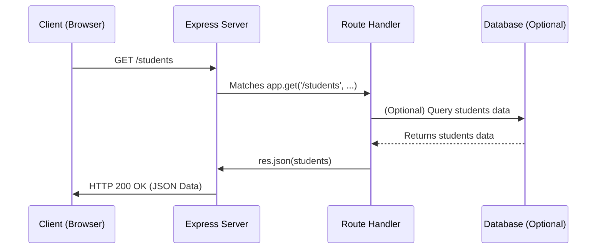

# Chapter 3: Node.js Express Web Server & Routing

In the previous chapters, we explored asynchronous JavaScript and event-driven programming with Node.js. Now, we'll see how to leverage Node.js to build actual web applications and APIs using Express, a minimal and flexible Node.js web application framework.

Express simplifies the process of creating web servers, handling requests, defining routes, and managing responses, making it a popular choice for developers.

### What is Express.js?

Express.js is a framework that sits on top of Node.js's built-in HTTP module. It provides a robust set of features for web and mobile applications, including:
*   **Routing:** Directing different types of requests (like `/home`, `/about`, `/users`) to specific code.
*   **Middleware:** Functions that have access to the request object (`req`), the response object (`res`), and the next middleware function in the application’s request-response cycle.
*   **Template Engines:** Support for rendering dynamic HTML content.
*   **HTTP Utility Methods:** Easy ways to send various types of responses (HTML, JSON, files).

### Setting Up an Express Server

To get started, you first need to install Express in your Node.js project. If you haven't already, initialize a Node.js project:

```bash
mkdir my-express-app
cd my-express-app
npm init -y
npm install express
```

Now, let's create a basic Express server that listens for incoming web requests:

```javascript
// server.js
const express = require('express'); // 1. Import Express
const app = express();              // 2. Create an Express application
const port = 3000;                  // 3. Define the port

// 4. Define a basic route for the root URL ("/")
app.get('/', (req, res) => {
  res.send('Hello from your Express Server!');
});

// 5. Start the server and listen on the specified port
app.listen(port, () => {
  console.log(`Server running on http://localhost:${port}`);
});
```

To run this server, save the code as `server.js` and execute:
```bash
node server.js
```
Then, open your web browser and navigate to `http://localhost:3000/`. You should see the message "Hello from your Express Server!".

### Understanding Routing

Routing is how your server determines how to respond to a client request to a particular endpoint. An endpoint is a combination of a URL (e.g., `/students`) and an HTTP request method (e.g., GET, POST, DELETE).

Express uses methods like `app.get()`, `app.post()`, `app.delete()`, and `app.put()` to define routes for different HTTP verbs.

#### GET Requests (Retrieving Data)

The `app.get()` method handles requests to retrieve data from the server.

```javascript
// ... (previous server setup) ...

// Route to get a list of students
app.get('/students', (req, res) => {
  const students = [
    { id: 1, name: 'Alice' },
    { id: 2, name: 'Bob' },
    { id: 3, name: 'Charlie' }
  ];
  res.json(students); // Send JSON response
});

// ... (app.listen) ...
```
If you visit `http://localhost:3000/students` in your browser, you'll see a JSON array of student data. `res.json()` is a convenient way to send JSON responses.

#### POST Requests (Sending Data)

The `app.post()` method handles requests to send data to the server, typically to create a new resource.

```javascript
// ... (previous server setup) ...

// Route to add a new student
app.post('/students', (req, res) => {
  // In a real app, you'd extract data from req.body and save it
  res.send('New student added successfully!');
});

// ... (app.listen) ...
```
You can test POST requests using tools like Postman, Insomnia, or browser developer tools.

#### DELETE Requests (Removing Data)

The `app.delete()` method handles requests to remove data from the server. Often, these routes include route parameters to specify which item to delete.

```javascript
// ... (previous server setup) ...

// Route to delete a student by ID
app.delete('/students/:id', (req, res) => {
  const studentId = req.params.id; // Access route parameter
  // In a real app, you'd use studentId to delete from a database
  res.send(`Student with ID ${studentId} deleted.`);
});

// ... (app.listen) ...
```
Here, `:id` is a route parameter. When a request like `/students/5` comes in, `req.params.id` will be `5`.

### How Express Handles a Request

This sequence diagram illustrates how a client's request is handled by an Express server.



In summary, Express provides a powerful yet easy-to-use framework for building web applications. By defining routes and using appropriate HTTP methods, you can create a structured way for your server to interact with clients.

---

Generated by [AI Codebase Knowledge Builder]