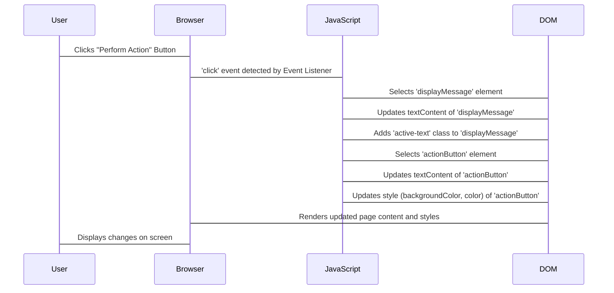

# Chapter 4: DOM Manipulation (Vanilla JavaScript)

Hello, `WC` students! So far, we've explored the server side of web programming with Node.js and Express. Now, it's time to dive into the client side – what happens in the user's web browser! This chapter introduces you to the **Document Object Model (DOM)** and how to manipulate it using plain, "vanilla" JavaScript.

---

### What is the DOM?

Imagine a web page as a house. The HTML is like the blueprint, defining the rooms, windows, and doors. The CSS is like the interior design, giving colors, furniture styles, and layouts. The **DOM** is like an interactive, living representation of that house that JavaScript can understand and change.

The DOM is a **programming interface** for web documents. When your browser loads an HTML page, it creates a tree-like structure in memory, where each HTML element, attribute, and text is a "node." JavaScript can then access and modify this tree structure.

**Key takeaway:** The DOM allows JavaScript to interact with the HTML and CSS of a web page, making it dynamic and interactive.

### Why Manipulate the DOM?

DOM manipulation is fundamental to creating dynamic and responsive web pages. With it, you can:
*   **Update content:** Change text, images, or links without reloading the page.
*   **Change styles:** Modify colors, sizes, visibility, or positions of elements based on user actions.
*   **Add/remove elements:** Dynamically generate new content (like a new item in a to-do list) or remove old content.
*   **Respond to user interactions:** Make things happen when a user clicks a button, types into a field, or moves their mouse.

This is the core of client-side interactivity!

### Selecting Elements: Finding Your Way Around

Before you can change an element, you need to find it! JavaScript provides several methods to select elements from the DOM.

#### 1. By ID

The fastest way to select a single unique element is by its `id` attribute.

```html
<!-- index.html -->
<h1 id="main-title">Welcome to DOM Wonderland!</h1>
```

```javascript
// script.js
const titleElement = document.getElementById('main-title');
console.log(titleElement.textContent); // Output: Welcome to DOM Wonderland!
```

#### 2. By CSS Selectors (Query Selector)

`querySelector()` and `querySelectorAll()` are incredibly powerful, as they let you use CSS selectors to find elements.

*   `querySelector()`: Returns the *first* element that matches the specified CSS selector.
*   `querySelectorAll()`: Returns a *NodeList* (similar to an array) of *all* elements that match the selector.

```html
<!-- index.html -->
<div class="card">
    <p>Item 1</p>
</div>
<div class="card">
    <p class="special-text">Item 2</p>
</div>
<button id="myButton">Click Me</button>
```

```javascript
// script.js
const firstCard = document.querySelector('.card');
console.log(firstCard); // Selects the first div with class 'card'

const allParagraphs = document.querySelectorAll('p');
console.log(allParagraphs.length); // Output: 2

const button = document.querySelector('#myButton'); // Selects by ID using a CSS selector
console.log(button.tagName); // Output: BUTTON

const specialText = document.querySelector('.card .special-text'); // Descendant selector
console.log(specialText.textContent); // Output: Item 2
```

### Modifying Elements: Changing Content and Style

Once you have an element, you can change almost anything about it!

#### 1. Changing Text Content

*   `textContent`: Changes or gets the text content of an element, ignoring HTML tags within it. Safe.
*   `innerHTML`: Changes or gets the HTML content inside an element. Be careful with user input, as it can introduce security vulnerabilities (XSS).

```html
<!-- index.html -->
<p id="message">Hello there!</p>
<div id="container"></div>
```

```javascript
// script.js
const messageElement = document.getElementById('message');
messageElement.textContent = 'Goodbye world!'; // Changes text content
console.log(messageElement.textContent); // Output: Goodbye world!

const containerDiv = document.getElementById('container');
containerDiv.innerHTML = '<h2>New Heading</h2><p>Some new content.</p>'; // Adds HTML
```

#### 2. Changing Attributes

You can get or set HTML attributes like `id`, `class`, `src`, `href`, etc.

```html
<!-- index.html -->

<a id="myLink" href="https://example.com">Visit Example</a>
```

```javascript
// script.js
const image = document.getElementById('myImage');
image.setAttribute('src', 'new-image.jpg'); // Changes the 'src' attribute
image.alt = 'A beautiful new image'; // Another way to change common attributes

const link = document.getElementById('myLink');
link.href = 'https://developer.mozilla.org'; // Changes the 'href' attribute
console.log(link.getAttribute('href')); // Output: https://developer.mozilla.org
```

#### 3. Changing Styles

Directly modify an element's CSS properties using its `style` property. Note that CSS properties like `background-color` become `backgroundColor` in JavaScript (camelCase).

```html
<!-- index.html -->
<p id="styled-text">I want to be colorful!</p>
```

```javascript
// script.js
const styledText = document.getElementById('styled-text');
styledText.style.color = 'blue';
styledText.style.fontSize = '20px';
styledText.style.fontWeight = 'bold';
styledText.style.backgroundColor = '#f0f0f0';
```

#### 4. Managing CSS Classes

A better way to manage styles is by adding or removing CSS classes. This keeps your JavaScript focused on behavior and your CSS focused on presentation.

```html
<!-- index.html -->
<style>
    .highlight {
        background-color: yellow;
        border: 2px solid orange;
    }
    .hidden {
        display: none;
    }
</style>
<button id="toggleBtn">Toggle Highlight</button>
<p id="class-demo">This text will be highlighted.</p>
```

```javascript
// script.js
const classDemo = document.getElementById('class-demo');
classDemo.classList.add('highlight');    // Adds the 'highlight' class
classDemo.classList.remove('hidden');    // Removes the 'hidden' class
classDemo.classList.toggle('highlight'); // Toggles: removes 'highlight' if present, adds if not
console.log(classDemo.classList.contains('highlight')); // Checks if class is present (false after toggle)
```

### Creating and Deleting Elements

You're not limited to just changing existing elements; you can also create entirely new ones or remove old ones.

#### 1. Creating Elements

```javascript
// script.js
const newDiv = document.createElement('div'); // Creates a new <div> element
newDiv.textContent = 'I am a brand new div!';
newDiv.style.color = 'green';
newDiv.classList.add('new-item');

// You need to add it to the document to see it!
const body = document.querySelector('body');
body.appendChild(newDiv); // Appends newDiv as the last child of the body
```

#### 2. Appending and Prepending Elements

*   `appendChild(element)`: Adds an element as the last child of the parent.
*   `prepend(element)`: Adds an element as the first child of the parent.

```html
<!-- index.html -->
<ul id="myList">
    <li>Existing Item</li>
</ul>
```

```javascript
// script.js
const list = document.getElementById('myList');

const newItem1 = document.createElement('li');
newItem1.textContent = 'New Item (last)';
list.appendChild(newItem1); // Adds to the end

const newItem2 = document.createElement('li');
newItem2.textContent = 'New Item (first)';
list.prepend(newItem2); // Adds to the beginning
```

#### 3. Removing Elements

*   `parentNode.removeChild(childElement)`: Removes a specified child element from its parent.
*   `element.remove()`: A simpler way to remove an element directly (newer browsers).

```html
<!-- index.html -->
<div id="parent">
    <p id="child1">I will be removed!</p>
    <p id="child2">I will stay.</p>
</div>
```

```javascript
// script.js
const parentDiv = document.getElementById('parent');
const child1 = document.getElementById('child1');

// Method 1: using removeChild (needs parent)
parentDiv.removeChild(child1);

// Method 2: using remove() (simpler if element reference exists)
// const child2 = document.getElementById('child2');
// child2.remove(); // This would remove child2 if uncommented
```

### Putting It All Together: A Simple Interactive Example

Let's create a button that changes a paragraph's text and style when clicked.

```html
<!-- index.html -->
<!DOCTYPE html>
<html lang="en">
<head>
    <meta charset="UTF-8">
    <meta name="viewport" content="width=device-width, initial-scale=1.0">
    <title>DOM Interaction</title>
    <style>
        body { font-family: Arial, sans-serif; text-align: center; margin-top: 50px; }
        .active-text { color: purple; font-weight: bold; }
    </style>
</head>
<body>
    <h1 id="pageTitle">My Interactive Page</h1>
    <p id="displayMessage">Click the button below to see some magic!</p>
    <button id="actionButton">Perform Action</button>

    <script src="script.js"></script>
</body>
</html>
```

```javascript
// script.js
// 1. Get references to the elements we want to interact with
const actionButton = document.getElementById('actionButton');
const displayMessage = document.getElementById('displayMessage');

// 2. Add an event listener to the button
actionButton.addEventListener('click', function() {
    // 3. When the button is clicked, perform DOM manipulations
    displayMessage.textContent = 'The button was clicked! DOM changed!'; // Change text
    displayMessage.classList.add('active-text'); // Add a CSS class

    // Change button text
    actionButton.textContent = 'Action Performed!';
    actionButton.style.backgroundColor = '#4CAF50'; // Change button style directly
    actionButton.style.color = 'white';
});
```

Here's how this interaction flows:



### Summary

In this chapter, you've learned:
*   The **Document Object Model (DOM)** is JavaScript's interface to an HTML page.
*   How to **select elements** using `document.getElementById()` and `document.querySelector()`/`querySelectorAll()`.
*   How to **modify element content** with `textContent` and `innerHTML`.
*   How to **change attributes** using `setAttribute()` or direct property access.
*   How to **manipulate styles** directly via `element.style` or, preferably, by adding/removing **CSS classes** using `classList`.
*   How to **create new elements** with `document.createElement()` and **add them to the page** with `appendChild()`/`prepend()`.
*   How to **remove elements** with `removeChild()` or `remove()`.

DOM manipulation is the cornerstone of interactive web development. With these skills, you can make your static web pages come alive! In the next chapter, we'll build on this by looking at how to handle form submissions and validate user input on the client side.

---

Generated by [AI Codebase Knowledge Builder]