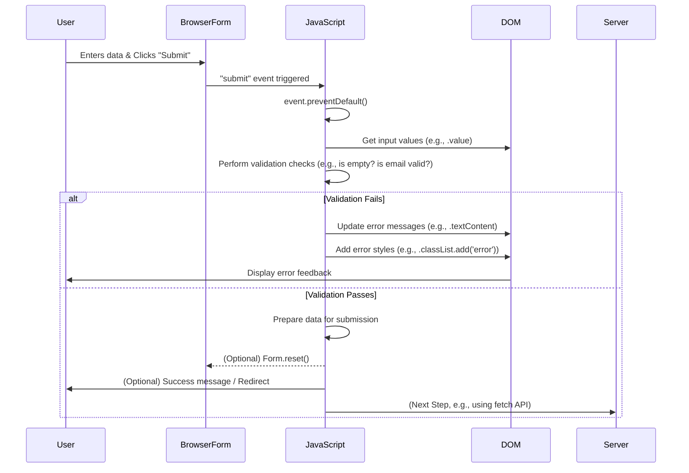

# Chapter 5: Client-Side Form Handling & Validation

Welcome to Chapter 5! In the previous chapter, we learned how to manipulate the Document Object Model (DOM) using vanilla JavaScript. This skill is crucial for building interactive web pages, and nowhere is it more evident than in handling web forms.

Web forms are the primary way users interact with your application to submit data – think registration forms, login pages, or contact forms. **Client-side form handling** refers to how we capture this user input, and **client-side validation** is the process of checking if that input is correct and complete *before* it's sent to a server.

### Why Client-Side Validation?

1.  **Instant Feedback:** Users get immediate notification if something is wrong, improving the user experience.
2.  **Reduced Server Load:** Invalid data is caught at the client, preventing unnecessary requests to your server.
3.  **Better User Experience:** Guides users to provide correct information, making forms less frustrating.

### Basic Form Structure (HTML)

Let's start with a simple HTML form.

```html
<form id="registrationForm">
    <label for="username">Username:</label>
    <input type="text" id="username" name="username" required>
    <span id="usernameError" class="error-message"></span>

    <label for="email">Email:</label>
    <input type="email" id="email" name="email" required>
    <span id="emailError" class="error-message"></span>

    <button type="submit">Register</button>
</form>
```

We've added `id` attributes to our `input` fields and `span` elements. These `id`s will be essential for our JavaScript to access and manipulate them. The `required` attribute provides basic browser-level validation, but we'll implement more robust custom validation.

### Capturing User Input with JavaScript

To validate the form, we first need to get the values the user has typed. We do this by selecting the form elements using their `id`s and accessing their `value` property.

```javascript
// Get references to form elements
const form = document.getElementById('registrationForm');
const usernameInput = document.getElementById('username');
const emailInput = document.getElementById('email');
const usernameError = document.getElementById('usernameError');
const emailError = document.getElementById('emailError');

// Add an event listener to the form's submit event
form.addEventListener('submit', function(event) {
    // Prevent the default form submission (which would reload the page)
    event.preventDefault();

    // Get the current values from the inputs
    const username = usernameInput.value;
    const email = emailInput.value;

    console.log('Username:', username);
    console.log('Email:', email);

    // ... validation logic will go here ...
});
```

The `event.preventDefault()` line is critical. It stops the browser from performing its default action (submitting the form and refreshing the page), allowing our JavaScript to take control and perform validation first.

### Client-Side Validation Logic

Now, let's add some validation checks. We'll check if the fields are empty and if the email format is valid.

```javascript
// (Previous code for getting elements and event listener)

form.addEventListener('submit', function(event) {
    event.preventDefault();

    const username = usernameInput.value.trim(); // .trim() removes whitespace
    const email = emailInput.value.trim();
    let isValid = true; // Flag to track overall form validity

    // Reset error messages
    usernameError.textContent = '';
    emailError.textContent = '';

    // Validate Username
    if (username === '') {
        usernameError.textContent = 'Username is required.';
        isValid = false;
    }

    // Validate Email
    const emailRegex = /^[^\s@]+@[^\s@]+\.[^\s@]+$/;
    if (email === '') {
        emailError.textContent = 'Email is required.';
        isValid = false;
    } else if (!emailRegex.test(email)) {
        emailError.textContent = 'Please enter a valid email address.';
        isValid = false;
    }

    // If all validation passes, you can proceed with submission (e.g., via AJAX)
    if (isValid) {
        alert('Form submitted successfully!'); // For demonstration
        // Here you would typically send data to a server using fetch() or XMLHttpRequest
        form.reset(); // Clear the form
    }
});
```
In this example, `emailRegex` is a **regular expression** – a powerful tool for matching text patterns. This particular regex checks for a basic email structure. If `isValid` remains `true` after all checks, the form data is considered valid on the client side.

### The Client-Side Validation Flow

Here's a sequence diagram illustrating how client-side validation typically works:



### Bridging to React

While vanilla JavaScript gives you direct control over the DOM, modern web development often uses frameworks like React. In React, form handling and validation are typically managed using **state**. Instead of directly reading `input.value` and manipulating `span.textContent`, you'd store input values in React's state using `useState` hooks.

For example, the beginning of your `App.js` in a React application might look like this:

```jsx
// REACT (Registration_page)/App.js
import { React, useState } from "react";

function App() {
    // State variables to hold form input values
    const [firstName, setFirstName] = useState("");
    const [lastName, setLastName] = useState("");
    const [email, setEmail] = useState("");
    // ... other form fields ...

    // State variables to hold validation errors
    const [firstNameError, setFirstNameError] = useState("");
    const [emailError, setEmailError] = useState("");

    // Event handler for input changes
    const handleFirstNameChange = (event) => {
        setFirstName(event.target.value);
        // Clear error as user types
        setFirstNameError("");
    };

    // Event handler for form submission
    const handleSubmit = (event) => {
        event.preventDefault();
        let isValid = true;

        if (firstName.trim() === "") {
            setFirstNameError("First name is required.");
            isValid = false;
        }
        // ... more validation for email, etc. ...

        if (isValid) {
            console.log("Form data:", { firstName, email });
            // Submit data to server
        }
    };

    return (
        <form onSubmit={handleSubmit}>
            <label>First Name:</label>
            <input type="text" value={firstName} onChange={handleFirstNameChange} />
            {firstNameError && <span className="error-message">{firstNameError}</span>}

            {/* ... other form fields and their handlers ... */}
            <button type="submit">Register</button>
        </form>
    );
}
export default App;
```

In this React example, `useState` manages the values of `firstName` and `email`, and also their corresponding error messages. When an input changes, `onChange` updates the state. When the form is submitted, `handleSubmit` performs validation by checking state values and updating error states, which then automatically re-renders the component to show or hide error messages.

### Conclusion

Client-side form handling and validation are fundamental for creating robust and user-friendly web applications. By using JavaScript to capture input, validate it, and provide immediate feedback, you significantly enhance the user experience and streamline the data collection process. In the next chapter, we'll dive deeper into React, exploring how components and state management simplify these tasks even further.

---

Generated by [AI Codebase Knowledge Builder]