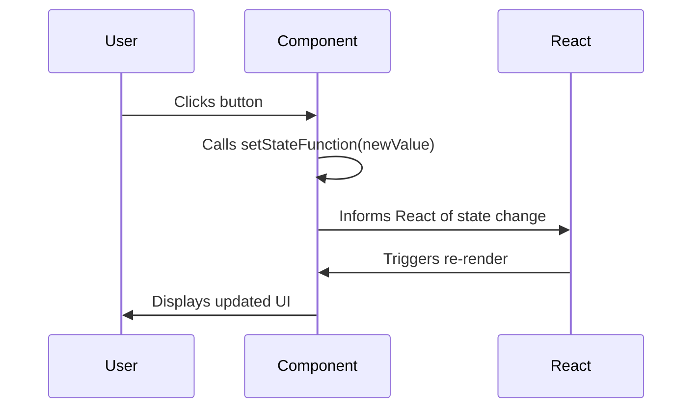

# Chapter 6: React Functional Components & State Management

Welcome to Chapter 6! So far, we've explored the foundations of JavaScript, Node.js, and how to directly manipulate the DOM. While direct DOM manipulation works, it can become complex and hard to manage for large, interactive applications. This is where modern JavaScript frameworks like React come in.

React is a powerful library for building user interfaces. It allows you to break down your UI into independent, reusable pieces called **components**. In this chapter, we'll focus on **Functional Components** and how they use the `useState` hook to manage their internal data, known as **state**.

---

### What are Functional Components?

Imagine building a house. Instead of building the entire house from scratch every time, you'd use pre-made bricks, windows, and doors. In React, functional components are like these pre-made parts.

A functional component is essentially a regular JavaScript function that returns JSX (JavaScript XML), which looks a lot like HTML. React then takes this JSX and efficiently updates your web page.

Here's a simple example:

```jsx
import React from 'react'; // Don't worry about this line for now

function WelcomeMessage() {
  return (
    <h1>Hello, React Component!</h1>
  );
}
```

This `WelcomeMessage` function is a functional component. When React renders it, you'll see "Hello, React Component!" on your page.

---

### The Concept of State

Most interactive web pages need to remember things. Think about a counter that needs to know its current number, or a toggle switch that remembers if it's on or off. This "remembered information" within a component is called its **state**.

When a component's state changes, React automatically knows to re-render that component, showing the updated information to the user. This makes creating dynamic user interfaces much easier and more efficient.

---

### Introducing the `useState` Hook

In functional components, we manage state using a special React function called a **Hook**. The most fundamental hook for state management is `useState`.

`useState` allows your functional components to "hook into" React's state features. Here's how it generally looks:

```jsx
import React, { useState } from 'react';

function Counter() {
  // Declare a new state variable, which we'll call 'count'
  const [count, setCount] = useState(0);

  return (
    // ... JSX using count and calling setCount ...
  );
}
```

Let's break down `const [count, setCount] = useState(0);`:

*   **`useState(0)`**: This is the `useState` hook itself. It takes one argument: the **initial value** for your state (in this case, `0`).
*   **`[count, setCount]`**: `useState` returns an array with two items:
    *   `count`: This is your **state variable**. It holds the current value of the state.
    *   `setCount`: This is a **function** that you use to update the `count` state. When you call `setCount`, React will re-render your component with the new value.

---

### How `useState` Triggers Re-renders

This automatic re-rendering is a core concept. When you call the `setStateFunction` (like `setCount`), React takes care of updating the UI.



---

### Putting it Together: A Simple Counter Example

Let's see `useState` in action with a simple counter:

```jsx
import React, { useState } from 'react';

function SimpleCounter() {
  const [count, setCount] = useState(0);

  const increment = () => {
    setCount(count + 1); // Update the state
  };

  return (
    <div>
      <p>Current Count: {count}</p>
      <button onClick={increment}>Increment</button>
    </div>
  );
}
```

In this example:
1.  `count` starts at `0`.
2.  When the button is clicked, `increment` is called.
3.  `setCount(count + 1)` updates `count` to `1`.
4.  React sees that the state has changed and re-renders `SimpleCounter`.
5.  The `<p>` tag now displays "Current Count: 1".

---

### Managing Form State

The `App.js` code snippet you saw uses `useState` extensively to manage the values of various form inputs. For each piece of information you want to track (first name, email, etc.), you'll declare a separate state variable.

For example, to manage an input field for a first name:

```jsx
import React, { useState } from 'react';

function RegistrationFormSnippet() {
    const [firstName, setFirstName] = useState("");

    const handleFirstNameChange = (event) => {
        setFirstName(event.target.value);
    };

    return (
        <label>
            First Name:
            <input
                type="text"
                value={firstName}
                onChange={handleFirstNameChange}
            />
        </label>
    );
}
```

Here:
*   `firstName` holds the current value of the input field.
*   `setFirstName` is used to update `firstName` whenever the user types.
*   `event.target.value` gives us the current text from the input field.
*   The `value={firstName}` prop makes the input a "controlled component," meaning its value is always dictated by React state.

Your `App.js` snippet shows similar lines for `lastName`, `email`, `contact`, and even for more complex states like `subjects` (an object) or `gender` (a default string). This pattern of pairing `useState` with input elements is fundamental for handling forms in React.

---

### Key Takeaways

*   **Functional Components** are JavaScript functions that return JSX, forming reusable UI blocks.
*   **State** is internal data that a component "remembers."
*   The **`useState` hook** is used in functional components to declare and manage state.
*   `useState` returns an array: `[stateVariable, setStateFunction]`.
*   Calling `setStateFunction` not only updates the state but also tells React to **re-render** the component, showing the latest data.
*   This mechanism makes building dynamic and interactive web pages efficient and manageable.

In the next chapters, we'll continue building on these React fundamentals to create even more sophisticated user interfaces!

---

Generated by [AI Codebase Knowledge Builder]