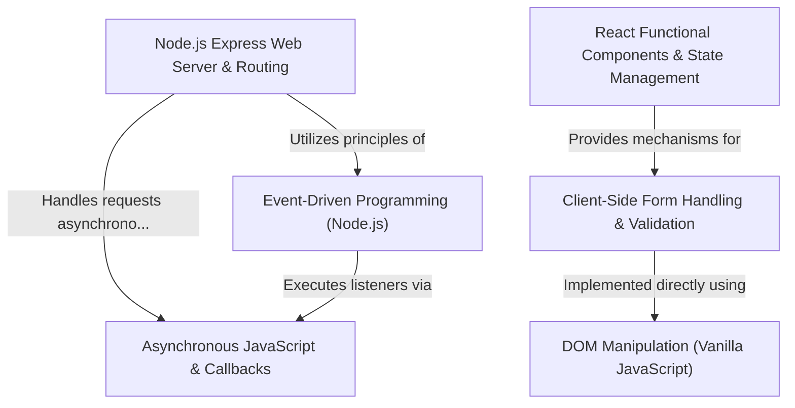

# Tutorial: WC

The project "WC" serves as a comprehensive demonstration of fundamental web development concepts, spanning both backend and frontend technologies. It illustrates backend development using Node.js and the Express framework for setting up web servers, defining routes, and implementing event-driven and asynchronous programming patterns. On the frontend, it showcases React's functional components and state management for building dynamic user interfaces, particularly focusing on client-side form handling and validation. The project also provides examples of client-side form validation and direct DOM manipulation using vanilla JavaScript, offering a holistic view of modern web application architecture and core programming paradigms.

**Source Repository:** [https://github.com/010624/WC](https://github.com/010624/WC)

## Chapters

1. [Asynchronous JavaScript & Callbacks
](01_asynchronous_javascript___callbacks_.md)
2. [Event-Driven Programming (Node.js)
](02_event_driven_programming__node_js__.md)
3. [Node.js Express Web Server & Routing
](03_node_js_express_web_server___routing_.md)
4. [DOM Manipulation (Vanilla JavaScript)
](04_dom_manipulation__vanilla_javascript__.md)
5. [Client-Side Form Handling & Validation
](05_client_side_form_handling___validation_.md)
6. [React Functional Components & State Management
](06_react_functional_components___state_management_.md)

---

Generated by [AI Codebase Knowledge Builder]