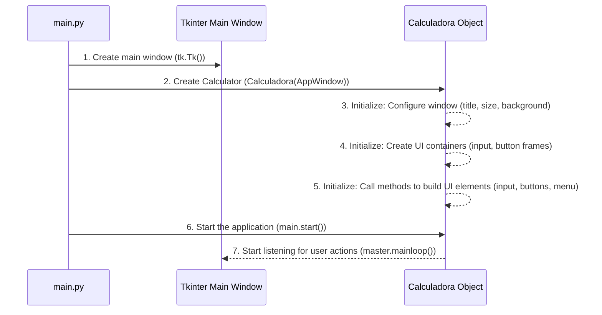

# Chapter 1: Application Bootstrap

Imagine your calculator is like a brand new car. Before you can drive it, honk the horn, or turn on the radio, you first need to put the key in the ignition and turn it! That initial moment, when the engine roars to life and all the dashboard lights come on, is exactly what "Application Bootstrap" is for our `Calculadora Tk` project.

It's the very first part of our code that runs when you launch the application. Its main job is to set up the main window where our calculator will live and make sure everything is ready before you can start pressing buttons. It's the grand opening act!

### The Starting Line: `main.py`

Every Python application needs a starting point. For `calculadora-tk`, this is the `main.py` file. It's a small but mighty file that acts as the "ignition key" for our entire calculator.

Here's what `main.py` looks like:

```python
# main.py
import tkinter as tk
from app.calculadora import Calculadora

if __name__ == '__main__':
    master = tk.Tk()
    main = Calculadora(master)
    main.start()
```

Let's break down what's happening here, line by line:

1.  `import tkinter as tk`: This line brings in the "Tkinter" library. Tkinter is Python's standard way to create graphical user interfaces (GUIs), which means all the windows, buttons, and text fields you see in our calculator are built using this library.
2.  `from app.calculadora import Calculadora`: This line imports our main `Calculadora` class from another file (`app/calculadora.py`). This class contains all the instructions on how to build and operate our calculator.
3.  `if __name__ == '__main__':`: This is a standard Python trick. It ensures that the code inside this block only runs when `main.py` is executed directly (not when it's imported as a module into another file). Think of it as saying, "If *this* is the main program, then do the following..."
4.  `master = tk.Tk()`: This is where our calculator's main window is born! `tk.Tk()` creates the top-level window for our application. We often call this the "root" or "master" window.
5.  `main = Calculadora(master)`: Now we're creating an instance of our `Calculadora` class. We pass the `master` window we just created to it. This tells our `Calculadora` object *which* window it should use to display itself.
6.  `main.start()`: This is the final step in `main.py`! It calls a method within our `Calculadora` object to officially kick off the application and make it visible and interactive to the user.

When you run `main.py`, a new calculator window will appear on your screen, ready for you to use!

### Inside the Calculator's Engine Room (`app/calculadora.py`)

Now, let's peek inside the `Calculadora` class itself, located in `app/calculadora.py`. This is where the magic of preparing the window and drawing the calculator begins.

When we write `main = Calculadora(master)` in `main.py`, a special method inside the `Calculadora` class called `__init__` (short for "initialize") gets called automatically.

#### The Constructor (`__init__`)

The `__init__` method is like receiving the blueprints for our car and starting the assembly process. It sets up all the initial characteristics of our calculator's main window.

Here's a simplified look at the key parts of the `__init__` method related to bootstrapping:

```python
# app/calculadora.py (simplified __init__ method)
import tkinter as tk # Tkinter is used here too
# ... other imports for settings, theme, etc. (we'll cover these later!)

class Calculadora(object):
    def __init__(self, master):
        self.master = master # Our main window from main.py

        # --- Setting up the main window's properties ---
        self.master.title('Calculadora Tk') # Title displayed at the top of the window
        self.master.maxsize(width=335, height=415) # Maximum size the user can resize the window to
        self.master.minsize(width=335, height=415) # Minimum size
        self.master.geometry('-150+100') # Position the window on your screen (e.g., near top-right)
        self.master['bg'] = '#282c34' # Set a basic background color for the main window

        # --- Creating dedicated areas inside the window ---
        self._frame_input = tk.Frame(self.master, bg='#3e4452', pady=4) # Area for the number display
        self._frame_input.pack() # Place this frame in the window

        self._frame_buttons = tk.Frame(self.master, bg='#3e4452', padx=2) # Area for all the calculator buttons
        self._frame_buttons.pack() # Place this frame below the input frame

        # --- Kicking off the creation of calculator components ---
        # These methods will actually draw the input field, buttons, and menu!
        self._create_input(self._frame_input)
        self._create_buttons(self._frame_buttons)
        self._create_menu(self.master)
```

In this code:
*   `self.master` is how our `Calculadora` object refers to the main Tkinter window.
*   We set basic properties like the window's `title`, its `maxsize` and `minsize`, and its starting `geometry` (position on the screen).
*   `self.master['bg']` sets the background color of the main window itself. (The actual project loads theme colors, but we've simplified it here to focus on the core window setup).
*   We create `tk.Frame` objects, which are like invisible containers. `_frame_input` will hold our calculator's display, and `_frame_buttons` will hold all the number and operation buttons. The `.pack()` method tells Tkinter to arrange and make these frames visible.
*   Finally, `_create_input`, `_create_buttons`, and `_create_menu` are called. These methods are responsible for populating the frames with the actual visual elements of the calculator, like the entry field and all the buttons. We'll dive much deeper into how these elements are built and arranged in [Chapter 2: Calculator User Interface (GUI)](02_calculator_user_interface__gui__.md).

#### The Launchpad (`start`)

After `__init__` has prepared everything, the `main.start()` call in `main.py` brings our calculator to life.

```python
# app/calculadora.py (start method)
class Calculadora(object):
    # ... (other methods)

    def start(self):
        print('\33[92mCalculadora Tk Iniciada. . .\33[m\n') # A friendly message in the terminal
        self.master.mainloop() # This is the heart of our GUI!
```

The most important line here is `self.master.mainloop()`. This command tells Tkinter to start listening! It waits for you to click buttons, type, or interact with the window. Without `mainloop()`, the window would just appear for a split second and then vanish. It's what keeps the application running and responsive to your actions.

### How It All Connects: A High-Level Flow

Let's visualize the "bootstrap" process:



This sequence shows how `main.py` hands off the main window to our `Calculadora` class, which then sets everything up before finally starting the main loop to listen for user interactions.

### Conclusion

In this chapter, we've learned about the critical "Application Bootstrap" phase of our `Calculadora Tk` project. We saw how `main.py` acts as the entry point, creating the main window and our `Calculadora` object. We also explored the `__init__` method within the `Calculadora` class, which sets up the basic window properties and prepares the groundwork for the user interface. Finally, `self.master.mainloop()` was introduced as the engine that keeps our application running and responsive.

Now that our calculator's "engine is running" and the "dashboard is set up," the next step is to actually build and place all the visible parts like the display screen and the buttons!

[Next Chapter: Calculator User Interface (GUI)](02_calculator_user_interface__gui__.md)

---

Generated by [AI Codebase Knowledge Builder]