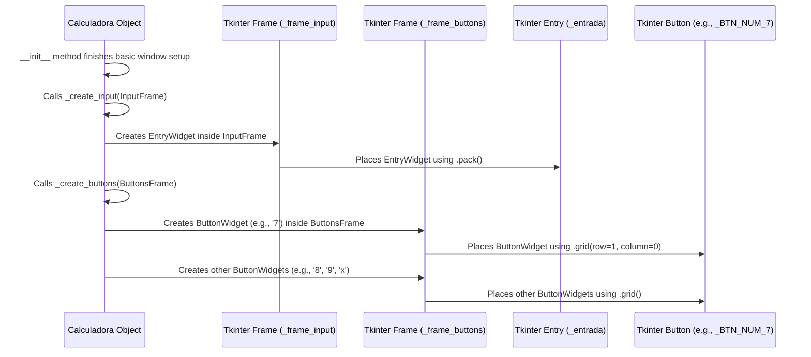

# Chapter 2: Calculator User Interface (GUI)

Welcome back, future Pythonista! In [Chapter 1: Application Bootstrap](01_application_bootstrap_.md), we learned how to "start the engine" of our calculator by setting up its main window. We created an empty canvas, ready for us to draw on. Now, it's time for the exciting part: making our calculator look like, well, a calculator!

Imagine your calculator's main window, which we set up in the previous chapter, is like the empty dashboard of a car. It's just a blank space. The "Calculator User Interface (GUI)" is all about adding the speedometer, the radio, the air conditioning controls, and all the buttons you push to make the car do things. For our calculator, this means adding the display screen, all the numeric buttons (0-9), the operator buttons (+, -, \*, /), and even the menu at the top.

This chapter will guide you through how `Calculadora Tk` creates and arranges all these visual elements. Our main goal is to understand how the calculator gets its 'face' – specifically, how the input display appears and how the number and operator buttons are carefully placed so you can interact with them.

### Building Blocks of a GUI: Frames, Entry, and Buttons

In Tkinter (the Python library we use for GUIs), we don't just throw everything onto the window randomly. We use special "building blocks" to organize things.

1.  **Frames (`tk.Frame`)**: Think of these as invisible containers or sections within your main window. Just like a car's dashboard might have a section for the radio and another for the climate control, frames help us organize our calculator into logical areas. In Chapter 1, we already saw two frames being created: `_frame_input` (for the display) and `_frame_buttons` (for all the buttons).

2.  **The Display Screen (`tk.Entry`)**: This is where you see the numbers you type and the results of your calculations. It's like the car's speedometer, showing you important information. In Tkinter, we use a `tk.Entry` widget for this. It's a single line text box that users can type into or that the program can update.

3.  **Buttons (`tk.Button`)**: These are the interactive elements you click! Every number, every operator, and every function like "Clear" or "Equals" is a `tk.Button`. These are your car's radio buttons or hazard light switch.

### Arranging Elements: The Grid Layout

Once you have your building blocks (frames, entry, buttons), you need a way to arrange them neatly. Tkinter offers several "layout managers," and our `Calculadora Tk` project uses the `grid()` manager.

The `grid()` manager is like a spreadsheet or a chessboard. You divide your frame into rows and columns, and then you tell each widget (like a button) which row and column it should sit in. This makes it super easy to create structured layouts, like the 4x5 or 5x4 grid of buttons you see on most calculators.

### The Calculator's Face: Inside `_create_input` and `_create_buttons`

In [Chapter 1: Application Bootstrap](01_application_bootstrap_.md), we saw that our `Calculadora` class's `__init__` method calls `_create_input` and `_create_buttons`. These are the core methods responsible for actually drawing the visual components of our calculator.

Let's look at simplified versions of these methods in `app/calculadora.py`.

#### Creating the Input Display

The `_create_input` method is quite straightforward. Its job is to create the single line entry field where numbers and results will appear.

```python
# app/calculadora.py (simplified _create_input method)
import tkinter as tk # Needed for tk.Entry

class Calculadora(object):
    # ... (other methods)

    def _create_input(self, master):
        # 'master' here refers to the _frame_input we created earlier
        self._entrada = tk.Entry(master, cnf=self.theme['INPUT'])
        self._entrada.insert(0,0) # Start with '0' displayed
        self._entrada.pack()      # Make the entry field visible
```

**Explanation:**
1.  `self._entrada = tk.Entry(master, ...)`: This line creates the actual text entry box.
    *   `master`: We pass `_frame_input` here, telling Tkinter that this entry box should live inside our input frame.
    *   `cnf=self.theme['INPUT']`: This is how we apply styling (like font size, text color, background color) to our input field. We'll explore themes in [Chapter 5: Theme and Settings Management](05_theme_and_management.md). For now, just know it makes it look pretty!
2.  `self._entrada.insert(0,0)`: This puts a default `0` into the entry field when the calculator first starts.
3.  `self._entrada.pack()`: This is a simpler layout manager that just places the widget. Since `_frame_input` only contains this one `tk.Entry` widget, `pack()` is sufficient to make it visible within the frame.

#### Creating and Arranging Buttons

This is where the `grid()` layout manager shines! The `_create_buttons` method creates *all* the number and operator buttons and arranges them neatly.

```python
# app/calculadora.py (simplified _create_buttons method)
import tkinter as tk # Needed for tk.Button

class Calculadora(object):
    # ... (other methods)

    def _create_buttons(self, master):
        # 'master' here refers to the _frame_buttons we created earlier

        # Update global settings (covered in Chapter 5)
        # self.theme['BTN_NUMERICO'].update(self.settings['global'])
        # self.theme['BTN_OPERADOR'].update(self.settings['global'])
        # self.theme['BTN_DEFAULT'].update(self.settings['global'])

        # Create numeric buttons (example: 7, 8, 9)
        self._BTN_NUM_7 = tk.Button(master, text='7', cnf=self.theme['BTN_NUMERICO'])
        self._BTN_NUM_8 = tk.Button(master, text='8', cnf=self.theme['BTN_NUMERICO'])
        self._BTN_NUM_9 = tk.Button(master, text='9', cnf=self.theme['BTN_NUMERICO'])

        # Create an operator button (example: multiply)
        self._BTN_MULT = tk.Button(master, text='x', cnf=self.theme['BTN_OPERADOR'])

        # --- Arranging buttons using the grid layout ---
        # Imagine a grid:
        # (0,0) (0,1) (0,2) (0,3)
        # (1,0) (1,1) (1,2) (1,3)  <-- This is where 7, 8, 9, x will go

        # Place 7, 8, 9, x on "Line 1" of our button grid
        self._BTN_NUM_7.grid(row=1, column=0, padx=1, pady=1) # Row 1, Column 0
        self._BTN_NUM_8.grid(row=1, column=1, padx=1, pady=1) # Row 1, Column 1
        self._BTN_NUM_9.grid(row=1, column=2, padx=1, pady=1) # Row 1, Column 2
        self._BTN_MULT.grid(row=1, column=3, padx=1, pady=1) # Row 1, Column 3

        # ... (many more buttons and their grid placements would go here)
        # We'll learn about associating actions (like calculation) in
        # [Chapter 4: User Input and Display Management](04_user_input_and_display_management_.md)
```

**Explanation:**
1.  `self._BTN_NUM_7 = tk.Button(master, text='7', ...)`: This creates a button.
    *   `master`: The `_frame_buttons` is passed here, meaning all these buttons will appear inside our button frame.
    *   `text='7'`: This is the label that appears on the button.
    *   `cnf=self.theme['BTN_NUMERICO']`: Again, this applies the styling for numeric buttons (colors, font, etc.).
2.  `self._BTN_NUM_7.grid(row=1, column=0, padx=1, pady=1)`: This is the magic of the `grid` manager!
    *   `row=1`, `column=0`: This tells Tkinter exactly where to place the button within the `_frame_buttons` grid. `row=1` means the second row (since counting starts from 0), and `column=0` means the first column.
    *   `padx=1`, `pady=1`: These add a little bit of empty space (padding) around the button, making it look less cramped.

By repeating this pattern for all the buttons, `_create_buttons` builds up the entire calculator keypad!

### How the GUI Comes Together: A Simplified Flow

Let's visualize how `Calculadora` creates its user interface after the application has bootstrapped:



This diagram shows that our `Calculadora` object orchestrates the creation of the user interface. It tells the `_frame_input` to create the display and the `_frame_buttons` to create and arrange all the buttons.

### Conclusion

In this chapter, we've explored the "Calculator User Interface (GUI)" and how `Calculadora Tk` builds its visual elements. We learned about `tk.Frame` as containers, `tk.Entry` for the display, and `tk.Button` for interactive clicks. Crucially, we saw how the `grid()` layout manager is used to arrange buttons neatly into rows and columns, giving our calculator its familiar layout.

Now that our calculator has a beautiful face with all its buttons and display, the next big question is: How does it actually perform calculations? That's what we'll explore in the next chapter!

[Next Chapter: Mathematical Core](03_mathematical_core_.md)

---

Generated by [AI Codebase Knowledge Builder]