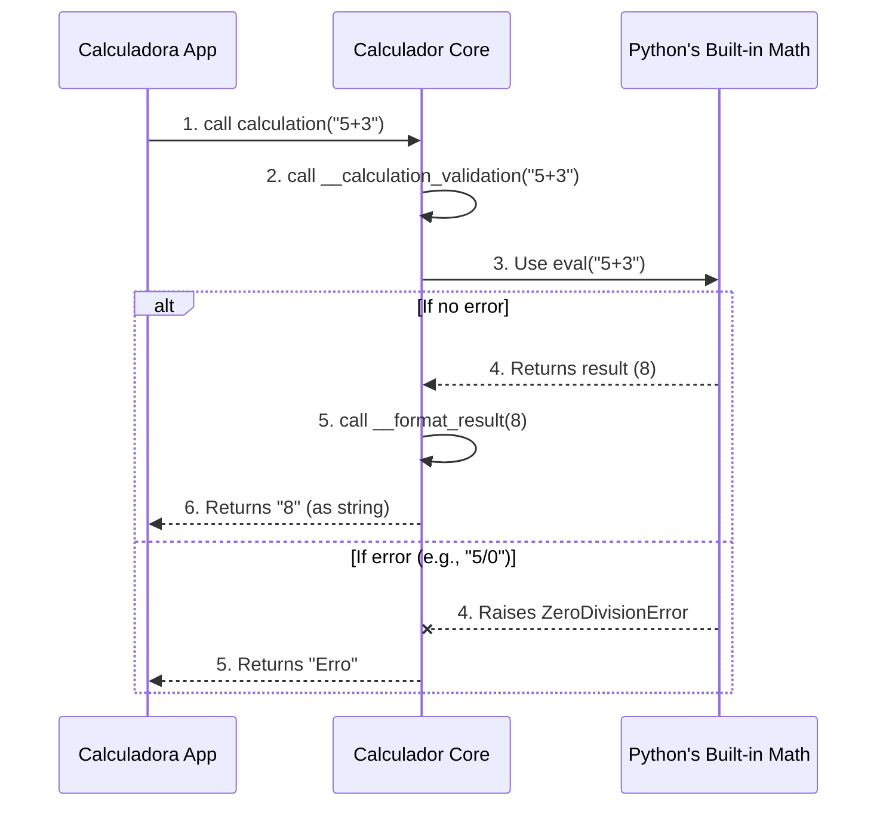

# Chapter 3: Mathematical Core

Welcome back! In [Chapter 1: Application Bootstrap](01_application_bootstrap_.md), we got our calculator's engine running. Then, in [Chapter 2: Calculator User Interface (GUI)](02_calculator_user_interface__gui__.md), we built its "face" – the display screen and all the interactive buttons. Now, you can see the calculator, and you can even click buttons, but nothing *happens* yet when you click "=". This chapter is where we finally give our calculator its "brain"!

Imagine your calculator is like a car. The previous chapters covered starting the car and building its dashboard with all the controls. This chapter is about the *engine* – the powerful part that actually makes the car move. For our `Calculadora Tk`, the "Mathematical Core" is exactly that: it's the calculator's engine, its brain, the component that knows how to take a bunch of numbers and operations, figure out the answer, and even tell you if you've made a mistake (like trying to divide by zero).

When you type something like `5 + 3` into the calculator and press `=`, this "Mathematical Core" is the part that swings into action. It takes `5 + 3`, understands it's an addition, performs the calculation, and then gives back `8`.

### The Calculator's Brain: The `Calculador` Class

In our project, the "Mathematical Core" is a special Python class called `Calculador` (note the "r" at the end, distinguishing it from the main `Calculadora` app class). This class lives in its own file, `app/calculador.py`, because its job is very specific: *only* to perform calculations.

The `Calculador` class has a few key responsibilities:

1.  **`calculation`**: This is the main "door" to the brain. You give it a math problem (as a text string), and it tries to solve it.
2.  **`__calculation_validation`**: This is the actual thinking part. It processes the math problem and, importantly, catches any errors.
3.  **`__format_result`**: It makes sure the answer looks good, even if it's a very long number!

Let's see how our main `Calculadora` application uses this brain.

### Solving a Math Problem: "5 + 3 ="

Let's trace how the calculator figures out `5 + 3`.

When you type `5`, then `+`, then `3`, and finally click the `=` button, the main `Calculadora` application (from `app/calculadora.py`) prepares the math problem. It then hands this problem over to the `Calculador` brain.

The key method that triggers this hand-off is `_get_data_in_input` in our `Calculadora` class:

```python
# app/calculadora.py (inside the Calculadora class)

# ... (other methods)

def _get_data_in_input(self):
    """Pega os dados com todas as operações contidos dentro do input
    para realizar o calculo"""
    if self._entrada.get() == 'Erro': # If the display shows 'Erro', do nothing
        return

    # Here's where the magic happens!
    # We ask our 'calc' (the Calculador object) to perform the calculation
    result = self.calc.calculation(self._entrada.get())

    # Then, we display the result back in the input field
    self._set_result_in_input(result=result)

# ... (other methods)
```

**Explanation:**
1.  `if self._entrada.get() == 'Erro': return`: This line checks if the display already shows an error message. If so, it stops, preventing further calculations on an error.
2.  `result = self.calc.calculation(self._entrada.get())`: This is the crucial line!
    *   `self._entrada.get()`: This fetches the text currently displayed in the calculator's input field (e.g., "5+3").
    *   `self.calc`: This refers to an instance of our `Calculador` class, which was created when the `Calculadora` app started.
    *   `calculation(...)`: We call the `calculation` method on our `Calculador` object, passing the math problem to it.
    *   `result = ...`: The answer returned by `Calculador` is stored in the `result` variable.
3.  `self._set_result_in_input(result=result)`: Once we have the result, this method (also in `Calculadora`) updates the calculator's display to show the answer.

So, when you type `5+3` and hit `=`, `_get_data_in_input` will grab "5+3", send it to the `Calculador` brain, get "8" back, and then put "8" on the display.

### Inside the Brain: How `Calculador` Works

Now, let's peek under the hood of the `Calculador` class in `app/calculador.py` to see how it performs these calculations and handles errors.

#### The `Calculador` Object in `Calculadora`

First, how does `Calculadora` even get a `Calculador` object? It's created during the application's bootstrap phase, in the `__init__` method of `Calculadora`:

```python
# app/calculadora.py (inside the Calculadora class's __init__ method)

# ... (other imports)
from .calculador import Calculador # Import the brain!

class Calculadora(object):
    def __init__(self, master):
        self.master = master
        self.calc = Calculador() # Create an instance of the brain!

        # ... (rest of __init__ method)
```

**Explanation:**
*   `from .calculador import Calculador`: This line imports our `Calculador` class from its own file.
*   `self.calc = Calculador()`: This creates a new "brain" object and stores it in `self.calc`. Now, our `Calculadora` app has a dedicated brain ready to do math!

#### The Calculation Flow

When `self.calc.calculation(expression)` is called, here's a simplified view of what happens inside the `Calculador` brain:



Let's dive into the code of `app/calculador.py` to see these steps in action.

#### The `calculation` Method

This is the public method that `Calculadora` calls. It acts as a wrapper for the actual validation and calculation logic.

```python
# app/calculador.py (inside the Calculador class)

class Calculador(object):
    def calculation(self, calc):
        """Receives the calculation to be performed, returning
        the result or an error message in case of failure.
        """
        return self.__calculation_validation(calc=calc)
```

**Explanation:**
*   It simply calls `__calculation_validation`, passing the math problem (`calc`) to it. The double underscore `__` at the start of `__calculation_validation` indicates that it's an internal helper method, not meant to be called directly from outside the `Calculador` class.

#### The `__calculation_validation` Method

This is the core of the brain, where the actual computation happens and errors are handled.

```python
# app/calculador.py (inside the Calculador class)

class Calculador(object):
    # ... (calculation method)

    def __calculation_validation(self, calc):
        """Verifies if the informed calculation can be performed"""

        try:
            # Python's powerful built-in function to evaluate expressions
            result = eval(calc)

            # If successful, format the result and return it
            return self.__format_result(result=result)
        except (ZeroDivisionError, SyntaxError): # Catch common math errors
            return 'Erro' # Return 'Erro' if something went wrong
```

**Explanation:**
1.  `try...except`: This is a fundamental Python concept for error handling.
    *   The code inside the `try` block is attempted. If it runs without issues, the `except` block is skipped.
    *   If an error occurs *inside* the `try` block, Python immediately jumps to the `except` block.
2.  `result = eval(calc)`: This is the star of the show!
    *   `eval()` is a built-in Python function that takes a string (like "5+3" or "10/2") and *evaluates* it as a Python expression. It then returns the calculated numerical result. It's like having a tiny Python interpreter built into our calculator!
    *   **Important Note for Beginners**: `eval()` is incredibly powerful, but in real-world applications (especially if users can input *any* code), it can be dangerous. For a simple calculator like this, where we control the input somewhat, it's a convenient tool.
3.  `except (ZeroDivisionError, SyntaxError)`: This line tells Python to specifically catch two common types of errors:
    *   `ZeroDivisionError`: Occurs if you try to divide by zero (e.g., `5/0`).
    *   `SyntaxError`: Occurs if the math problem isn't valid Python code (e.g., `5++3` or `(5`).
    *   If either of these errors happens, the `except` block executes, and the method returns the string `'Erro'`.
4.  `return self.__format_result(result=result)`: If the calculation is successful, the result is sent to another helper method, `__format_result`, to make sure it looks nice.

#### The `__format_result` Method

Calculators sometimes show very long numbers in a special way (scientific notation). This method handles that.

```python
# app/calculador.py (inside the Calculador class)

class Calculador(object):
    # ... (calculation and __calculation_validation methods)

    def __format_result(self, result):
        """Formats the result into scientific notation if it's too large
        and returns the formatted value as a string."""

        result = str(result) # Convert the number to a string to check its length
        if len(result) > 15: # If the string is too long (e.g., 15 digits)
            result = '{:5.5E}'.format(float(result)) # Format it into scientific notation (e.g., 1.2345E+10)

        return result
```

**Explanation:**
1.  `result = str(result)`: We convert the numerical result to a string so we can easily check its length.
2.  `if len(result) > 15:`: If the number, as a string, is longer than 15 characters, it might be too big for the display.
3.  `result = '{:5.5E}'.format(float(result))`: This line uses Python's string formatting to convert the number into scientific notation (e.g., `1234567890123456` becomes `1.23457E+15`).
4.  `return result`: The formatted string result is returned.

### Conclusion

In this chapter, we've brought our `Calculadora Tk` to life by understanding its "Mathematical Core." We learned that the `Calculador` class is the dedicated "brain" responsible for all computations. We saw how the main `Calculadora` application sends math problems to this brain, and how the `Calculador` uses `eval()` to perform calculations, all while using `try...except` blocks to gracefully handle potential errors like division by zero or invalid expressions. Finally, we learned how results are formatted to fit nicely on the display.

Now that our calculator can actually *do* math, the next step is to connect the buttons you press on the GUI to the actions that update the display and trigger these calculations. That's what we'll explore in the next chapter!

[Next Chapter: User Input and Display Management](04_user_input_and_display_management_.md)

---

Generated by [AI Codebase Knowledge Builder]