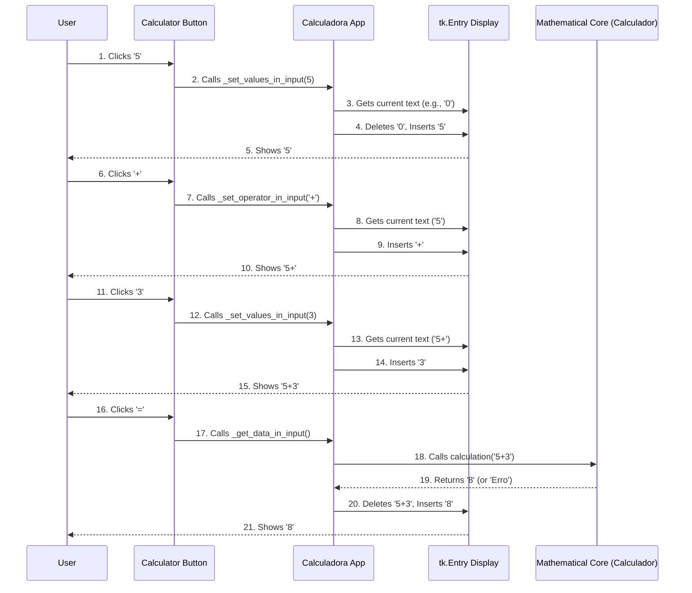

# Chapter 4: User Input and Display Management

Welcome back! In [Chapter 1: Application Bootstrap](01_application_bootstrap_.md), we learned how to get our calculator's engine running. Then, in [Chapter 2: Calculator User Interface (GUI)](02_calculator_user_interface__gui__.md), we built its "face" – the display screen and all the interactive buttons. And in [Chapter 3: Mathematical Core](03_mathematical_core_.md), we gave it a "brain" that knows how to perform calculations.

Now, imagine your calculator is like a car. The previous chapters covered starting the car, building its dashboard, and even putting an engine inside. But how do you *drive* it? How does pressing the accelerator make the car speed up, or turning the steering wheel make it change direction?

This chapter, "User Input and Display Management," is like the car's **controls** (steering wheel, pedals) and its **speedometer**. It's the part of our `Calculadora Tk` that:
1.  **Captures** every number and operation you press on the calculator's buttons.
2.  **Displays** what you've typed on the screen.
3.  **Manages** the input, ensuring things like operators and parentheses are added correctly.
4.  **Updates** the display with the final result when a calculation is done.

In short, this is where the `Calculadora` app listens to *you* and shows *you* what's happening.

### How it Works: Pressing Buttons and Seeing the Display Update

Let's trace a simple interaction: You press the '5' button on the calculator. What happens?

1.  Your finger presses the physical button.
2.  The `Calculadora` app detects this press.
3.  It calls a special method that knows how to handle button presses.
4.  This method tells the display (`_entrada`, our `tk.Entry` widget) to show '5'.

This chapter focuses on the methods within our main `Calculadora` class (in `app/calculadora.py`) that handle these steps.

### 1. Connecting Buttons to Actions

In [Chapter 2: Calculator User Interface (GUI)](02_calculator_user_interface__gui__.md), we saw how `_create_buttons` creates all the buttons. But how do we tell a button what to *do* when it's clicked?

Tkinter buttons have a `command` attribute. You assign a function (or "method" in a class) to this `command`, and Tkinter will automatically call that function when the button is clicked.

For example, here's how we tell the '7' button to do something:

```python
# app/calculadora.py (inside _create_buttons method - simplified)

class Calculadora(object):
    # ...

    def _create_buttons(self, master):
        # ... (button creation for _BTN_NUM_7)

        # Event for the numeric '7' button
        self._BTN_NUM_7['command'] = partial(self._set_values_in_input, 7)

        # ... (other button events)
```

**Explanation:**
*   `self._BTN_NUM_7['command'] = ...`: This line sets the action for the '7' button.
*   `partial(self._set_values_in_input, 7)`: This is a Python trick! `partial` allows us to create a new function that calls `_set_values_in_input` but *always* passes `7` as an argument. Without `partial`, if we just wrote `self._set_values_in_input(7)`, it would call the method immediately when the button is *created*, not when it's *clicked*.

Every button (numbers, operators, clear, equals) has a similar `command` assigned to it, pointing to a specific method that handles its action.

### 2. Displaying Numbers (`_set_values_in_input`)

When you click a number button (like '5'), the `_set_values_in_input` method is called. Its job is to update the calculator's display (`self._entrada`).

```python
# app/calculadora.py (inside Calculadora class - simplified)

class Calculadora(object):
    # ...

    def _set_values_in_input(self, value):
        """Method responsible for capturing the clicked numeric value and setting it in the input."""

        current_display = self._entrada.get() # Get what's currently on the screen

        if current_display == 'Erro': # If showing 'Erro', clear it first
            self._entrada.delete(0, len(current_display))

        if current_display == '0': # If display is just '0', replace it
            self._entrada.delete(0)
            self._entrada.insert(0 ,value)
        elif self._lenght_max(current_display): # If not max length, add the number
            self._entrada.insert(len(current_display) ,value)
```

**Explanation:**
1.  `current_display = self._entrada.get()`: This gets the text that is currently visible in our display field (`tk.Entry`).
2.  `if current_display == 'Erro':`: If the calculator is showing an error, pressing a number button should clear the error and start a new input. `self._entrada.delete(0, len(current_display))` clears the entire display.
3.  `if current_display == '0':`: If the display just shows a single '0' (like when the calculator first starts), we want to replace it with the new number, not add it after the '0'. So, `_entrada.delete(0)` removes the '0', and `_entrada.insert(0, value)` puts the new number at the beginning.
4.  `elif self._lenght_max(current_display):`: This checks if the display hasn't reached its maximum allowed length (to prevent overflowing).
5.  `self._entrada.insert(len(current_display) ,value)`: If all checks pass, this adds the `value` (the number you clicked) to the *end* of the current text in the display. `len(current_display)` ensures it's inserted at the very last position.

### 3. Displaying Operators and Special Characters

Adding operators (`+`, `-`, `*`, `/`), the decimal point (`.`), or parentheses `(` `)` has slightly different rules to ensure the math expression remains valid.

#### Adding Operators (`_set_operator_in_input`)

```python
# app/calculadora.py (inside Calculadora class - simplified)

class Calculadora(object):
    # ...

    def _set_operator_in_input(self, operator):
        """Method responsible for capturing the clicked mathematical operator and setting it in the input."""

        current_display = self._entrada.get()

        if current_display == 'Erro': # Don't add operators if an error is displayed
            return

        if current_display == '': # Don't add an operator to an empty display
            return

        # Avoid cases of repeated operators (e.g., '5++3')
        # Check if the last character is NOT an operator and if length is max
        if current_display[-1] not in '+-*/' and self._lenght_max(current_display):
            self._entrada.insert(len(current_display) ,operator)
```

**Explanation:**
*   `if current_display[-1] not in '+-*/'`: This is a crucial check. It prevents you from typing `5++3` or `5-/2`. If the last character on the display is *already* an operator, it simply ignores the new operator press. This keeps the input clean for the [Mathematical Core](03_mathematical_core_.md).

Similar methods exist for the decimal point (`_set_dot_in_input`), open parenthesis (`_set_open_parent`), and close parenthesis (`_set_close_parent`), each with its own specific rules to maintain a valid mathematical expression. For example, `_set_close_parent` checks if there are more open parentheses than closed ones to prevent `5) + 3`.

### 4. Special Actions: Clear and Delete

Calculators also need buttons to fix mistakes!

#### Clear (`_clear_input`)

This simply resets the display to '0'.

```python
# app/calculadora.py (inside Calculadora class - simplified)

class Calculadora(object):
    # ...

    def _clear_input(self):
        """Resets the calculator input, clearing it completely and inserting the value 0."""
        self._entrada.delete(0, len(self._entrada.get())) # Delete all text
        self._entrada.insert(0,0) # Insert '0'
```

#### Delete (`_del_last_value_in_input`)

This removes the last character.

```python
# app/calculadora.py (inside Calculadora class - simplified)

class Calculadora(object):
    # ...

    def _del_last_value_in_input(self):
        """Deletes the last digit contained within the input."""
        if self._entrada.get() == 'Erro': # Don't delete if an error is displayed
            return

        if len(self._entrada.get()) == 1: # If only one character left, make it '0'
            self._entrada.delete(0)
            self._entrada.insert(0,0)
        else:
            self._entrada.delete(len(self._entrada.get()) - 1) # Delete the very last character
```

### 5. Triggering Calculation and Displaying Result (`_get_data_in_input`, `_set_result_in_input`)

Finally, when you press the '=' button, it's time to get the answer!

The `_get_data_in_input` method (which we briefly saw in [Chapter 3: Mathematical Core](03_mathematical_core_.md)) is called when the '=' button is pressed.

```python
# app/calculadora.py (inside Calculadora class - simplified)

class Calculadora(object):
    # ...

    def _get_data_in_input(self):
        """Gets all operations from the input to perform the calculation."""
        if self._entrada.get() == 'Erro': # If an error is displayed, do nothing
            return

        # Pass the current display text to our 'brain' (Calculador) for calculation
        result = self.calc.calculation(self._entrada.get())

        # Update the display with the result
        self._set_result_in_input(result=result)
```

**Explanation:**
1.  `result = self.calc.calculation(self._entrada.get())`: This is where the [Mathematical Core](03_mathematical_core_.md) (`self.calc`) takes over. It gets the entire string from the display (`self._entrada.get()`, e.g., "5+3"), calculates the answer, and returns it.
2.  `self._set_result_in_input(result=result)`: Once the `Calculador` returns the `result`, this method updates the display.

#### `_set_result_in_input`

```python
# app/calculadora.py (inside Calculadora class - simplified)

class Calculadora(object):
    # ...

    def _set_result_in_input(self, result=0):
        """Sets the result of the entire operation into the input."""
        if self._entrada.get() == 'Erro': # Don't update if current display is 'Erro' (already handled)
            return

        self._entrada.delete(0, len(self._entrada.get())) # Clear the current expression
        self._entrada.insert(0, result) # Display the new result
```

This method first clears whatever was on the screen (the math problem) and then inserts the calculated `result` onto the display.

### How It All Connects: Input to Display Flow

Let's visualize the journey of a button press:



### Other Helper Methods

The `Calculadora` class also has other helper methods for display management:

*   `_lenght_max(data_in_input)`: This simple method (`if len(str(data_in_input)) >= 15: return False`) prevents the input display from becoming too long, ensuring numbers don't go off-screen.

These small, focused methods work together to provide a smooth and intuitive user experience, ensuring that what you type appears correctly and leads to the right results.

### Conclusion

In this chapter, we've explored "User Input and Display Management," the crucial link between your actions and the calculator's response. We saw how buttons are connected to specific methods using the `command` attribute and `partial`. We then dived into how these methods (`_set_values_in_input`, `_set_operator_in_input`, `_clear_input`, `_del_last_value_in_input`) intelligently manage the calculator's display (`tk.Entry`), handling various rules for numbers, operators, and special actions. Finally, we understood how the '=' button triggers a call to the [Mathematical Core](03_mathematical_core_.md) and updates the display with the final result.

Now that our calculator can take input, process it, and show the result, the next exciting step is to make it look even better and allow users to customize its appearance!

[Next Chapter: Theme and Settings Management](05_theme_and_settings_management_.md)

---

Generated by [AI Codebase Knowledge Builder]