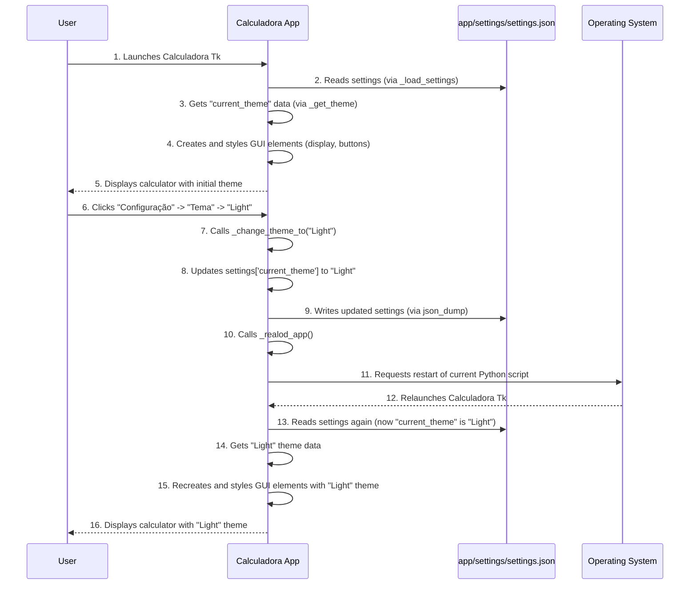

# Chapter 5: Theme and Settings Management

Welcome back! In [Chapter 4: User Input and Display Management](04_user_input_and_display_management_.md), we learned how our calculator listens to your button presses and updates its display in real-time. Now, imagine you've been driving your calculator for a while, and you're thinking, "This 'paint job' (the default look) is nice, but I'd really like to pick a different color scheme, maybe a dark mode, or a brighter one!"

This is where "Theme and Settings Management" comes in. Think of it as the **customization shop** for your calculator. This part of the code allows you to:
*   **Change its appearance** (the "theme," like a new paint job).
*   **Store your preferences** (the "settings," like remembering your favorite radio station or seat position).
*   **Load these preferences** every time you start the calculator.

The main goal of this chapter is to understand how you can personalize your `Calculadora Tk` by switching themes and how the calculator remembers your choice.

### The Brains Behind the Style: `settings.json`

Just like your car might have a user manual or a computer has preference files, our calculator stores all its customization options in a special file called `settings.json`. This file is written in a format called JSON (JavaScript Object Notation), which is a common way for programs to store structured data.

Let's look at a simplified version of `app/settings/settings.json`:

```json
{
    "current_theme": "Dark",
    "global": {
        "width": 8,
        "height": 4,
        "font": "Arial 13 bold"
    },
    "themes": [
        {
            "name": "Dark",
            "master_bg": "#282c34",
            "frame_bg": "#3e4452",
            "INPUT": {
                "bg": "#abb2bf",
                "fg": "#282c34",
                "font": "Arial 22 bold"
            },
            "BTN_NUMERICO": {
                "bg": "#3e4452",
                "fg": "#e0e0e0"
            }
        },
        {
            "name": "Light",
            "master_bg": "#f0f0f0",
            "frame_bg": "#e0e0e0",
            "INPUT": {
                "bg": "#5c5c5c",
                "fg": "#e0e0e0",
                "font": "Arial 22 bold"
            },
            "BTN_NUMERICO": {
                "bg": "#c0c0c0",
                "fg": "#333333"
            }
        }
    ]
}
```

**Explanation:**
*   `"current_theme": "Dark"`: This is the most important setting for us! It tells the calculator which theme to load when it starts.
*   `"global": { ... }`: These are general settings (like button size and font) that apply to *all* themes unless a specific theme overrides them.
*   `"themes": [ ... ]`: This is a list of all the available themes. Each theme (like "Dark" or "Light") has its own set of colors (`master_bg` for the main window, `frame_bg` for button areas) and specific styles for different parts of the calculator (like `INPUT` for the display and `BTN_NUMERICO` for number buttons).

### How Themes are Applied When the Calculator Starts

When you launch `Calculadora Tk`, the first thing it does is read this `settings.json` file. Let's see how our `Calculadora` class (in `app/calculadora.py`) does this.

#### 1. Loading the Settings File (`_load_settings`)

Inside the `__init__` method of our `Calculadora` class, the `_load_settings` method is called to read the `settings.json` file.

```python
# app/calculadora.py (simplified __init__ method)
import json # Needed for json_load

class Calculadora(object):
    def __init__(self, master):
        # ... (other initializations)

        self.settings = self._load_settings() # <-- Load settings
        
        # Determine which theme to use (e.g., specific for MacOS or the current_theme)
        # We'll simplify this for now and assume it picks self.settings['current_theme']
        self.theme = self._get_theme(self.settings['current_theme']) # <-- Get theme details

        # Apply the main window's background color from the chosen theme
        self.master['bg'] = self.theme['master_bg']
        
        # ... (rest of __init__ method creating frames and widgets)
```

The `_load_settings` method itself is quite simple:

```python
# app/calculadora.py (simplified _load_settings method)
from json import load as json_load # Import only the 'load' function

class Calculadora(object):
    @staticmethod
    def _load_settings():
        """Utility to load the calculator's settings file."""
        # Open the settings.json file for reading
        with open('./app/settings/settings.json', mode='r', encoding='utf-8') as f:
            settings = json_load(f) # Read the JSON data into a Python dictionary
        return settings # Return the dictionary
```
**Explanation:**
*   `with open(...) as f:`: This opens the `settings.json` file. The `with` statement ensures the file is automatically closed afterwards.
*   `json_load(f)`: This is the magic! It reads all the content from the file `f` and converts the JSON text into a Python dictionary, which is then stored in the `settings` variable.

#### 2. Picking the Right Theme (`_get_theme`)

Once all settings are loaded, the `_get_theme` method finds the specific theme data based on the `current_theme` name.

```python
# app/calculadora.py (simplified _get_theme method)
from copy import deepcopy # Important for getting a fresh copy of the theme

class Calculadora(object):
    # ...

    def _get_theme(self, name='Dark'):
        """Returns the style settings for the specified theme."""
        list_of_themes = self.settings['themes'] # Get the list of all themes

        found_theme = None
        for t in list_of_themes: # Loop through each theme
            if name == t['name']: # Check if its name matches the requested name
                found_theme = deepcopy(t) # Get a copy of the theme's data
                break # Stop searching once found
        
        return found_theme # Return the theme data
```
**Explanation:**
*   `list_of_themes = self.settings['themes']`: We access the "themes" list from our loaded settings.
*   The `for` loop goes through each theme in the list.
*   `if name == t['name']`: It checks if the `name` we asked for (e.g., "Dark") matches the `name` of the current theme in the loop.
*   `found_theme = deepcopy(t)`: If a match is found, `deepcopy(t)` creates a *completely separate copy* of that theme's data. This is important so that if we make changes later, we don't accidentally mess up the original theme definition in our `settings` data.

After these steps, `self.theme` in our `Calculadora` object now holds all the color and style information for the currently selected theme.

#### 3. Applying the Theme to GUI Elements

As we saw in [Chapter 2: Calculator User Interface (GUI)](02_calculator_user_interface__gui__.md), when the display and buttons are created, they use this `self.theme` data to set their colors, fonts, and other visual properties.

For example, when creating the input display:
```python
# app/calculadora.py (simplified _create_input method)
class Calculadora(object):
    # ...
    def _create_input(self, master):
        self._entrada = tk.Entry(master, cnf=self.theme['INPUT']) # Uses theme['INPUT'] settings
        # ...
```

And for buttons:
```python
# app/calculadora.py (simplified _create_buttons method)
class Calculadora(object):
    # ...
    def _create_buttons(self, master):
        # Update global settings (like default width/height) into specific button themes
        self.theme['BTN_NUMERICO'].update(self.settings['global']) # Apply global overrides

        self._BTN_NUM_7 = tk.Button(master, text='7', cnf=self.theme['BTN_NUMERICO']) # Uses theme['BTN_NUMERICO']
        # ...
```
**Explanation:**
*   `cnf=self.theme['INPUT']`: The `cnf` (short for configuration) argument lets us pass a dictionary of settings directly to the Tkinter widget. Here, `self.theme['INPUT']` is a dictionary containing `bg`, `fg`, `font`, etc., from our `settings.json`.
*   `self.theme['BTN_NUMERICO'].update(self.settings['global'])`: This line is clever! It takes the specific theme settings for numeric buttons (`BTN_NUMERICO`) and updates them with any "global" settings (`self.settings['global']`). This means `global` settings can override or add to specific theme settings, making it easy to manage common properties like button `width` and `height`.

### How to Change the Theme

The `Calculadora Tk` app allows you to change themes through its menu.

#### 1. Creating the Theme Menu (`_create_menu`)

The `_create_menu` method (which we briefly mentioned in [Chapter 1: Application Bootstrap](01_application_bootstrap_.md)) is responsible for creating the "Configuração" (Configuration) menu and its "Tema" (Theme) submenu.

```python
# app/calculadora.py (simplified _create_menu method)
import tkinter as tk
from tkinter import Menu
from functools import partial

class Calculadora(object):
    # ...
    def _create_menu(self, master):
        # ... (menu setup)
        calc_menu = Menu(self.master)
        self.master.config(menu=calc_menu)

        config = Menu(calc_menu)
        theme = Menu(config) # This is our 'Theme' submenu

        for t in self.settings['themes']: # Loop through all available themes
            name = t['name']
            # Add each theme name as a menu command
            theme.add_command(label=name, command=partial(self._change_theme_to, name))
        
        calc_menu.add_cascade(label='Configuração', menu=config)
        config.add_cascade(label='Tema', menu=theme)
        # ...
```
**Explanation:**
*   `theme = Menu(config)`: Creates the actual submenu where theme names will be listed.
*   `for t in self.settings['themes']:`: The code iterates through the `themes` list from our loaded settings.
*   `theme.add_command(label=name, command=partial(self._change_theme_to, name))`: For each theme, it creates a menu item.
    *   `label=name`: The text shown in the menu (e.g., "Dark", "Light").
    *   `command=partial(self._change_theme_to, name)`: This is the action that happens when you click a theme name. `partial` is used again (like in [Chapter 4: User Input and Display Management](04_user_input_and_display_management_.md)) to call the `_change_theme_to` method, passing the *name* of the selected theme to it.

#### 2. Applying the New Theme and Saving the Choice (`_change_theme_to` and `_realod_app`)

When you select a theme from the menu, the `_change_theme_to` method is called.

```python
# app/calculadora.py (simplified _change_theme_to method)
from json import dump as json_dump # Import only the 'dump' function
import sys
import os

class Calculadora(object):
    # ...
    def _change_theme_to(self, name='Dark'):
        self.settings['current_theme'] = name # Update the current_theme in our settings

        # Save the updated settings back to the file
        with open('./app/settings/settings.json', 'w') as outfile:
            json_dump(self.settings, outfile, indent=4) # Write the Python dictionary back as JSON

        self._realod_app() # Restart the entire application
```
**Explanation:**
*   `self.settings['current_theme'] = name`: This line updates the `current_theme` entry in our `settings` dictionary to the newly selected theme's `name`.
*   `with open(..., 'w') as outfile: json_dump(self.settings, outfile, indent=4)`: This is how we *save* our choice!
    *   `'w'`: This opens `settings.json` in "write" mode, meaning it will overwrite the file.
    *   `json_dump()`: This takes our updated Python dictionary (`self.settings`) and converts it back into JSON text, writing it to the `outfile`. `indent=4` makes the JSON file nicely formatted for human readability.
*   `self._realod_app()`: This is a crucial step! For theme changes to fully take effect (since most UI elements are created once at startup), the application needs to restart. This method handles that.

The `_realod_app` method is quite powerful:

```python
# app/calculadora.py (simplified _realod_app method)
import sys
import os

class Calculadora(object):
    # ...
    def _realod_app(self):
        """Restarts the application."""
        python = sys.executable  # Get the path to the Python interpreter
        os.execl(python, python, * sys.argv) # Execute the current script again
```
**Explanation:**
*   `sys.executable`: This gives us the path to the Python program currently running our calculator.
*   `os.execl(...)`: This is an operating system function that replaces the current running process with a new one. In simpler terms, it *restarts* our Python script, making the application relaunch and load all the settings (including the new `current_theme`) from scratch.

### How It All Connects: Changing a Theme Flow

Let's visualize the entire process of changing a theme:



### Conclusion

In this chapter, we've explored "Theme and Settings Management," the customization hub of our `Calculadora Tk` project. We learned how `settings.json` acts as the central storage for themes and preferences. We saw how the calculator loads these settings on startup using `_load_settings` and `_get_theme` to apply the chosen style to its user interface. Most importantly, we understood how to change themes via the menu, how this choice is saved back to `settings.json` using `json_dump`, and how the application cleverly restarts itself using `_realod_app` to apply the new look.

Now that our calculator is fully functional, customizable, and ready for use, the final chapter will guide you on how you can contribute to this project and make it even better!

[Next Chapter: Project Contribution Guide](06_project_contribution_guide_.md)

---

Generated by [AI Codebase Knowledge Builder]