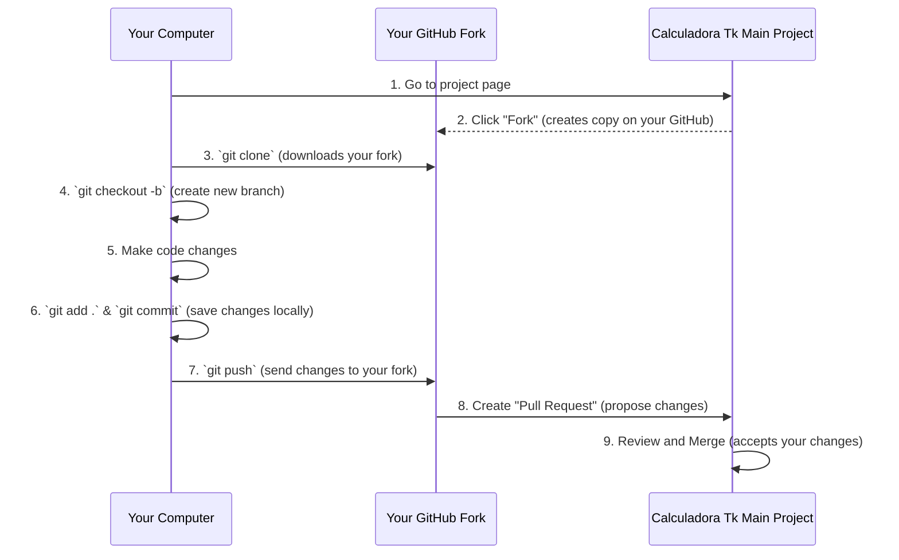

# Chapter 6: Project Contribution Guide

Welcome back, future open-source contributor! In our previous chapters, we've taken an incredible journey:
*   In [Chapter 1: Application Bootstrap](01_application_bootstrap_.md), we learned how our calculator starts up.
*   In [Chapter 2: Calculator User Interface (GUI)](02_calculator_user_interface__gui__.md), we built its visual face.
*   In [Chapter 3: Mathematical Core](03_mathematical_core_.md), we gave it the brain to do math.
*   In [Chapter 4: User Input and Display Management](04_user_input_and_display_management_.md), we made it interactive.
*   And in [Chapter 5: Theme and Settings Management](05_theme_and_settings_management_.md), we made it customizable.

By now, you understand how `Calculadora Tk` works from the inside out! You've successfully "assembled" your model car, started its engine, built its dashboard, and even picked its paint color. But what if you want to add a new feature, fix a tiny squeak, or suggest a bigger upgrade? This is where the "Project Contribution Guide" comes in!

Imagine this chapter as your **roadmap and manual for becoming a co-builder** of `Calculadora Tk`. It clearly outlines the steps needed for anyone who wants to help improve the calculator, from setting up their development environment to submitting their changes. It also provides information on how to report bugs or suggest new features, making it easy for beginners to get involved and contribute to the project's growth.

The main goal of this chapter is to empower you to take your newfound knowledge and use it to make `Calculadora Tk` even better, or even start contributing to other open-source projects!

### Why Contribute?

Contributing to an open-source project like `Calculadora Tk` is a fantastic way to:
*   **Learn and grow:** You'll practice your coding skills, learn about collaboration, and see how real-world projects are managed.
*   **Gain experience:** Having contributions on your GitHub profile shows potential employers or collaborators that you're an active learner.
*   **Help others:** Your improvements can make the calculator more useful for everyone!
*   **Become part of a community:** You'll connect with other developers and share ideas.

### Types of Contributions

There are many ways to contribute, even if you're just starting:

1.  **Code Contributions:** This involves writing or changing code to:
    *   Fix bugs (e.g., if `5 / 0` crashes the app instead of showing "Erro").
    *   Add new features (e.g., a square root button, memory functions).
    *   Improve existing code (e.g., making it faster or easier to read).
2.  **Bug Reports:** If you find a problem but don't know how to fix it, you can tell the project maintainers about it.
3.  **Feature Suggestions:** If you have a cool idea for an improvement, you can suggest it.

Let's look at how to do each of these!

### 1. How to Contribute Code (Step-by-Step)

Contributing code usually follows a standard workflow used in many open-source projects. Don't worry if it sounds complex; we'll break it down!

#### Step 1: Fork the Project

Think of "forking" as making your very own personal copy of the entire `Calculadora Tk` project on GitHub. This copy lives in *your* GitHub account, so you can make any changes you want without affecting the original project.

To fork the project:
1.  Go to the `Calculadora Tk` GitHub page: `https://github.com/matheusfelipeog/calculadora-tk.git`
2.  Click the "Fork" button, usually found in the top right corner of the page.

Now you have your own version of `Calculadora Tk`!

#### Step 2: Clone Your Fork

"Cloning" means downloading your personal copy of the project from GitHub to your computer. This allows you to work on the code locally.

Open your terminal or command prompt and type:

```bash
git clone https://github.com/SEU_USUARIO/calculadora-tk.git
```
**Explanation:**
*   Replace `SEU_USUARIO` with your actual GitHub username.
*   This command creates a new folder on your computer named `calculadora-tk` containing all the project files.

#### Step 3: Create a New Branch

It's a good practice to work on your changes in a separate "branch." A branch is like a parallel timeline in your project. It keeps your new changes isolated, so if something goes wrong, it doesn't mess up the main version of the code.

Navigate into your cloned project folder:

```bash
cd calculadora-tk
git checkout -b feature/my-new-button
```
**Explanation:**
*   `cd calculadora-tk`: Changes your directory to the project folder.
*   `git checkout -b feature/my-new-button`: This command does two things:
    *   `-b` creates a **new branch**.
    *   `feature/my-new-button` is the name of your new branch. It's a good convention to start branch names with `feature/` for new features or `bugfix/` for bug fixes. Choose a descriptive name related to what you're changing!

#### Step 4: Make Your Changes

Now you can open the project in your favorite code editor (like VS Code) and start coding! For example, if you wanted to add a square root button, you'd look at:
*   [Chapter 2: Calculator User Interface (GUI)](02_calculator_user_interface__gui__.md) to add the button in `_create_buttons`.
*   [Chapter 4: User Input and Display Management](04_user_input_and_display_management_.md) to connect the button to a new method.
*   [Chapter 3: Mathematical Core](03_mathematical_core_.md) to teach the `Calculador` class how to perform square roots.

Once you've made your changes and tested them to make sure they work, you're ready for the next step.

#### Step 5: Commit Your Changes

"Committing" is like saving a snapshot of your changes locally. It records what you changed and why.

```bash
git add .
git commit -m "feat: Add square root button and functionality"
```
**Explanation:**
*   `git add .`: This command stages all your changes, preparing them to be committed.
*   `git commit -m "..."`: This saves your changes. The message inside the quotes should clearly describe what you did (e.g., `feat:` for new features, `fix:` for bug fixes).

#### Step 6: Push to Your Fork

After committing, your changes are only on your local computer. "Pushing" sends these committed changes from your computer to your personal fork on GitHub.

```bash
git push origin feature/my-new-button
```
**Explanation:**
*   `git push origin`: Sends your changes to your remote repository (your fork on GitHub).
*   `feature/my-new-button`: Specifies which branch you are pushing.

#### Step 7: Create a Pull Request (PR)

This is the final step where you propose your changes to the original `Calculadora Tk` project! A "Pull Request" (PR) asks the project maintainers to "pull" your changes from your fork into their main project.

1.  Go to your fork's page on GitHub.
2.  You'll usually see a message saying "This branch is 1 commit ahead of main branch." and a "Contribute" button, or "New pull request" button. Click it!
3.  Fill out the pull request form:
    *   Give it a clear title (e.g., "Add Square Root Button").
    *   Write a detailed description of what your changes do, why you made them, and any relevant information for the maintainers.
4.  Submit the PR.

The project maintainers will then review your changes, might ask questions or suggest improvements, and eventually, if all looks good, they will "merge" your changes into the main project! Congratulations, you've officially contributed!

#### Visualizing the Code Contribution Flow



### 2. How to Report Bugs or Suggest Features

Even if you're not ready to write code, your ideas and bug reports are incredibly valuable! For this, we use "Issues" on GitHub.

#### How to Report a Bug

If you find something that doesn't work as expected:
1.  Go to the "Issues" tab of the `Calculadora Tk` main project on GitHub.
2.  Click the "New issue" button.
3.  Choose a "Bug report" template if available.
4.  Give your issue a clear title (e.g., "Calculator Crashes on Division by Zero").
5.  In the description, explain:
    *   **What you expected to happen.**
    *   **What actually happened.**
    *   **The exact steps to reproduce the bug:** This is crucial! For example: "1. Open calculator. 2. Type '5'. 3. Press '/'. 4. Type '0'. 5. Press '='. 6. App crashes."
    *   Any error messages you saw.
    *   Your operating system (Windows, macOS, Linux).

#### How to Suggest a New Feature

If you have an idea to make the calculator better:
1.  Go to the "Issues" tab of the `Calculadora Tk` main project on GitHub.
2.  Click the "New issue" button.
3.  Choose a "Feature request" template if available.
4.  Give your issue a clear title (e.g., "Feature Request: Add Memory Buttons (M+, M-, MR, MC)").
5.  In the description, explain:
    *   **What the new feature is.**
    *   **Why it would be useful** (the problem it solves).
    *   **How it might work** from a user's perspective.

### Helpful Resources

Learning Git and GitHub can be a bit tricky at first, but there are many excellent resources available:

*   **Git and GitHub Tutorial (Reading):** [Tutorial no Tableless (Portuguese)](https://tableless.com.br/tudo-que-voce-queria-saber-sobre-git-e-github-mas-tinha-vergonha-de-perguntar/)
*   **Git and GitHub Tutorial (Video):** [Tutorial no Youtube (Portuguese)](https://www.youtube.com/playlist?list=PLQCmSnNFVYnRdgxOC_ufH58NxlmM6VYd1)
*   **Pull Request on GitHub (Reading):** [Tutorial DigitalOcean (Portuguese)](https://www.digitalocean.com/community/tutorials/como-criar-um-pull-request-no-github-pt)

These resources will provide more in-depth explanations and guided examples for the Git and GitHub commands mentioned above.

### Conclusion

You've reached the end of our `Calculadora Tk` tutorial, and hopefully, you now feel confident enough to not just use, but also improve, the calculator! This chapter introduced you to the exciting world of open-source contributions, from setting up your development environment and submitting code via pull requests, to reporting bugs and suggesting new features.

Remember, every great project started small, and every contribution, big or small, helps it grow. Don't be afraid to dive in, ask questions, and start your journey as an open-source contributor. We encourage you to use what you've learned in these chapters to make `Calculadora Tk` even more robust and feature-rich. Happy coding!

---

Generated by [AI Codebase Knowledge Builder]