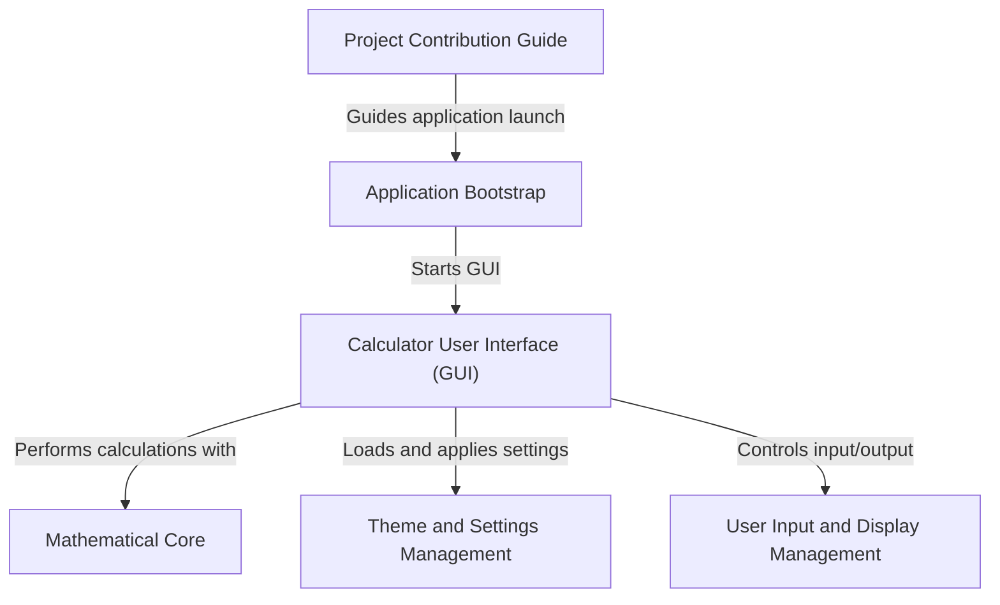

# Tutorial: calculadora-tk

The `calculadora-tk` project is an **open-source Python calculator** designed to help *beginners learn GUI programming* with Tkinter. It provides a visual interface for performing *basic mathematical operations*, allowing users to customize its appearance with different themes. The project also encourages new developers to contribute by fixing bugs and adding new features, with a dedicated guide for participation.

**Source Repository:** [https://github.com/matheusfelipeog/calculadora-tk](https://github.com/matheusfelipeog/calculadora-tk)

## Chapters

1. [Application Bootstrap
](01_application_bootstrap_.md)
2. [Calculator User Interface (GUI)
](02_calculator_user_interface__gui__.md)
3. [Mathematical Core
](03_mathematical_core_.md)
4. [User Input and Display Management
](04_user_input_and_display_management_.md)
5. [Theme and Settings Management
](05_theme_and_settings_management_.md)
6. [Project Contribution Guide
](06_project_contribution_guide_.md)

---

Generated by [AI Codebase Knowledge Builder]