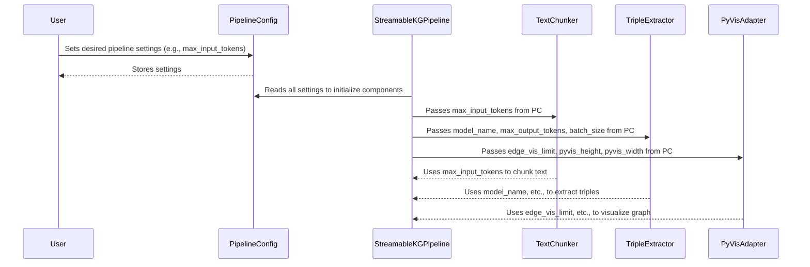

# Chapter 1: PipelineConfig

Welcome to the first chapter of our journey into building a GPU-accelerated Knowledge Graph! We're going to start with something that might seem simple on the surface, but it's incredibly important for making our complex pipeline run smoothly, especially on a specialized GPU like the Google Colab T4: the `PipelineConfig`.

### What Problem Does PipelineConfig Solve?

Imagine you're trying to build a really cool toy robot. This robot has many parts: a motor, sensors, a speaker, and a remote control. Each part needs specific instructions: how fast should the motor spin? How sensitive should the sensors be? What volume should the speaker be set to?

Our Knowledge Graph pipeline is a bit like that robot. It has many "parts":

*   An intelligent language model (LLM) that reads text.
*   Parts that prepare the text for the LLM.
*   Parts that process the LLM's output on the GPU.
*   Parts that visualize the final graph.

Each of these parts needs settings: Which LLM should we use? How much text should we feed it at once? How many "facts" should the final visualization show?

If these settings were scattered all over the place, it would be a mess! It would be hard to know what's going on, and even harder to adjust things to make our robot (or pipeline) work best. This is especially true when we're trying to optimize for a specific, often memory-constrained, GPU like the T4 in Google Colab.

**`PipelineConfig`** solves this problem by acting as our **central control panel** or **master settings menu** for the entire knowledge graph pipeline. It brings all these important "knobs" and "switches" into one convenient place.

### Understanding PipelineConfig: Your Control Panel

Think of `PipelineConfig` as a car's dashboard. It doesn't *drive* the car, but it shows you all the critical information and lets you adjust things like the radio volume, air conditioning, or even switch between different driving modes.

Here are some of the key "knobs" you'll find on the `PipelineConfig` dashboard:

*   **`model_name`**: This tells the pipeline *which* Large Language Model (LLM) to use for extracting information from your text. Different LLMs have different capabilities and memory requirements.
*   **`max_input_tokens`**: LLMs can only process a certain amount of text at a time. This setting controls the maximum length of text (measured in "tokens," which are like words or parts of words) that we feed into the LLM in one go.
*   **`max_output_tokens`**: Similarly, this limits how much information the LLM is allowed to generate in response.
*   **`batch_size`**: To make the best use of the GPU, we often process several pieces of text at the same time, in a "batch." This setting determines how many such pieces are processed together. Increasing this can speed things up, but it uses more GPU memory.
*   **`edge_vis_limit`** and **`top_k_nodes`**: A knowledge graph can become enormous! These settings help prevent your web browser from crashing when visualizing the graph by limiting how many connections (edges) and important nodes are displayed.
*   **`pyvis_height`, `pyvis_width`**: These simply control the size of the final visual graph on your screen.

By adjusting these settings, you can fine-tune how the pipeline behaves, its speed, and critically, its memory usage on the GPU. For our Colab T4 GPU, the default settings are carefully chosen to work well without running out of memory.

### How to Use PipelineConfig

Using `PipelineConfig` is very straightforward. In our project, it's defined using something called a `dataclass` in Python, which is a neat way to create classes that mainly store data (like a structured list of variables).

Let's look at how you'd typically set it up:

```python
# main.py (simplified)
from dataclasses import dataclass

@dataclass
class PipelineConfig:
    """Memory-aware configuration for T4 GPU"""
    model_name: str = "nvidia/Nemotron-Mini-4B-Instruct"
    max_input_tokens: int = 1400
    max_output_tokens: int = 128
    batch_size: int = 2
    edge_vis_limit: int = 20_000
    # ... other settings ...

# Create an instance of the configuration
config = PipelineConfig()

print(f"Default model: {config.model_name}")
# Default model: nvidia/Nemotron-Mini-4B-Instruct
```

In the snippet above, we first define the `PipelineConfig` (don't worry about `@dataclass` for now; just know it helps organize data). Then, we create an instance named `config`. This `config` object now holds all the default settings.

What if you want to change a setting? It's just like changing a variable!

```python
# main.py (simplified)

# Create an instance with default settings
config = PipelineConfig()

# Want to process smaller chunks of text?
config.max_input_tokens = 1000
print(f"New max input tokens: {config.max_input_tokens}")
# New max input tokens: 1000

# Want to see more edges in the visualization?
config.edge_vis_limit = 30_000
print(f"New edge visualization limit: {config.edge_vis_limit}")
# New edge visualization limit: 30000
```

By changing these values in the `config` object, you tell the rest of the pipeline how to behave. For example, if you change `max_input_tokens`, the [TextChunker](03_textchunker_.md) will split your text into smaller pieces. If you change `edge_vis_limit`, the [PyVisAdapter](08_pyvisadapter_.md) will show more connections in the final graph.

### Under the Hood: How PipelineConfig Works

`PipelineConfig` itself doesn't *do* any of the heavy lifting like extracting triples or running graph algorithms. Instead, it's a passive holder of information. Other parts of the pipeline *read* from it to know how to perform their tasks.

Let's use our car dashboard analogy again. When you turn on the air conditioning (a setting), the A/C unit in the car (a component) reads that setting and starts cooling. The dashboard itself doesn't cool anything.

Here's a simplified view of how the `PipelineConfig` interacts with other components in our system:



As you can see, the user first sets up their desired configuration in `PipelineConfig`. Then, the main orchestration class, [StreamableKGPipeline](02_streamablekgpipeline_.md), takes this `config` object and passes relevant settings to the individual components responsible for different stages of the pipeline:

*   The [TextChunker](03_textchunker_.md) uses `max_input_tokens` to decide how to split the input text.
*   The [TripleExtractor](04_tripleextractor_.md) uses `model_name`, `max_output_tokens`, and `batch_size` to perform efficient LLM inference.
*   The [PyVisAdapter](08_pyvisadapter_.md) uses `edge_vis_limit` and visualization dimensions to render the final interactive graph.

This centralized approach makes our pipeline flexible and easy to manage!

The actual code for `PipelineConfig` from `main.py` looks like this:

```python
# main.py
# ... (imports) ...

@dataclass
class PipelineConfig:
    """Memory-aware configuration for T4 GPU"""
    # LLM constraints
    model_name: str = "nvidia/Nemotron-Mini-4B-Instruct"
    max_input_tokens: int = 1400
    max_output_tokens: int = 128
    batch_size: int = 2
    use_flash_attention: bool = False # Disable for compatibility

    # Graph constraints
    edge_vis_limit: int = 20_000
    edge_batch_limit: int = 5_000

    # Visualization
    top_k_nodes: int = 100
    pyvis_height: str = "800px"
    pyvis_width: str = "100%"

config = PipelineConfig() # This line creates the default config object
```

The `@dataclass` decorator automatically handles creating a constructor and `__repr__` method for our class, making it convenient to define classes that primarily hold data. Each line specifies a setting, its Python type (e.g., `str` for text, `int` for whole numbers), and a default value. This ensures that even if you don't change anything, the pipeline has sensible defaults, especially optimized for the Colab T4 GPU.

### Conclusion

In this chapter, we learned that `PipelineConfig` is the central control panel for our GPU-accelerated knowledge graph pipeline. It allows us to manage all the critical settings—from the LLM model to use, to memory constraints, to visualization limits—in one organized place. By understanding and adjusting these settings, you gain control over the pipeline's behavior and performance, especially important when working with specific hardware like the Colab T4 GPU.

Now that we know how to configure our pipeline, let's move on to understanding the overall structure that brings all these configured components together: the [StreamableKGPipeline](02_streamablekgpipeline_.md).

---

Generated by [AI Codebase Knowledge Builder]