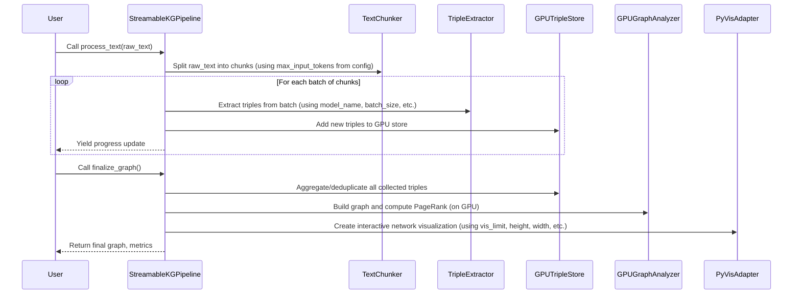

# Chapter 2: StreamableKGPipeline

Welcome back! In our last chapter, [Chapter 1: PipelineConfig](01_pipelineconfig_.md), we learned about `PipelineConfig` – the central control panel for all the settings in our knowledge graph pipeline. We saw how it holds important "knobs" and "switches" that control how our pipeline behaves, especially to make it run smoothly on a Google Colab T4 GPU.

Now that we know *how* to set up our pipeline's rules, it's time to meet the component that *follows* those rules and makes everything happen: the `StreamableKGPipeline`.

### What Problem Does StreamableKGPipeline Solve?

Imagine you're trying to build a complex, multi-stage project – like making a movie! You have a scriptwriter, actors, a director of photography, editors, and special effects artists. Each one is a specialist in their own field.

But who brings them all together? Who ensures the script is written before the actors start? Who makes sure the footage is shot before the editor begins? Who oversees the entire process from start to finish, keeping track of progress, and making sure everyone is working on the right thing at the right time?

That's the job of the **movie director**!

Our knowledge graph pipeline is very similar. We have many specialized "experts":

*   A [TextChunker](03_textchunker_.md) that prepares text.
*   A [TripleExtractor](04_tripleextractor_.md) that pulls out facts using a powerful LLM.
*   A [GPUTripleStore](06_gputriplestore_.md) that cleans and organizes these facts on the GPU.
*   A [GPUGraphAnalyzer](07_gpugraphanalyzer_.md) that finds important patterns in the facts.
*   A [PyVisAdapter](08_pyvisadapter_.md) that creates a visual graph.

Each of these components is brilliant at its specific task, but they don't know how to talk to each other or in what order to operate.

The **`StreamableKGPipeline`** is the **conductor of our knowledge graph orchestra** (or the movie director!). It's the central brain that doesn't *do* the individual heavy lifting itself, but it understands the overall flow. It directs each component, ensuring they perform their tasks in the correct sequence, efficiently, and with respect to our GPU's memory limits. It also provides **progress updates** as it works, which is super helpful for long texts!

### Understanding StreamableKGPipeline: The Conductor

The `StreamableKGPipeline` has two main responsibilities:

1.  **Orchestration (Directing the Show)**: It initializes all the individual components (the "sections" of the orchestra) and then tells them when and how to perform their part of the process.
2.  **Streaming & Progress (Keeping You Informed)**: When processing long texts, it breaks down the work into manageable batches and keeps you updated on its progress. This is what "streamable" means – it doesn't wait until the very end to give you feedback; it streams information as it progresses.

Let's look at how it works in practice.

#### Setting Up the Pipeline

First, just like a conductor needs to know the music score, the `StreamableKGPipeline` needs to know our pipeline's settings. It gets this information from the `PipelineConfig` we discussed in the previous chapter.

When you create an instance of `StreamableKGPipeline`, it immediately sets up all the specialized components it will need:

```python
# main.py (simplified)
from your_module import PipelineConfig, TripleExtractor, TextChunker, GPUTripleStore

# 1. First, create your configuration (like setting up the stage)
config = PipelineConfig()

# 2. Then, create the StreamableKGPipeline, giving it the config
pipeline = StreamableKGPipeline(config)

print("Pipeline is ready to conduct!")
# Output: Pipeline is ready to conduct!
```

In this snippet, `pipeline` is our conductor. It now has all the necessary instruments ([TextChunker](03_textchunker_.md), [TripleExtractor](04_tripleextractor_.md), [GPUTripleStore](06_gputriplestore_.md)) and knows their settings from `config`.

#### Processing Text in Stages

Once set up, the `StreamableKGPipeline` manages the entire process in two main phases:

1.  **`process_text(text)`**: This is where the core extraction happens. It takes your raw input text, breaks it into chunks, sends those chunks to the GPU for fact extraction, and stores the extracted facts. Crucially, it "yields" progress reports along the way, so you see updates in real-time.
2.  **`finalize_graph()`**: After all facts are extracted, this phase brings everything together. It aggregates duplicate facts, runs GPU-powered graph analytics, and prepares the final interactive visualization.

### How to Use StreamableKGPipeline

You typically won't call `StreamableKGPipeline`'s methods directly in your main script, but rather use a convenience function like `run_pipeline` (as shown in `main.py`), which wraps these calls. However, let's look at the core interaction:

```python
# main.py (simplified excerpt from run_pipeline function)

# 1. Initialize the conductor with our settings
pipeline = StreamableKGPipeline(config)

# 2. Start the concert! Process the text and show progress.
# The 'for status in ...' loop lets us see updates as they happen.
print("\nStarting text processing...")
for status in pipeline.process_text(SAMPLE_TEXT):
    # Here, 'status' would contain progress information like
    # {'progress': 0.1, 'triples_extracted': 5, 'batch': 1, 'eta_seconds': 120}
    # (The actual display is handled by tqdm, a progress bar library, inside process_text)
    pass # We just let it run and print its own updates

# 3. Once text processing is done, finalize the grand finale!
print("\nFinalizing the graph...")
edges_df, metrics, network = pipeline.finalize_graph()

# Now 'network' holds the complete, visualized knowledge graph!
```

As you can see, using `StreamableKGPipeline` involves just a few high-level steps: instantiate it with a `config`, then call `process_text`, and finally `finalize_graph`. It handles all the complex interactions between the GPU-accelerated components for you.

### Under the Hood: The Conductor's Baton

Let's peek behind the curtain to see how `StreamableKGPipeline` coordinates everything.

#### The Orchestration Flow

Here's a simplified sequence of events when `StreamableKGPipeline` goes to work:



This diagram shows how `StreamableKGPipeline` acts as the central hub, passing data and instructions between the different specialized components.

#### Looking at the Code

Let's examine the key parts of the `StreamableKGPipeline` class in `main.py`.

**1. Initializing the Conductor (`__init__`)**:

```python
# main.py (simplified StreamableKGPipeline.__init__)
class StreamableKGPipeline:
    def __init__(self, config: PipelineConfig):
        self.config = config
        # The conductor introduces itself to its orchestra members:
        self.extractor = TripleExtractor(config) # The LLM expert
        self.chunker = TextChunker(self.extractor.tokenizer, config.max_input_tokens) # The text preparer
        self.triple_store = GPUTripleStore() # The fact organizer (on GPU)
```

Here, when you create `StreamableKGPipeline`, it immediately creates instances of the other main components, passing them the `config` so they know how to behave. Notice that `TripleExtractor` needs the `config` and `TextChunker` needs the `extractor`'s tokenizer and `max_input_tokens` from `config` to do its job.

**2. Directing the Extraction (`process_text`)**:

```python
# main.py (simplified StreamableKGPipeline.process_text)
class StreamableKGPipeline:
    # ... __init__ ...
    def process_text(self, text: str) -> Iterator[Dict]:
        chunks = self.chunker.chunk_text(text) # Ask the chunker to prepare text
        total_chunks = len(chunks)

        # Loop through chunks in batches (as specified by config.batch_size)
        for i in range(0, total_chunks, self.config.batch_size):
            batch = chunks[i:i + self.config.batch_size]

            # Ask the extractor to extract triples from this batch (on GPU)
            toon_lines = self.extractor.extract_batch(batch)
            # Ask the triple store to add these newly extracted facts
            self.triple_store.add_triples(toon_lines)

            # Important: Yield progress!
            yield {'progress': (i + len(batch)) / total_chunks, 'batch': i // self.config.batch_size + 1}

            # And don't forget memory cleanup for our T4 GPU!
            gc.collect()
            torch.cuda.empty_cache()
```

The `process_text` method is a generator (that's what `Iterator[Dict]` means). It goes through your text piece by piece. For each "batch" of text:
*   It asks the [TextChunker](03_textchunker_.md) to get the text ready.
*   It sends that batch to the [TripleExtractor](04_tripleextractor_.md) to find facts using the LLM.
*   It then passes those raw facts to the [GPUTripleStore](06_gputriplestore_.md) to start collecting them.
*   After each batch, it `yield`s (sends back) a dictionary with progress information, then cleans up GPU memory. This is crucial for keeping our T4 GPU happy!

**3. The Grand Finale (`finalize_graph`)**:

```python
# main.py (simplified StreamableKGPipeline.finalize_graph)
class StreamableKGPipeline:
    # ... __init__ and process_text ...
    def finalize_graph(self) -> Tuple[cudf.DataFrame, Dict, Network]:
        # Ask the triple store to clean up and aggregate all facts on GPU
        edges_df = self.triple_store.aggregate()

        # If we have facts, ask the analyzer to find patterns (PageRank, etc.)
        if len(edges_df) > 0:
            analyzer = GPUGraphAnalyzer(edges_df) # The graph math expert
            metrics = analyzer.compute_metrics()
        else:
            metrics = {} # No facts, no metrics

        # Finally, ask the adapter to create the visual graph
        adapter = PyVisAdapter(self.config) # The visualization artist
        network = adapter.create_network(edges_df, metrics)

        return edges_df, metrics, network
```

Once `process_text` is done collecting all the raw facts, `finalize_graph` takes over:
*   It asks the [GPUTripleStore](06_gputriplestore_.md) to perform its GPU-powered deduplication and aggregation, turning many raw facts into clean, unique relationships.
*   It then creates a [GPUGraphAnalyzer](07_gpugraphanalyzer_.md) to run powerful graph algorithms (like finding the most important "nodes" or entities in your graph using PageRank).
*   Finally, it creates a [PyVisAdapter](08_pyvisadapter_.md) to transform all this data into an interactive HTML visualization that you can open in your browser!

### Conclusion

In this chapter, we met the `StreamableKGPipeline`, the conductor of our knowledge graph orchestra. We learned that it's responsible for orchestrating all the different GPU-accelerated stages—from chunking text to extracting facts, organizing them, analyzing them, and finally visualizing them. It makes sure everything runs in the right order, efficiently, and even provides streaming progress updates along the way.

Now that we understand the overall flow, let's dive into the very first "instrument" in our orchestra: the [TextChunker](03_textchunker_.md), which prepares our raw text for the powerful LLM.

---

Generated by [AI Codebase Knowledge Builder]