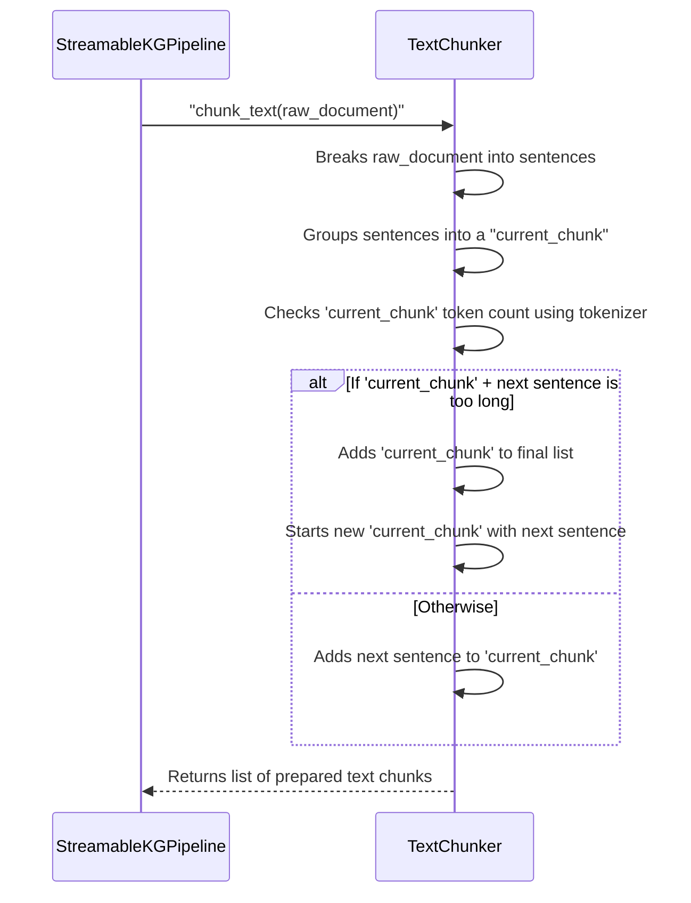

# Chapter 3: TextChunker

Welcome back! In our last chapter, [Chapter 2: StreamableKGPipeline](02_streamablekgpipeline_.md), we learned that the `StreamableKGPipeline` is like the conductor of our knowledge graph orchestra. It brings together all the different specialized components and tells them what to do, in what order.

Now, let's dive into the very first instrument in that orchestra, the one that prepares the sheet music before anyone else plays: the `TextChunker`.

### What Problem Does TextChunker Solve?

Imagine you have a super-smart friend who can understand incredibly complex ideas. But there's a catch: they can only read a few pages of a book at a time. If you give them an entire novel, they'll just look confused and tell you it's too much! You have to break the book into smaller, digestible parts for them.

Even more, you can't just randomly cut the book in the middle of a sentence. That would make no sense! You need to carefully find the end of a paragraph or a sentence, so each piece your friend reads is a complete thought.

Our Knowledge Graph pipeline has a similar challenge:

*   We often have **very long documents** (like articles, reports, or entire books).
*   Our powerful **Large Language Model (LLM)**, which is responsible for extracting facts, is like your super-smart friend. It has a **limited "attention span"** – it can only process a certain amount of text (measured in "tokens," which are like words or parts of words) at a time. If you give it too much, it gets overwhelmed and can't work.

If we just cut the text randomly, we might split sentences or ideas in half, making it impossible for the LLM to understand and extract meaningful facts.

The **`TextChunker`** solves this problem perfectly! It acts like a **smart editor**. It takes your long document and intelligently breaks it into smaller, manageable "chunks" or "paragraphs." It's careful to respect **sentence boundaries**, ensuring that each chunk is a complete thought, and not too long for our LLM to process.

### Understanding TextChunker: Your Smart Editor

The main goal of the `TextChunker` is to make sure our powerful LLM gets text in just the right size, without losing any meaning.

Here’s how to think about its key roles:

1.  **Breaking Big Text into Small Pieces**: It takes your entire input text, no matter how long, and prepares it for the LLM.
2.  **Respecting Sentence Boundaries**: This is crucial! Instead of cutting randomly, it finds natural breaks in the text, like the end of a sentence. This way, each chunk the LLM reads contains coherent, complete ideas.
3.  **Staying Within Token Limits**: The `TextChunker` knows the `max_input_tokens` setting from our [PipelineConfig](01_pipelineconfig_.md). It uses this information to make sure no chunk is larger than what the LLM can handle. It does this by using the same `tokenizer` as the LLM to count tokens accurately.

### How to Use TextChunker

You won't directly interact with the `TextChunker` in your main script! Remember, the `StreamableKGPipeline` is the conductor. It takes care of calling the `TextChunker` for you at the beginning of the extraction process.

Let's look at how the `StreamableKGPipeline` initializes and uses it:

```python
# main.py (simplified from StreamableKGPipeline.__init__ and process_text)

# First, define your configuration (like setting rules for the editor)
# config = PipelineConfig() # from Chapter 1

class StreamableKGPipeline:
    def __init__(self, config):
        self.config = config
        # The LLM expert needs a tokenizer
        self.extractor = TripleExtractor(config) # (covered in Chapter 4)
        # The TextChunker needs the tokenizer and the max_input_tokens from config
        self.chunker = TextChunker(self.extractor.tokenizer, config.max_input_tokens)
        # ... other components ...

    def process_text(self, text: str):
        # The conductor asks the TextChunker to do its job!
        chunks = self.chunker.chunk_text(text)
        # print(f"Text was broken into {len(chunks)} chunks.")
        # ... rest of the extraction process ...
```

As you can see, when the `StreamableKGPipeline` is created, it first sets up the `TripleExtractor` (our LLM expert) and then passes its `tokenizer` and the `max_input_tokens` from `PipelineConfig` to the `TextChunker`.

Later, when you call `pipeline.process_text(your_long_document)`, the `TextChunker` is the first component to get to work, returning a list of neatly prepared text chunks.

If you were to peek at what `chunks` might contain, it would look something like this:

```python
# Imaginary output from chunker.chunk_text()
# For a text about "AI and Machine Learning"

# Example Input (part of SAMPLE_TEXT from main.py):
# "Artificial intelligence is transforming modern computing. Machine learning algorithms enable computers to learn from data without explicit programming. Deep learning, a subset of machine learning, uses neural networks with multiple layers to model complex patterns."

# Example Output (what 'chunks' might look like):
chunks = [
    "Artificial intelligence is transforming modern computing. Machine learning algorithms enable computers to learn from data without explicit programming.",
    "Deep learning, a subset of machine learning, uses neural networks with multiple layers to model complex patterns."
]
```
Notice how each chunk ends at a sentence boundary, and no chunk is too long for the LLM.

### Under the Hood: How the Smart Editor Works

Let's take a quick look at how the `TextChunker` actually performs its magic.

#### The Chunking Process Flow

Here's a simplified sequence of events:



1.  **Receives Text**: The `StreamableKGPipeline` gives the `TextChunker` a long string of text.
2.  **Splits into Sentences**: The `TextChunker` first breaks this long string into individual sentences. This is its secret to respecting meaning!
3.  **Builds Chunks**: It then goes through these sentences one by one, adding them to a "current chunk" of text.
4.  **Checks Length (with Tokens!)**: Before adding a new sentence, it calculates how many "tokens" (using the LLM's own tokenizer) the `current_chunk` *plus* the new sentence would have.
5.  **Decides to Cut**: If adding the new sentence would make the `current_chunk` too long (exceeding `max_input_tokens`), it "cuts" there. The `current_chunk` is finalized and added to a list, and a *new* `current_chunk` is started with the new sentence.
6.  **Returns Chunks**: Once all sentences are processed, it returns a list of these nicely sized, meaningful text chunks.

#### Peeking at the Code

Let's look at the core parts of the `TextChunker` class from `main.py`:

**1. Initializing the Chunker (`__init__`)**:

```python
# main.py (simplified TextChunker.__init__)
class TextChunker:
    def __init__(self, tokenizer, max_tokens: int = 1400):
        self.tokenizer = tokenizer # The LLM's way to count "words"
        self.max_tokens = max_tokens # The limit from PipelineConfig

# This tells the TextChunker:
# - How to count tokens (using the 'tokenizer').
# - What the maximum allowed token count is for each chunk ('max_tokens').
```

**2. The `chunk_text` Method (Simplified)**:

```python
# main.py (simplified TextChunker.chunk_text)
class TextChunker:
    # ... __init__ ...
    def chunk_text(self, text: str) -> List[str]:
        # Step 1: Split into sentences (smart boundary!)
        sentences = re.split(r'(?<=[.!?])\s+', text)
        chunks = []
        current_chunk = []
        current_length = 0 # Keeps track of tokens in current_chunk

        for sent in sentences:
            # Step 2: Count tokens for the current sentence
            sent_tokens = len(self.tokenizer.encode(sent, add_special_tokens=False))

            # Step 3: Check if adding this sentence makes the chunk too big
            if current_length + sent_tokens > self.max_tokens:
                if current_chunk: # If there's content, finalize it
                    chunks.append(' '.join(current_chunk))
                    current_chunk = [sent] # Start a new chunk
                    current_length = sent_tokens
                else:
                    # Handle very long single sentences (rare for good text)
                    chunks.append(sent[:self.max_tokens * 4]) # Rough cut
                    current_chunk = []
                    current_length = 0
            else:
                # Step 4: Add sentence to current chunk
                current_chunk.append(sent)
                current_length += sent_tokens

        # Add any remaining text as the last chunk
        if current_chunk:
            chunks.append(' '.join(current_chunk))

        return chunks
```
This simplified code snippet shows the core logic: `re.split` breaks the text by sentence, `tokenizer.encode` counts tokens, and the `if` condition checks if adding a sentence would exceed our `max_tokens` limit. This ensures the LLM gets perfectly sized, meaningful inputs.

### Conclusion

In this chapter, we unpacked the `TextChunker`, our smart editor. We learned that its job is to prepare long documents by breaking them into smaller, digestible chunks, always respecting sentence boundaries and adhering to the LLM's `max_input_tokens` limit (which comes from our [PipelineConfig](01_pipelineconfig_.md)). It's the essential first step to ensure our powerful LLM can actually read and understand the text without getting overwhelmed.

Now that our text is neatly chunked and ready, the next step is to feed these chunks to the LLM and extract facts! Let's move on to the [TripleExtractor](04_tripleextractor_.md).

---

Generated by [AI Codebase Knowledge Builder]