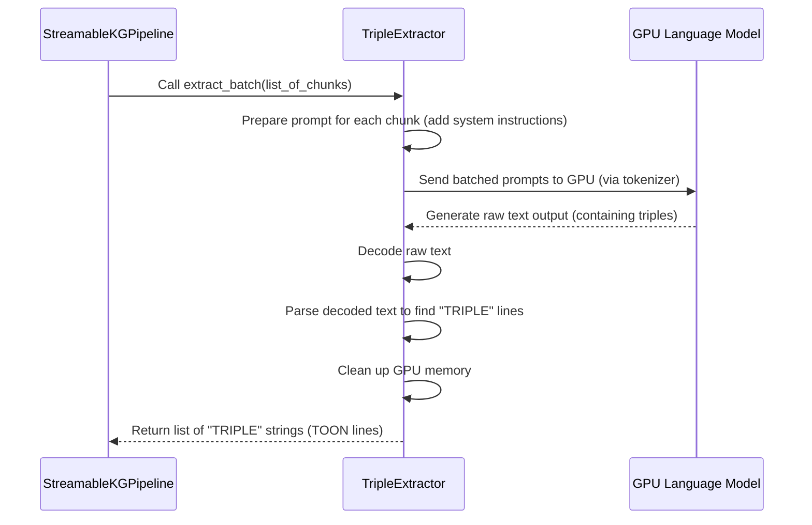

# Chapter 4: TripleExtractor

Welcome back! In our last chapter, [Chapter 3: TextChunker](03_textchunker_.md), we learned how the `TextChunker` acts as a smart editor, taking your long documents and breaking them into smaller, digestible chunks, perfectly sized for our powerful AI.

Now that our text is neatly organized and ready to be read, it's time for the real magic to happen: extracting the actual facts! This is where the **`TripleExtractor`** steps in.

### What Problem Does TripleExtractor Solve?

Imagine you've just read a fascinating article about a new scientific discovery. Your brain automatically picks out key facts: "Dr. Smith invented X," "X solves problem Y," "Y is related to Z." You're not just reading words; you're understanding relationships.

Our knowledge graph pipeline needs a component that can do the same thing, but for a computer. We have a list of text chunks, but they're still just raw text. We need to find the connections, the "who did what to whom," "what is part of what," or "what has which property."

The challenge is:
*   This "understanding" needs powerful intelligence, like a human expert.
*   It needs to work very quickly and efficiently, especially on our specialized GPU (like the T4).
*   The extracted facts must be in a very specific, structured format so that the next steps in our GPU pipeline can easily understand them.

The **`TripleExtractor`** is like a highly specialized, incredibly smart **language detective** who sits right inside your GPU. It takes those text chunks from the `TextChunker`, uses a powerful Artificial Intelligence (AI) language model (called an LLM), and figures out all the important relationships between things (we call these "entities").

Then, this detective doesn't just keep the facts to itself. It translates them into a very specific, easy-to-understand format: `TRIPLE source:"X" predicate:"Y" target:"Z"`. This structured output is absolutely crucial because it's the "language" that all the subsequent GPU processing steps will use. It's also designed to be super memory-efficient, making the most of our T4 GPU.

### Understanding TripleExtractor: Your GPU-Powered Fact Detective

The `TripleExtractor` has a few core responsibilities:

1.  **Reads Text Chunks**: It takes the carefully prepared text chunks provided by the [TextChunker](03_textchunker_.md).
2.  **Uses an AI Brain (LLM)**: It loads and uses a powerful AI Large Language Model (LLM) on the GPU. This LLM is the "intelligence" that understands the text.
3.  **Identifies Relationships**: Based on the text, the LLM finds connections between entities (people, places, concepts, things). For example, if it reads "Geoffrey Hinton pioneered deep learning," it identifies "Geoffrey Hinton" as the source, "pioneered" as the predicate (the action/relationship), and "deep learning" as the target.
4.  **Structures the Output**: It translates these identified relationships into the precise `TRIPLE source:"X" predicate:"Y" target:"Z"` format. This format is often called **TOON** (TRIPLE-Oriented Object Notation), and it's covered in detail in the next chapter. For now, just know it's a standardized way to write down a fact.
5.  **Memory Efficiency**: Because LLMs can be memory-hungry, the `TripleExtractor` is carefully designed to be memory-efficient, ensuring our T4 GPU doesn't run out of juice. It does this by loading the LLM only once and aggressively cleaning up memory after each batch.

### How to Use TripleExtractor

Just like the `TextChunker`, you usually won't directly call the `TripleExtractor` yourself. Remember, the [StreamableKGPipeline](02_streamablekgpipeline_.md) is our conductor! It handles setting up and calling the `TripleExtractor` at the right time.

Let's see how the `StreamableKGPipeline` initializes and uses our fact detective:

```python
# main.py (simplified from StreamableKGPipeline.__init__)

# First, define your configuration (from Chapter 1)
# config = PipelineConfig()

class StreamableKGPipeline:
    def __init__(self, config):
        self.config = config
        # The TripleExtractor (our LLM expert) is created first.
        # It needs the config for settings like model_name, max_output_tokens.
        self.extractor = TripleExtractor(config) # <--- This line creates it!
        # The TextChunker needs the tokenizer from the extractor.
        self.chunker = TextChunker(self.extractor.tokenizer, config.max_input_tokens)
        # ... other components ...
```
When the `StreamableKGPipeline` starts up, it creates an instance of `TripleExtractor`, giving it the `config` object (from [Chapter 1: PipelineConfig](01_pipelineconfig_.md)) which contains important settings like `model_name` (which LLM to use) and `max_output_tokens` (how much text the LLM should generate).

Then, during the `process_text` phase, the `StreamableKGPipeline` asks the `TripleExtractor` to get to work:

```python
# main.py (simplified from StreamableKGPipeline.process_text)

class StreamableKGPipeline:
    # ... __init__ ...
    def process_text(self, text: str):
        chunks = self.chunker.chunk_text(text) # TextChunker prepares the text
        total_chunks = len(chunks)

        for i in range(0, total_chunks, self.config.batch_size):
            batch = chunks[i:i + self.config.batch_size]

            # The conductor asks the TripleExtractor to extract facts from this batch!
            toon_lines = self.extractor.extract_batch(batch) # <--- This line calls it!

            # toon_lines would now be a list of strings like:
            # ['TRIPLE source:"Geoffrey Hinton" predicate:"pioneered" target:"deep learning" confidence:0.95',
            #  'TRIPLE source:"Deep learning" predicate:"uses" target:"neural networks" confidence:0.90']
            # ... rest of the extraction process ...
```

The `extractor.extract_batch(batch)` method is the core action. It takes a `batch` of text chunks, sends them to the powerful LLM on the GPU, and returns a list of strings, where each string is a fact in our `TRIPLE` (TOON) format.

### Under the Hood: How the Fact Detective Works

Let's peek behind the scenes to see how the `TripleExtractor` performs its tasks.

#### The Extraction Process Flow

Here's a simplified sequence of how `TripleExtractor` interacts with the LLM:



1.  **Receives Chunks**: The `StreamableKGPipeline` gives `TripleExtractor` a batch of text chunks.
2.  **Prepares Prompts**: For each chunk, `TripleExtractor` creates a special "prompt." This prompt includes a set of instructions (called `system_prompt`) that tell the LLM exactly *how* to extract facts and *what format* to use (the `TRIPLE` format). Then it adds the actual text chunk to this prompt.
3.  **Sends to LLM**: It uses a `tokenizer` to convert these prompts into numbers (tokens) that the LLM can understand, then sends them to the LLM on the GPU.
4.  **LLM Generates**: The powerful LLM reads the prompts on the GPU and generates new text, trying to follow the instructions to output triples.
5.  **Decodes & Parses**: The `TripleExtractor` receives the raw generated text from the LLM, decodes it back into human-readable text, and then carefully searches for lines that start with "TRIPLE" to extract the structured facts.
6.  **Cleans Up**: Very importantly for our T4 GPU, it cleans up all the temporary data from the GPU memory (`torch.cuda.empty_cache()`) so there's enough room for the next batch.
7.  **Returns Triples**: Finally, it sends the list of extracted `TRIPLE` strings back to the `StreamableKGPipeline`.

#### Peeking at the Code

Let's look at the key parts of the `TripleExtractor` class from `main.py`.

**1. Loading the Model (The Singleton Pattern for Memory)**:

To save precious GPU memory and avoid loading the same huge LLM multiple times, `TripleExtractor` uses a special trick called the **Singleton pattern**. This means that no matter how many times you try to create a `TripleExtractor` object, it only *actually* loads the LLM onto the GPU *once*.

```python
# main.py (simplified TripleExtractor __new__ and __init__)
class TripleExtractor:
    _instance = None # Keeps track if an instance already exists
    _model = None    # Stores the loaded LLM
    _tokenizer = None # Stores the loaded tokenizer

    def __new__(cls, config: PipelineConfig):
        # If no TripleExtractor has been created yet, create a new one.
        if cls._instance is None:
            cls._instance = super().__new__(cls)
        return cls._instance

    def __init__(self, config: PipelineConfig):
        # If the model is already loaded, just use it and skip loading again.
        if self._model is not None:
            self.config = config
            self.model = self._model
            self.tokenizer = self._tokenizer
            self.device = torch.device("cuda" if torch.cuda.is_available() else "cpu")
            return

        self.config = config
        self.device = torch.device("cuda" if torch.cuda.is_available() else "cpu")
        print(f"Loading model on {self.device}...")

        # Load the LLM's "tokenizer" (its way of understanding words)
        self.tokenizer = AutoTokenizer.from_pretrained(config.model_name, trust_remote_code=True)
        if self.tokenizer.pad_token is None:
            self.tokenizer.pad_token = self.tokenizer.eos_token

        # Load the actual LLM (the "brain") onto the GPU
        self.model = AutoModelForCausalLM.from_pretrained(
            config.model_name,
            torch_dtype=torch.float16, # Use half-precision for speed and memory on GPU
            device_map="auto",         # Automatically place parts of the model on GPU/CPU
            low_cpu_mem_usage=True,    # Reduce CPU memory during loading
            offload_folder="./offload" # Use disk if GPU/CPU memory runs out
        )
        self.model.eval() # Set model to evaluation mode (no learning during extraction)

        # Store the loaded model/tokenizer so they can be reused
        self._model = self.model
        self._tokenizer = self.tokenizer

        # This is the "rulebook" for the LLM!
        self.system_prompt = """You are a knowledge graph extraction expert. Extract ALL meaningful relationships from the text.
        ... (detailed instructions for the LLM on how to extract and format triples) ...
        OUTPUT FORMAT (one per line):
        TRIPLE source:"entity1" predicate:"relationship" target:"entity2" confidence:0.XX
        ...
        Extract triples from this text:"""
```
The `__new__` method ensures the model is loaded only once. The `__init__` method then loads the `tokenizer` and the `model` from the `config.model_name`. Notice `torch_dtype=torch.float16` and `device_map="auto"`. These are crucial for making large models fit and run fast on GPUs like the T4! Finally, the `system_prompt` is defined, which is a detailed set of instructions that tells the LLM exactly *what* to extract and *how* to format it as `TRIPLE` lines.

**2. Extracting a Batch of Triples (`extract_batch`)**:

```python
# main.py (simplified TripleExtractor.extract_batch)
class TripleExtractor:
    # ... __init__ ...
    def extract_batch(self, chunks: List[str]) -> List[str]:
        # Create a full prompt for each chunk, including our system rules.
        prompts = [f"{self.system_prompt}\n\nText: {chunk}\n\nTriples:" for chunk in chunks]

        # Convert prompts into numbers (tokens) that the LLM understands, send to GPU.
        inputs = self.tokenizer(
            prompts,
            return_tensors="pt",
            padding=True,
            truncation=True,
            max_length=self.config.max_input_tokens
        ).to(self.device)

        with torch.no_grad(): # Don't track changes, just generate output
            # Tell the LLM to generate new text based on the prompts.
            outputs = self.model.generate(
                **inputs,
                max_new_tokens=self.config.max_output_tokens, # Limit output length
                do_sample=False, # Get deterministic output
                pad_token_id=self.tokenizer.eos_token_id
            )

        # Convert the LLM's numerical output back into human-readable text.
        decoded = self.tokenizer.batch_decode(outputs, skip_special_tokens=True)
        toon_lines = []

        for text in decoded:
            # Find the part of the text that contains our "TRIPLE" facts.
            response = text.split("Triples:")[-1].strip()
            # Extract only the lines that contain "TRIPLE".
            toon_lines.extend([line.strip() for line in response.split('\n') if 'TRIPLE' in line])

        # IMPORTANT: Free up GPU memory aggressively!
        del inputs, outputs # Delete the variables holding GPU data
        torch.cuda.empty_cache() # Clear unused memory from GPU

        return toon_lines
```
The `extract_batch` method is where the LLM does its work. It prepares the prompts, tokenizes them, sends them to the `model.generate()` function on the GPU, and then decodes the LLM's output. The crucial part here is parsing the `decoded` text to find the lines that contain `TRIPLE` statements, which are our extracted facts. Finally, `del inputs, outputs` and `torch.cuda.empty_cache()` are vital for cleaning up GPU memory, making it available for the next batch of chunks.

### Conclusion

In this chapter, we learned about the `TripleExtractor`, our highly specialized language detective. It takes the organized text chunks from the [TextChunker](03_textchunker_.md), uses a powerful AI language model on the GPU to identify relationships, and then translates these relationships into a very specific and structured format (`TRIPLE source:"X" predicate:"Y" target:"Z"`). This component is the brain of our extraction process, converting raw text into meaningful facts while being careful with our valuable GPU memory.

Now that we know the `TripleExtractor` produces facts in a structured `TRIPLE` format, let's dive deeper into understanding this format itself and why it's so important for our GPU-accelerated pipeline. Up next: [TOON Extraction Format](05_toon_extraction_format_.md).

---

Generated by [AI Codebase Knowledge Builder]