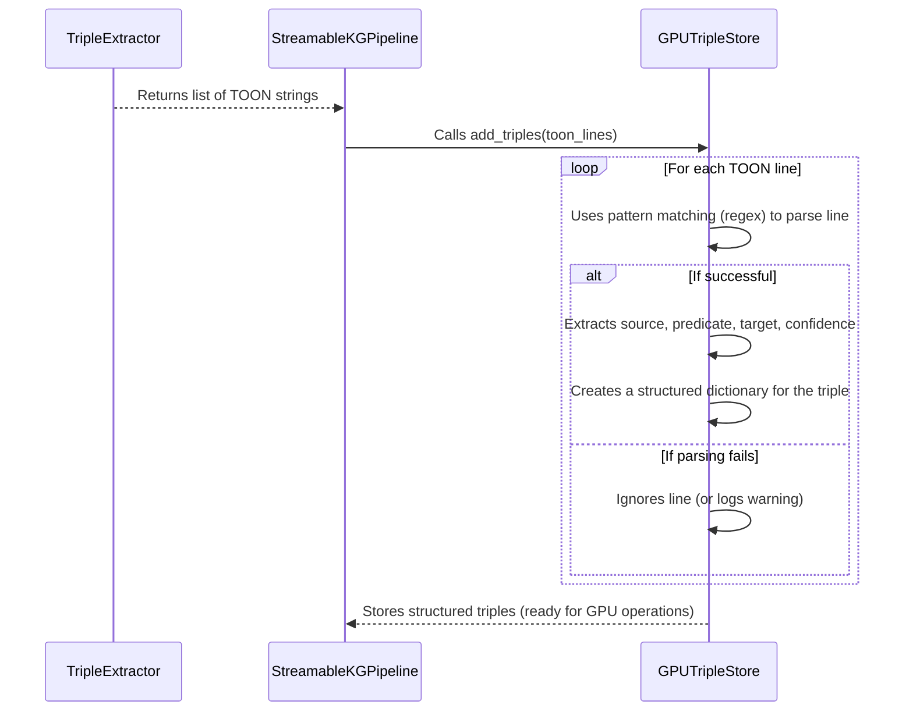

# Chapter 5: TOON Extraction Format

Welcome back! In our last chapter, [Chapter 4: TripleExtractor](04_tripleextractor_.md), we saw how our powerful AI language model (LLM) acts like a language detective, pulling out facts from text chunks. The `TripleExtractor` then outputs these facts in a very specific format, something like `TRIPLE source:"Geoffrey Hinton" predicate:"pioneered" target:"deep learning" confidence:0.95`.

Now, it's time to truly understand this crucial format itself. This chapter introduces you to the **TOON Extraction Format**, which stands for **TRIPLE Output ONeline**.

### What Problem Does TOON Solve?

Imagine you're trying to give instructions to a very powerful robot. If you just say, "The human wants to eat," the robot might get confused. Does the human want *to eat* something, or *be eaten*? What specifically do they want to eat?

But if you give instructions in a very strict, clear format, like:
`ACTION: EAT; OBJECT: SANDWICH; SUBJECT: HUMAN`
The robot understands perfectly! It knows exactly what to do.

Our knowledge graph pipeline faces a similar challenge. The [TripleExtractor](04_tripleextractor_.md) (our LLM) is incredibly smart at understanding text, but its raw output can be a bit like natural human language – sometimes ambiguous or inconsistent.

The parts of our pipeline that come *after* the LLM, especially the [GPUTripleStore](06_gputriplestore_.md) which runs on the GPU, need to quickly and reliably understand the extracted facts. They are designed for speed and efficiency, not for figuring out ambiguous human language. If the LLM just spat out facts in any old way, the `GPUTripleStore` would need its own complex natural language processing (NLP) capabilities, which would slow down our GPU-accelerated pipeline significantly.

The **TOON Extraction Format** solves this by acting as a **formal contract** or a **standardized language** between the LLM and the rest of our pipeline. It ensures that no matter what text the LLM processes, its output is *always* in a predictable, easy-to-parse structure. This strictness allows the `GPUTripleStore` to process the facts at incredible speeds on the GPU.

### Understanding TOON: The LLM's Formal Contract

TOON (TRIPLE Output ONeline) is a strict, standardized format that our LLM is trained and prompted to use. It's designed to represent a single fact or relationship in a way that's machine-readable and unambiguous.

Each TOON line represents a "triple" – a set of three parts (source, predicate, target) that describe a relationship, plus a confidence score.

Let's break down the format:

`TRIPLE source:"entity1" predicate:"relationship" target:"entity2" confidence:0.XX`

Here's what each part means:

1.  **`TRIPLE`**: This is a keyword that signals the start of a fact. It's like saying "Hey, here comes a structured piece of information!"
2.  **`source:"entity1"`**: This specifies the *subject* or *origin* of the relationship. "entity1" is the actual name (e.g., "Geoffrey Hinton," "Deep learning"). It's always enclosed in double quotes.
3.  **`predicate:"relationship"`**: This describes the *type of relationship* or *action* connecting the source and target (e.g., "pioneered," "uses," "is_a"). Also in double quotes.
4.  **`target:"entity2"`**: This is the *object* or *destination* of the relationship. "entity2" is the actual name (e.g., "deep learning," "neural networks"). Again, in double quotes.
5.  **`confidence:0.XX`**: This is a numerical score, between 0.00 and 1.00, indicating how certain the LLM is about this extracted fact. A higher number means more certainty (e.g., `0.95` for high certainty).

**Example:**

If the LLM reads "Geoffrey Hinton pioneered deep learning," it would output:

```
TRIPLE source:"Geoffrey Hinton" predicate:"pioneered" target:"deep learning" confidence:0.95
```

This single line concisely captures the relationship in a format that's easy for computers to understand.

### How Our Pipeline Uses TOON

The `StreamableKGPipeline` orchestrates everything, but the direct interaction with TOON happens between the [TripleExtractor](04_tripleextractor_.md) and the [GPUTripleStore](06_gputriplestore_.md).

#### 1. Generating TOON (by `TripleExtractor`)

The [TripleExtractor](04_tripleextractor_.md) is responsible for *generating* these TOON lines. It does this by giving the LLM a very clear set of instructions (called a `system_prompt`) that explicitly tells the LLM to output facts in the TOON format.

Here's a small snippet from the `system_prompt` inside `TripleExtractor` (from `main.py`) that dictates the output format:

```python
# main.py (simplified from TripleExtractor.system_prompt)
# ...
self.system_prompt = """You are a knowledge graph extraction expert. Extract ALL meaningful relationships from the text.
        ...
        OUTPUT FORMAT (one per line):
        TRIPLE source:"entity1" predicate:"relationship" target:"entity2" confidence:0.XX
        ...
        Extract triples from this text:"""
```
This `system_prompt` is critical. It's like giving our robot a detailed user manual for *how* to deliver its findings. Because the LLM gets these exact instructions, it knows to produce output that looks like the TOON format.

When the `TripleExtractor` calls the LLM, it receives raw text output. Then, it filters this output to find only the lines that actually start with `TRIPLE`. These become the `toon_lines` that are passed to the next stage.

```python
# main.py (simplified from StreamableKGPipeline.process_text)

# ... inside StreamableKGPipeline.process_text ...
        for i in range(0, total_chunks, self.config.batch_size):
            batch = chunks[i:i + self.config.batch_size]

            # The TripleExtractor extracts facts and returns TOON lines
            toon_lines = self.extractor.extract_batch(batch) # <--- These are TOON lines!

            # Example toon_lines:
            # ['TRIPLE source:"AI" predicate:"is_transforming" target:"modern computing" confidence:0.95',
            #  'TRIPLE source:"Machine learning" predicate:"uses" target:"algorithms" confidence:0.90']

            self.triple_store.add_triples(toon_lines)
# ...
```
The `toon_lines` list now contains precisely formatted strings, ready for the next step.

#### 2. Parsing TOON (by `GPUTripleStore`)

The next component, the [GPUTripleStore](06_gputriplestore_.md), is designed to *parse* these TOON lines. Because the format is so strict and predictable, `GPUTripleStore` doesn't need to do any complex NLP. It can use simple pattern matching to quickly pull out the source, predicate, target, and confidence from each line.

This rapid parsing is a key reason why our pipeline can be so efficient on the GPU!

### Under the Hood: Parsing with `GPUTripleStore`

Let's look at how the `GPUTripleStore` parses the TOON lines it receives.

#### The Parsing Flow



The diagram shows that the `GPUTripleStore` receives the TOON lines and, for each one, attempts to extract the components. If a line doesn't perfectly match the TOON format, it's either ignored or logged as a warning. This strictness ensures only valid, structured facts proceed.

#### Peeking at the Code: `parse_toon_line`

The `GPUTripleStore` has a special helper method called `parse_toon_line` (in `main.py`) that does this exact job. It uses regular expressions (regex) to match the expected pattern.

```python
# main.py (simplified from GPUTripleStore.parse_toon_line)
class GPUTripleStore:
    # ...
    @staticmethod
    def parse_toon_line(line: str) -> Dict:
        """Parse TOON format to structured dict"""
        # This is the strict pattern we expect: TRIPLE source:"X" predicate:"Y" target:"Z" confidence:0.XX
        pattern = r'TRIPLE source:"([^"]+)" predicate:"([^"]+)" target:"([^"]+)" confidence:([\d.]+)'
        match = re.search(pattern, line)

        if match:
            return {
                'source': match.group(1).strip(),      # "entity1"
                'predicate': match.group(2).strip(),   # "relationship"
                'target': match.group(3).strip(),      # "entity2"
                'confidence': min(float(match.group(4)), 1.0) # 0.XX
            }
        # If the strict pattern doesn't match, we have a fallback (for robustness),
        # but the LLM is primarily trained for the strict pattern.
        # ... (simplified_pattern handling is omitted for clarity) ...
        return None
```
In this code:
*   `pattern` is a regular expression that defines the exact structure of a TOON line. It uses `([^"]+)` to "capture" anything inside the double quotes (the source, predicate, and target) and `([\d.]+)` to capture the confidence number.
*   `re.search(pattern, line)` tries to find this pattern in the input `line`.
*   If a `match` is found, `match.group(1)`, `match.group(2)`, etc., give us the captured parts, which are then used to create a nice, structured Python dictionary. This dictionary is much easier to work with programmatically than the raw string.

Once the TOON lines are parsed into structured dictionaries, the `GPUTripleStore` then converts these into numerical IDs (using `hash_entity`) and stores them efficiently in a `cudf.DataFrame` on the GPU. But the details of that are for the next chapter!

### Conclusion

In this chapter, we explored the **TOON Extraction Format**, the strict, standardized language that our LLM uses to output relationships. We learned that this `TRIPLE source:"X" predicate:"Y" target:"Z" confidence:0.XX` structure acts as a formal contract, allowing the [GPUTripleStore](06_gputriplestore_.md) to reliably and efficiently parse extracted facts on the GPU without needing complex natural language processing. This strict adherence to a format is a cornerstone of our high-performance, GPU-accelerated pipeline.

Now that we understand the format of the facts, let's move on to how these facts are stored, deduplicated, and prepared for analysis entirely on the GPU: the [GPUTripleStore](06_gputriplestore_.md).

---

Generated by [AI Codebase Knowledge Builder]