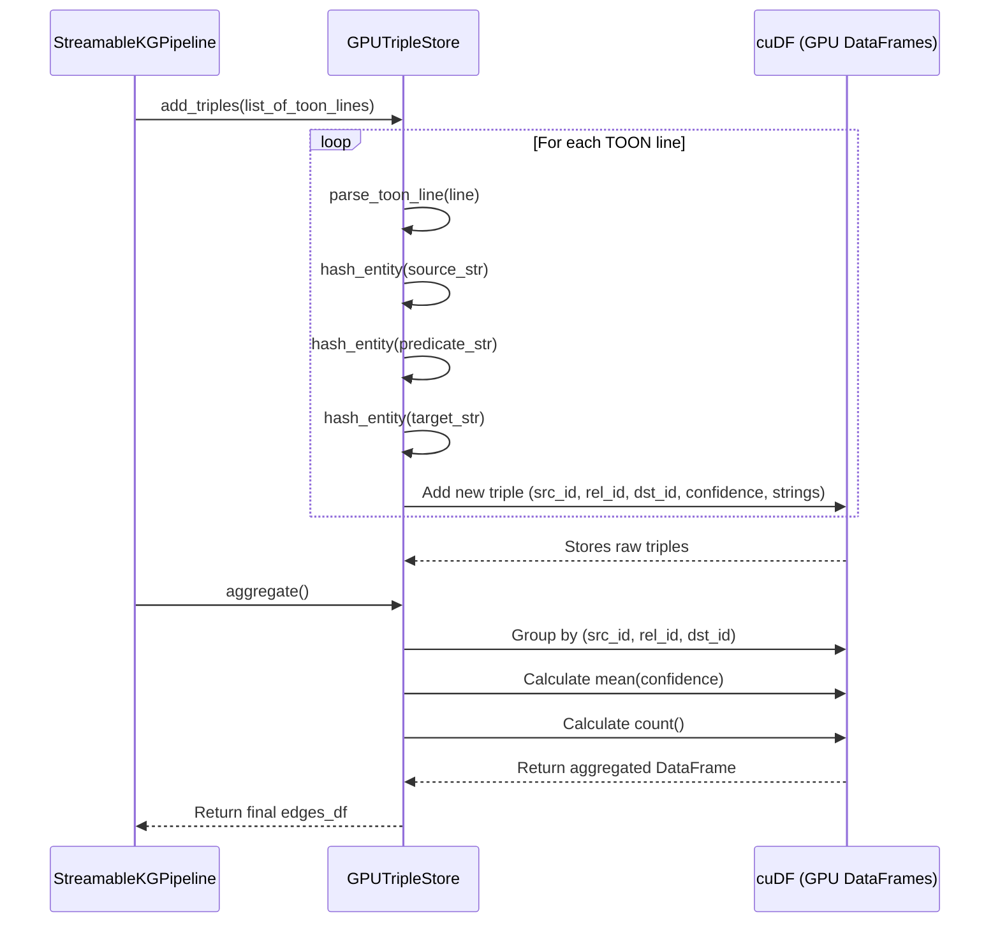

# Chapter 6: GPUTripleStore

Welcome back! In our last chapter, [Chapter 5: TOON Extraction Format](05_toon_extraction_format_.md), we learned about the precise `TRIPLE source:"X" predicate:"Y" target:"Z" confidence:0.XX` format that our LLM uses to output extracted facts. This strict format is crucial because it acts as a common language, making it easy for the next stages of our pipeline to understand the data.

Now, let's meet the component that takes these raw, structured facts and turns them into a clean, organized, and truly useful knowledge graph *right on the GPU*: the **`GPUTripleStore`**.

### What Problem Does GPUTripleStore Solve?

Imagine you're collecting facts from many different sources, all about the same topic. For example, several articles might mention:
*   "Geoffrey Hinton **pioneered** deep learning."
*   "Hinton **is known for** deep learning."
*   "Professor Hinton **worked on** deep learning."

Even though the wording is slightly different, these are essentially the *same core fact*. If we just stored every single line our [TripleExtractor](04_tripleextractor_.md) found, our knowledge graph would quickly become a messy, redundant jumble of duplicate information. It would be hard to tell what the most important facts are, or how confident we should be about them.

The challenges are:
*   How do we quickly identify that "Geoffrey Hinton pioneered deep learning" and "Professor Hinton worked on deep learning" refer to the same relationship, even if the phrasing or names are slightly different?
*   How do we combine these similar facts, perhaps calculating an average confidence score or counting how many times we've seen a particular relationship?
*   How can we do all this **super fast** and **efficiently** using our powerful GPU, without moving tons of data back and forth to the slower CPU?

The **`GPUTripleStore`** is the **pipeline's central data hub and smart organizer on the GPU**. It acts like a highly efficient librarian who specializes in knowledge graphs. It takes all the raw `TRIPLE` facts from the [TripleExtractor](04_tripleextractor_.md), intelligently identifies identical relationships, combines them, calculates statistics (like average confidence), and assigns unique ID numbers to everything. This entire process, called **canonicalization**, happens at lightning speed directly on the GPU, preventing duplicate entries from ever cluttering our graph.

### Understanding GPUTripleStore: Your GPU's Smart Data Organizer

The `GPUTripleStore` is where all the extracted facts come to get cleaned up and organized. It performs several crucial operations:

1.  **Parses TOON Lines**: It accurately reads the `TRIPLE` format to extract the source, predicate, target, and confidence from each line.
2.  **Assigns Unique IDs (Hashing)**: Instead of storing entity names like "Geoffrey Hinton" directly, which can be long and slow to compare, it assigns a unique, compact "ID number" (a hash) to each unique source, predicate, and target. Think of it like giving every unique person, place, or concept a short, distinct barcode. This makes GPU processing much faster.
3.  **Deduplicates and Canonicalizes**: This is a core feature! When it receives new facts, it compares their ID numbers. If it finds facts that have the *exact same* source ID, predicate ID, and target ID, it recognizes them as duplicates. It then combines these duplicates into a single, canonical (standardized) entry.
4.  **Aggregates Data**: When combining duplicates, it calculates important statistics. For example, it will:
    *   **Average the confidence scores**: If two identical facts have confidences of 0.90 and 0.95, the canonical fact will have an average confidence of 0.925.
    *   **Count occurrences**: It keeps track of how many times a particular fact has been observed.
5.  **Uses cuDF**: All these operations – parsing, hashing, deduplication, and aggregation – are powered by `cuDF`, a GPU-accelerated DataFrame library that works just like `pandas` but on the GPU. This is why it's so incredibly fast!

### How to Use GPUTripleStore

As a user, you typically don't directly interact with `GPUTripleStore`. Instead, the [StreamableKGPipeline](02_streamablekgpipeline_.md) (our conductor) manages it.

Here's how the `StreamableKGPipeline` uses `GPUTripleStore` in two main steps:

#### 1. Adding Triples (`add_triples`)

After the [TripleExtractor](04_tripleextractor_.md) generates a batch of `TRIPLE` lines, the `StreamableKGPipeline` hands them over to the `GPUTripleStore` to start collecting them.

```python
# main.py (simplified from StreamableKGPipeline.process_text)

class StreamableKGPipeline:
    def __init__(self, config):
        # ... other components ...
        self.triple_store = GPUTripleStore() # <--- GPUTripleStore is initialized!

    def process_text(self, text: str):
        # ... chunks and batches ...
        for i in range(0, total_chunks, self.config.batch_size):
            batch = chunks[i:i + self.config.batch_size]
            toon_lines = self.extractor.extract_batch(batch)

            # The conductor tells the GPUTripleStore to add these raw facts
            self.triple_store.add_triples(toon_lines) # <--- Using it here!
            # ... cleanup ...
```
When `add_triples` is called, the `GPUTripleStore` immediately parses each TOON line, hashes the entities, and stores them in an internal `cuDF` DataFrame on the GPU. It does *not* deduplicate at this stage; it just collects everything efficiently.

#### 2. Aggregating and Deduplicating (`aggregate`)

Once all the raw text chunks have been processed and all `TRIPLE` lines have been collected by `add_triples`, the `StreamableKGPipeline` calls `aggregate()`. This is the moment when all the collected facts are deduplicated and summarized into a clean, canonical set of relationships.

```python
# main.py (simplified from StreamableKGPipeline.finalize_graph)

class StreamableKGPipeline:
    # ... process_text ...
    def finalize_graph(self) -> Tuple[cudf.DataFrame, Dict, Network]:
        # The conductor asks GPUTripleStore to finalize and clean up the facts
        edges_df = self.triple_store.aggregate() # <--- Using it here!

        print(f"Graph: {len(edges_df)} unique edges")
        # ... rest of graph analysis and visualization ...
```
The `edges_df` returned by `aggregate()` is a `cuDF` DataFrame that contains all the *unique*, canonical relationships, along with their average confidence and count, all ready for the next GPU-accelerated steps.

### Under the Hood: How the Smart Data Organizer Works

Let's peek behind the scenes to see how `GPUTripleStore` performs its magic.

#### The Data Organization Flow

Here’s a simplified sequence of events when `GPUTripleStore` is at work:


This diagram illustrates the two main phases: `add_triples` where raw facts are collected, and `aggregate` where the real GPU-powered deduplication and summary happen.

#### Peeking at the Code

Let's look at the core parts of the `GPUTripleStore` class from `main.py`.

**1. Parsing TOON Lines (`parse_toon_line`)**:

This is the same method we briefly saw in [Chapter 5: TOON Extraction Format](05_toon_extraction_format_.md). It uses regular expressions to extract structured data from the `TRIPLE` string.

```python
# main.py (simplified from GPUTripleStore.parse_toon_line)
class GPUTripleStore:
    # ...
    @staticmethod
    def parse_toon_line(line: str) -> Dict:
        pattern = r'TRIPLE source:"([^"]+)" predicate:"([^"]+)" target:"([^"]+)" confidence:([\d.]+)'
        match = re.search(pattern, line)
        if match:
            return {
                'source': match.group(1).strip(),
                'predicate': match.group(2).strip(),
                'target': match.group(3).strip(),
                'confidence': min(float(match.group(4)), 1.0)
            }
        return None # If it doesn't match the strict pattern
```
This function converts a raw `TRIPLE` string into a Python dictionary, making it easy to access each component (source, predicate, target, confidence).

**2. Assigning Unique IDs (`hash_entity`)**:

To make comparing and grouping incredibly fast on the GPU, `GPUTripleStore` assigns a stable, unique 64-bit integer ID to each string using `xxhash`.

```python
# main.py (simplified from GPUTripleStore.hash_entity)
class GPUTripleStore:
    # ...
    @staticmethod
    def hash_entity(entity: str) -> int:
        """Stable int64 hash for GPU operations"""
        # xxhash is very fast and produces unique integer IDs for strings.
        return xxhash.xxh64(entity.encode('utf-8')).intdigest() & 0x7FFFFFFFFFFFFFFF
```
Every time "Geoffrey Hinton" is seen, it will always get the same `int64` ID number, which allows `cuDF` to quickly find and compare them.

**3. Collecting Raw Triples (`add_triples`)**:

This method takes the parsed triples, converts their string components into numerical IDs using `hash_entity`, and then adds them as new rows to a `cuDF` DataFrame.

```python
# main.py (simplified from GPUTripleStore.add_triples)
class GPUTripleStore:
    def __init__(self):
        self.triples_df = None # This will become our cuDF DataFrame

    def add_triples(self, toon_lines: List[str]):
        parsed = [self.parse_toon_line(line) for line in toon_lines]
        parsed = [t for t in parsed if t is not None] # Filter out failures

        if not parsed: return # No valid triples to add

        # Create numerical IDs for source, predicate, target
        data = {
            'src_id': [self.hash_entity(t['source']) for t in parsed],
            'rel_id': [self.hash_entity(t['predicate']) for t in parsed],
            'dst_id': [self.hash_entity(t['target']) for t in parsed],
            'confidence': [t['confidence'] for t in parsed],
            'source_str': [t['source'] for t in parsed], # Keep original strings too
            'predicate_str': [t['predicate'] for t in parsed],
            'target_str': [t['target'] for t in parsed]
        }
        new_df = cudf.DataFrame(data) # Create a new GPU DataFrame for this batch

        if self.triples_df is None:
            self.triples_df = new_df
        else:
            # Efficiently combine new triples with existing ones on GPU
            self.triples_df = cudf.concat([self.triples_df, new_df])
```
Each `add_triples` call potentially grows the `self.triples_df` by concatenating new batches of data. This keeps all raw, extracted triples in one place on the GPU.

**4. Deduplicating and Aggregating (`aggregate`)**:

This is the big moment! The `aggregate` method uses `cuDF`'s powerful `groupby()` function to find all identical `(src_id, rel_id, dst_id)` combinations. For each group, it calculates the mean confidence and counts how many times that unique triple appeared.

```python
# main.py (simplified from GPUTripleStore.aggregate)
class GPUTripleStore:
    # ... __init__ and add_triples ...

    def aggregate(self) -> cudf.DataFrame:
        if self.triples_df is None:
            return cudf.DataFrame()

        # Group by the unique IDs of source, predicate, and target
        # All of this happens on the GPU using cuDF!
        agg_df = self.triples_df.groupby(['src_id', 'rel_id', 'dst_id']).agg({
            'confidence': 'mean',     # Calculate average confidence
            'source_str': 'first',    # Take the first seen source string
            'predicate_str': 'first', # Take the first seen predicate string
            'target_str': 'first'     # Take the first seen target string
        }).reset_index()

        # Add a 'count' column showing how many raw triples were aggregated
        agg_df['count'] = self.triples_df.groupby(['src_id', 'rel_id', 'dst_id']).size().reset_index()[0]

        return agg_df
```
The result `agg_df` is a clean `cuDF` DataFrame where each row is a unique, canonical knowledge graph edge, complete with an average confidence and a count of its occurrences, all processed efficiently on the GPU.

### Conclusion

In this chapter, we explored the **`GPUTripleStore`**, the central data hub on our GPU. We learned how it takes raw `TRIPLE` facts, assigns unique ID numbers, and then uses the power of `cuDF` to rapidly deduplicate and aggregate identical relationships. This `canonicalization` process, happening entirely on the GPU, is critical for building a clean, efficient, and meaningful knowledge graph from potentially messy raw extractions.

Now that our facts are clean, unique, and ready, the next step is to put them into a graph structure and perform some powerful analysis on them, still on the GPU! Let's move on to the [GPUGraphAnalyzer](07_gpugraphanalyzer_.md).

---

Generated by [AI Codebase Knowledge Builder]