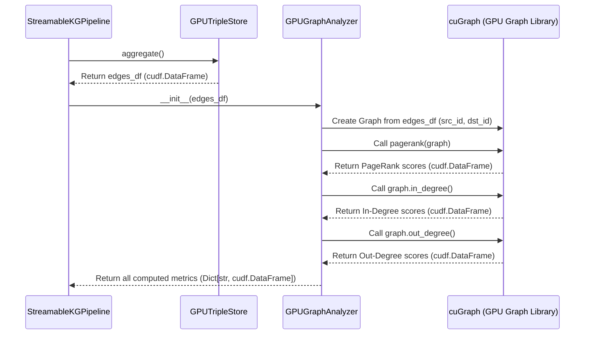

# Chapter 7: GPUGraphAnalyzer

Welcome back! In our last chapter, [Chapter 6: GPUTripleStore](06_gputriplestore_.md), we learned how the `GPUTripleStore` acts as a super-efficient librarian, taking all the raw facts extracted by our LLM, cleaning them up, removing duplicates, and organizing them into a neat `cudf.DataFrame`—all at lightning speed directly on the GPU.

Now that we have a clean, unique list of relationships, it's time to ask some interesting questions about our knowledge graph. This is where the **`GPUGraphAnalyzer`** steps in.

### What Problem Does GPUGraphAnalyzer Solve?

Imagine you've just mapped out a huge network of roads in a city. You know all the intersections and all the connections between them. But now you want to know:
*   Which intersections are the most important or busiest hubs?
*   Which roads have the most traffic coming *into* them?
*   Which roads have the most traffic flowing *out* of them?

Trying to figure this out by hand, or with slow methods, for a giant city map would take forever!

Our knowledge graph pipeline has a similar challenge. After the [GPUTripleStore](06_gputriplestore_.md) has given us a clean list of relationships (like `source:"Geoffrey Hinton" predicate:"pioneered" target:"deep learning"`), we don't just want to *see* them. We want to *understand* them:
*   Which entities (people, concepts, organizations) are the most influential or central to the information we extracted?
*   Which entities have many incoming connections (are often "acted upon" or described)?
*   Which entities have many outgoing connections (are often "acting" or describing others)?

Solving these kinds of questions, known as **graph analytics**, on potentially enormous graphs can be incredibly slow if done on a traditional CPU. Moving all that data between the GPU (where the facts were processed) and the CPU (for analysis) would also waste a lot of time and memory.

The **`GPUGraphAnalyzer`** solves this by acting like a **powerful supercomputer for graph calculations**. It takes the perfectly prepared, unique relationships (our `edges_df`) straight from the [GPUTripleStore](06_gputriplestore_.md) and quickly computes deep insights, such as importance and connectivity, *entirely on the GPU*. This means no slow data transfers and maximum speed!

### Understanding GPUGraphAnalyzer: Your Graph's Supercomputer

The `GPUGraphAnalyzer` is built to perform core graph analysis efficiently on the GPU. It focuses on finding critical patterns and metrics within your knowledge graph.

Here’s what it does:

1.  **Builds a Graph on the GPU**: It takes the list of clean, unique relationships (our `edges_df` from [GPUTripleStore](06_gputriplestore_.md)) and uses them to build a graph structure directly in GPU memory using the `cuGraph` library. `cuGraph` is specially designed for ultra-fast graph operations on NVIDIA GPUs.
2.  **Calculates PageRank**: This is like finding the "most important" or "most influential" nodes in your graph. Think of it like Google's original algorithm: a node is important if it's linked to by many other important nodes. In our road network analogy, these would be your major highway interchanges.
3.  **Calculates Degree Centrality**: This tells you how connected each node is:
    *   **In-Degree**: How many relationships point *to* an entity (e.g., how many things "use" or "are developed by" a concept). This is like traffic coming *into* an intersection.
    *   **Out-Degree**: How many relationships originate *from* an entity (e.g., how many things an entity "pioneered" or "enables"). This is like traffic going *out of* an intersection.
4.  **All on the GPU**: Every single one of these calculations happens on the GPU using `cuGraph`, ensuring blazing-fast results without bottlenecks.

### How to Use GPUGraphAnalyzer

You won't directly create or interact with the `GPUGraphAnalyzer` in your main script. As with other components, the [StreamableKGPipeline](02_streamablekgpipeline_.md) (our pipeline's conductor) handles this for you during the `finalize_graph()` stage.

Let's look at how the `StreamableKGPipeline` orchestrates the `GPUGraphAnalyzer`:

```python
# main.py (simplified from StreamableKGPipeline.finalize_graph)

class StreamableKGPipeline:
    # ... process_text method ...
    def finalize_graph(self) -> Tuple[cudf.DataFrame, Dict, Network]:
        # 1. First, GPUTripleStore aggregates and cleans up the facts.
        edges_df = self.triple_store.aggregate() # This comes from Chapter 6

        # Check if we have any facts to analyze
        if len(edges_df) == 0:
            print("No valid triples extracted, skipping graph analysis.")
            return cudf.DataFrame(), {}, None

        print("Running graph analytics on GPU...")
        # 2. The conductor creates a GPUGraphAnalyzer, giving it the clean facts.
        analyzer = GPUGraphAnalyzer(edges_df) # <--- GPUGraphAnalyzer created!

        # 3. The conductor then asks the analyzer to compute the metrics.
        metrics = analyzer.compute_metrics() # <--- Metrics computed!

        # metrics will now contain DataFrames for PageRank, in-degree, out-degree.
        # Example: metrics = {'pagerank': cudf.DataFrame, 'in_degree': cudf.DataFrame, ...}

        # ... then the PyVisAdapter uses these metrics for visualization ...
        return edges_df, metrics, network
```
In this snippet, the `StreamableKGPipeline` first gets the `edges_df` (a `cudf.DataFrame` containing `src_id`, `rel_id`, `dst_id`, `confidence`, `source_str`, `predicate_str`, `target_str`, `count`) from the [GPUTripleStore](06_gputriplestore_.md). It then creates an instance of `GPUGraphAnalyzer`, passing it this `edges_df`. Finally, it calls the `compute_metrics()` method, which performs all the GPU-accelerated calculations and returns a dictionary of results.

### Under the Hood: The Graph's Supercomputer at Work

Let's peek behind the scenes to see how the `GPUGraphAnalyzer` works its magic with `cuGraph`.

#### The Analysis Process Flow

Here’s a simplified sequence of events when `GPUGraphAnalyzer` is put to work:


This diagram shows how `GPUGraphAnalyzer` takes the `edges_df`, builds a graph using `cuGraph`, and then leverages `cuGraph` functions to compute various metrics before returning them to the `StreamableKGPipeline`.

#### Peeking at the Code

Let's look at the core parts of the `GPUGraphAnalyzer` class from `main.py`.

**1. Initializing the Analyzer (`__init__` and `build_graph`)**:

The `GPUGraphAnalyzer` is given the `edges_df` (the aggregated facts from [GPUTripleStore](06_gputriplestore_.md)). Its `__init__` method immediately calls `build_graph()` to prepare the graph structure for `cuGraph`.

```python
# main.py (simplified from GPUGraphAnalyzer.__init__ and build_graph)
class GPUGraphAnalyzer:
    def __init__(self, edges_df: cudf.DataFrame):
        self.edges_df = edges_df
        self.graph = None # This will hold our cuGraph object
        self.build_graph() # Immediately build the graph when created

    def build_graph(self):
        """Construct cuGraph from edge list"""
        self.graph = cugraph.Graph(directed=True) # Create an empty directed graph
        self.graph.from_cudf_edgelist(
            self.edges_df,
            source='src_id',       # Tell cuGraph which column is the source node ID
            destination='dst_id',  # Tell cuGraph which column is the destination node ID
            edge_attr='confidence' # Use confidence as a weight for edges (optional, but good practice)
        )
```
Here, `cugraph.Graph(directed=True)` creates a directed graph, meaning relationships have a clear direction (e.g., A *pioneered* B, not just A *is related to* B). `from_cudf_edgelist` is the magic method that takes our `cudf.DataFrame` (`edges_df`) and converts it into a `cuGraph` graph structure directly on the GPU, using the `src_id` and `dst_id` columns as the nodes and `confidence` as an optional edge weight.

**2. Computing Metrics (`compute_metrics`)**:

This method is where the powerful `cuGraph` algorithms are called.

```python
# main.py (simplified from GPUGraphAnalyzer.compute_metrics)
class GPUGraphAnalyzer:
    # ... __init__ and build_graph ...
    def compute_metrics(self) -> Dict[str, cudf.DataFrame]:
        """Run GPU graph algorithms"""
        metrics = {}

        # Calculate PageRank for influence/importance
        metrics['pagerank'] = cugraph.pagerank(self.graph)

        # Calculate in-degree (incoming connections)
        metrics['in_degree'] = self.graph.in_degree()

        # Calculate out-degree (outgoing connections)
        metrics['out_degree'] = self.graph.out_degree()

        return metrics
```
Each of these lines calls a `cuGraph` function. `cugraph.pagerank()` computes the PageRank scores for all nodes in our graph. `self.graph.in_degree()` and `self.graph.out_degree()` compute the total number of incoming and outgoing connections for each node, respectively. All these results are returned as new `cudf.DataFrame`s, containing a 'vertex' column (the node ID) and the corresponding score (e.g., 'pagerank', 'degree').

### Conclusion

In this chapter, we met the `GPUGraphAnalyzer`, the powerful supercomputer for our knowledge graph. We learned that it takes the clean, unique relationships from the [GPUTripleStore](06_gputriplestore_.md), builds a graph entirely on the GPU using `cuGraph`, and then quickly computes important insights like `PageRank` (entity influence) and `degree centrality` (entity connectivity). This GPU-first approach ensures that even complex graph analytics are performed at blazing speeds.

Now that we have extracted facts, cleaned them up, and performed powerful analytics, the final step is to make all this information easy to see and interact with! Let's move on to the [PyVisAdapter](08_pyvisadapter_.md), which will turn our GPU-processed graph into a beautiful, interactive visualization.

---

Generated by [AI Codebase Knowledge Builder]