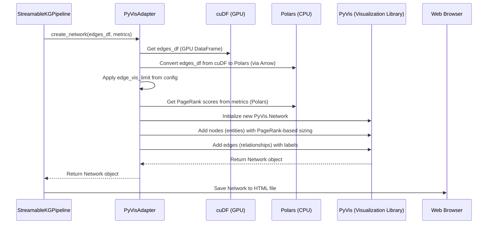

# Chapter 8: PyVisAdapter

Welcome back! In our last chapter, [Chapter 7: GPUGraphAnalyzer](07_gpugraphanalyzer_.md), we witnessed the incredible power of the `GPUGraphAnalyzer`. It took our neatly organized facts from the [GPUTripleStore](06_gputriplestore_.md) and, entirely on the GPU, performed lightning-fast calculations to tell us which entities were most important (PageRank) and how connected they were (degree centrality).

Now, we have all this amazing, deep understanding of our knowledge graph, stored efficiently in GPU memory. But how do we actually *see* it? How do we make an interactive map that we can explore with our own eyes? This is where the **`PyVisAdapter`** comes in.

### What Problem Does PyVisAdapter Solve?

Imagine you have a brilliant architect (our `GPUGraphAnalyzer`) who has designed an incredibly complex and beautiful city (our knowledge graph). This architect has all the plans and details in a highly specialized, technical format—maybe even in their head! You, as the city planner, want to show this city to the public. You can't just hand them the raw blueprints; they need a beautiful, easy-to-understand, interactive map!

Our knowledge graph pipeline faces a similar challenge:

*   **GPU data isn't directly viewable**: The `edges_df` and `metrics` (like PageRank) are stored in `cuDF` DataFrames on the GPU. Your web browser can't directly read this specialized GPU data.
*   **Browsers can't handle huge graphs**: A knowledge graph can easily have millions of connections (edges) and thousands of entities (nodes). If we tried to send *all* that data to a web browser for visualization, it would quickly run out of memory and crash! It's like trying to show a map of the entire world with every single tiny street name to someone on a small paper napkin.
*   **Making it interactive**: We don't just want a static picture; we want to click on nodes, drag them around, and see details when we hover over things.

The **`PyVisAdapter`** solves these problems by acting as our **interactive map maker and clever data translator**. It’s the bridge between the high-performance GPU world and the visual output you see in your web browser. It takes the cleaned, analyzed graph data from the GPU, carefully converts a *smaller, manageable subset* of it into a format the CPU can understand, and then uses a visualization library (`PyVis`) to draw an interactive map of the knowledge graph in your web browser. It carefully limits the size to prevent your browser from crashing.

### Understanding PyVisAdapter: Your Interactive Map Maker

The `PyVisAdapter` has a few crucial roles in our pipeline:

1.  **Data Translator**: It converts the graph data from `cuDF` (GPU-friendly format) into `Polars` (a CPU-friendly format that `PyVis` can work with). This transfer is done efficiently using something called "Arrow zero-copy," which minimizes data copying.
2.  **Size Manager**: It's very aware of the `edge_vis_limit` and `top_k_nodes` settings from our [PipelineConfig](01_pipelineconfig_.md). Before sending data to the browser, it intelligently selects only the most important and confident relationships, ensuring the visualization won't overwhelm your browser.
3.  **Visualization Preparer**: It takes the selected data and uses the `PyVis` library to create an interactive network. This involves:
    *   **Adding Nodes**: Representing entities (like "Geoffrey Hinton" or "Deep Learning"). It uses the `PageRank` scores to make more important nodes appear larger, giving you a visual cue of their influence.
    *   **Adding Edges**: Representing relationships (like "pioneered" or "uses"). It labels these connections clearly.
    *   **Creating HTML**: Finally, it produces a self-contained HTML file that you can open in any web browser to explore your knowledge graph.

### How to Use PyVisAdapter

You typically won't directly call `PyVisAdapter` in your main script. As with other components, the [StreamableKGPipeline](02_streamablekgpipeline_.md) (our conductor) handles this for you during the final `finalize_graph()` stage.

Let's look at how the `StreamableKGPipeline` orchestrates the `PyVisAdapter`:

```python
# main.py (simplified from StreamableKGPipeline.finalize_graph)

class StreamableKGPipeline:
    # ... process_text method ...
    def finalize_graph(self) -> Tuple[cudf.DataFrame, Dict, Network]:
        # 1. GPUTripleStore aggregates and cleans up the facts.
        edges_df = self.triple_store.aggregate()

        # 2. GPUGraphAnalyzer runs powerful graph analytics.
        analyzer = GPUGraphAnalyzer(edges_df)
        metrics = analyzer.compute_metrics()

        print("Creating visualization...")
        # 3. The conductor creates a PyVisAdapter, giving it the config.
        adapter = PyVisAdapter(self.config) # <--- PyVisAdapter created!

        # 4. The conductor then asks the adapter to create the network visualization.
        network = adapter.create_network(edges_df, metrics) # <--- Network created!

        return edges_df, metrics, network
```
In this snippet, the `StreamableKGPipeline` first gets the `edges_df` (the unique facts) and `metrics` (PageRank, etc.) from the GPU-accelerated steps. It then creates an instance of `PyVisAdapter`, passing it the `config` (which contains our visualization limits and dimensions). Finally, it calls `create_network()`, which takes the GPU data, processes it for visualization, and returns a `PyVis` `Network` object. This `Network` object is then saved to an HTML file for you to view.

### Under the Hood: How the Interactive Map Maker Works

Let's peek behind the scenes to see how `PyVisAdapter` transforms GPU data into an interactive map.

#### The Visualization Process Flow

Here’s a simplified sequence of events when `PyVisAdapter` is put to work:


This diagram shows how the `PyVisAdapter` acts as the central orchestrator for visualization. It first translates the GPU data to a CPU-friendly format, then intelligently limits its size, and finally uses `PyVis` to build the interactive graph before it's saved as an HTML file.

#### Peeking at the Code

Let's look at the core parts of the `PyVisAdapter` class from `main.py`.

**1. Initializing the Adapter (`__init__`)**:

The `PyVisAdapter` simply needs the `config` to know its visualization limits and dimensions.

```python
# main.py (simplified from PyVisAdapter.__init__)
class PyVisAdapter:
    def __init__(self, config: PipelineConfig):
        self.config = config # Stores the configuration, including visualization limits
```
This `config` object (from [Chapter 1: PipelineConfig](01_pipelineconfig_.md)) holds crucial settings like `edge_vis_limit`, `pyvis_height`, and `pyvis_width`.

**2. Building the Network (`create_network`)**:

This is the main method that handles the data conversion, filtering, and PyVis network creation.

```python
# main.py (simplified from PyVisAdapter.create_network)
class PyVisAdapter:
    # ... __init__ ...
    def create_network(
        self,
        edges_df: cudf.DataFrame, # Our GPU data
        metrics: Dict[str, cudf.DataFrame] # PageRank scores, etc.
    ) -> Network:
        """Build interactive PyVis network"""

        # Step 1: Convert GPU DataFrame (cuDF) to CPU DataFrame (Polars)
        # This uses Apache Arrow for efficient zero-copy transfer to CPU.
        edges_pl = pl.from_arrow(edges_df.to_arrow())

        # Step 2: Limit visualization size to prevent browser crashes
        if len(edges_pl) > self.config.edge_vis_limit:
            print(f"Limiting visualization to top {self.config.edge_vis_limit} edges by confidence")
            edges_pl = edges_pl.sort('confidence', descending=True).head(self.config.edge_vis_limit)

        # Step 3: Get PageRank scores and prepare them for node sizing
        pr_pl = pl.from_arrow(metrics['pagerank'].to_arrow())
        pr_dict = dict(zip(pr_pl['vertex'].to_list(), pr_pl['pagerank'].to_list()))

        # Step 4: Initialize PyVis network
        net = Network(
            height=self.config.pyvis_height,
            width=self.config.pyvis_width,
            directed=True,
            notebook=True,
            cdn_resources='in_line' # Make HTML file self-contained
        )
        net.barnes_hut() # A layout algorithm for better graph appearance

        # Step 5: Add nodes (entities) to the network
        unique_nodes = set(edges_pl['src_id'].to_list() + edges_pl['dst_id'].to_list())
        node_labels = {} # Map node IDs back to original string names

        for row in edges_pl.iter_rows(named=True):
            node_labels[row['src_id']] = row['source_str']
            node_labels[row['dst_id']] = row['target_str']

        for node_id in unique_nodes:
            pr_score = pr_dict.get(node_id, 0.001)
            size = 10 + (pr_score * 1000) # Scale node size based on PageRank

            net.add_node(
                node_id,
                label=node_labels.get(node_id, str(node_id)),
                size=size,
                title=f"PageRank: {pr_score:.4f}" # Show PageRank on hover
            )

        # Step 6: Add edges (relationships) to the network
        for row in edges_pl.iter_rows(named=True):
            net.add_edge(
                row['src_id'],
                row['dst_id'],
                title=row['predicate_str'],
                label=row['predicate_str'],
                value=float(row['confidence']) # Can use confidence for edge thickness
            )

        return net
```
Let's break down the key parts of this code:
*   `edges_pl = pl.from_arrow(edges_df.to_arrow())`: This line is crucial for the "bridge" function. It efficiently converts the `cuDF` DataFrame (`edges_df`) that lives on the GPU into a `Polars` DataFrame (`edges_pl`) that lives on the CPU, by using the intermediate Apache Arrow format.
*   `if len(edges_pl) > self.config.edge_vis_limit`: This demonstrates the `PyVisAdapter` acting as a "size manager." It checks if the number of edges exceeds the limit specified in our [PipelineConfig](01_pipelineconfig_.md). If so, it sorts the edges by `confidence` and only keeps the `top_k` (the most confident) to avoid crashing the browser.
*   `net = Network(...)`: This initializes the `PyVis` visualization object, setting its dimensions from `config.pyvis_height` and `config.pyvis_width`. `cdn_resources='in_line'` is a neat trick that embeds all necessary JavaScript into the HTML file, making it self-contained and easy to share.
*   The loops for `net.add_node` and `net.add_edge` iterate through our Polars DataFrame. `net.add_node` uses the `pr_score` (PageRank) from our [GPUGraphAnalyzer](07_gpugraphanalyzer_.md) to determine the `size` of each node, making important nodes stand out. `net.add_edge` adds the relationships, using the `predicate_str` as the label.

After `create_network` returns the `Network` object, the `StreamableKGPipeline` then calls `network.show(output_path)` to save this interactive visualization as an HTML file (e.g., `knowledge_graph.html`).

### Conclusion

In this chapter, we learned about the **`PyVisAdapter`**, the final piece of our GPU-accelerated knowledge graph pipeline. It acts as our interactive map maker and data translator, taking the powerful insights from the GPU (`cuDF` DataFrames and analytics from [GPUGraphAnalyzer](07_gpugraphanalyzer_.md)), converting a manageable subset of them into a CPU-friendly format (Polars), and finally rendering them into a beautiful, interactive HTML visualization using `PyVis`. This crucial component makes our complex, GPU-processed data accessible and understandable, allowing you to explore your knowledge graph without overwhelming your web browser.

With the `PyVisAdapter`, our journey is complete! We've successfully transformed raw text into a deep, analyzed, and visually engaging knowledge graph, all while cleverly leveraging the power of the NVIDIA T4 GPU.

---

Generated by [AI Codebase Knowledge Builder]