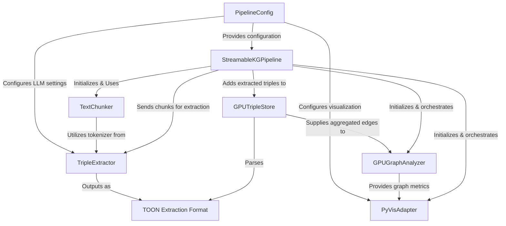

# Tutorial: knowledge-graph-Nvidia-T4-GPU-Accelerated

This project provides an *end-to-end pipeline* that transforms **raw text into an interactive knowledge graph**.
It heavily leverages the **GPU** (like a Colab T4) to perform all the intensive tasks, from *extracting relationships*
with an AI model to *deduplicating, analyzing, and building the graph* at high speed, finally visualizing the results.

**Source Repository:** [https://github.com/Dr-Westworld/knowledge-graph-Nvidia-T4-GPU-Accelerated](https://github.com/Dr-Westworld/knowledge-graph-Nvidia-T4-GPU-Accelerated)

## Chapters

1. [PipelineConfig
](01_pipelineconfig_.md)
2. [StreamableKGPipeline
](02_streamablekgpipeline_.md)
3. [TextChunker
](03_textchunker_.md)
4. [TripleExtractor
](04_tripleextractor_.md)
5. [TOON Extraction Format
](05_toon_extraction_format_.md)
6. [GPUTripleStore
](06_gputriplestore_.md)
7. [GPUGraphAnalyzer
](07_gpugraphanalyzer_.md)
8. [PyVisAdapter
](08_pyvisadapter_.md)

---

Generated by [AI Codebase Knowledge Builder]