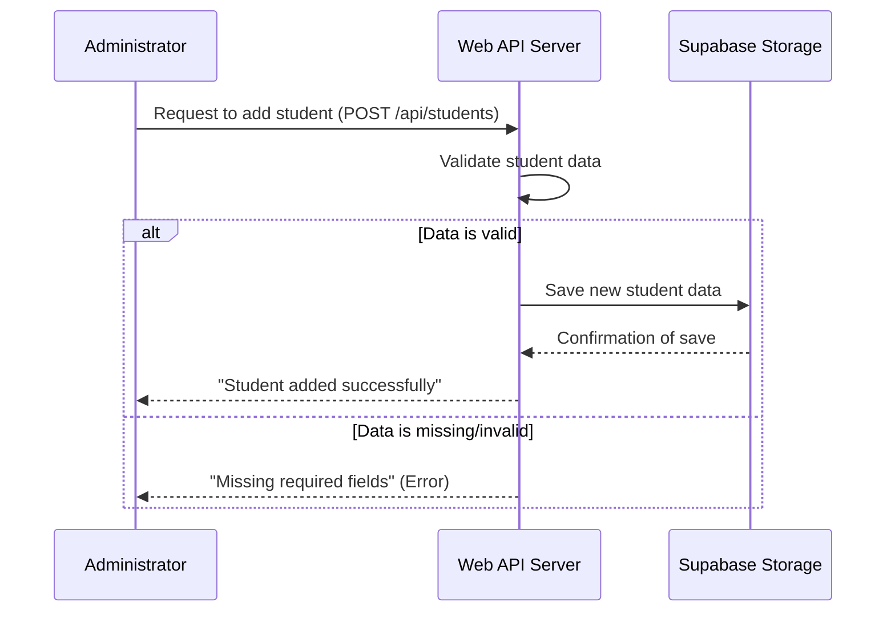

# Chapter 1: Student Data Model & API

Welcome to the first chapter of our Student Fees Management System tutorial! Imagine you're starting a new school, and the first thing you need to do is register. You fill out a form with all your basic information, right? That form is very similar to what we call a "Student Data Model" in software development.

### The Big Idea: Knowing Your Students

The core idea behind any student management system is simple: we need to know who our students are. What's their name? How do we identify them? What are they supposed to pay? This is where the **Student Data Model** comes in. It's like a blueprint or a standardized "student registration form" that defines *exactly* what pieces of information we'll keep for *every single student*.

Then, once we have this "form," how do we actually *use* it? How does an administrator add a new student, or how does the system find a student's information? This is where the **API (Application Programming Interface)** comes into play. Think of the API as a dedicated "clerk" or a set of specific instructions you can give to manage that student data.

Let's look at a concrete example: **Adding a new student to the system.** This is a central task that this chapter will help us understand.

### What is a "Student Data Model"?

Our Student Fees Management System needs to store specific details for each student. These details form our "Student Data Model." It's like the fields on a physical registration form:

*   **`student_id`**: A unique number or code to identify each student (like your student ID card number).
*   **`name`**: The student's full name.
*   **`email`**: The student's email address.
*   **`total_fees`**: The total amount of fees the student is required to pay for their course or semester.

These are the fundamental pieces of information our system cares about for each student.

### What is an "API" and "API Endpoints"?

An **API** is a set of rules and tools that lets different software programs talk to each other. In our case, it allows our web application (or an administrator using a tool) to "talk" to the part of our system that manages student data.

Think of it like ordering food at a restaurant:
*   You (the customer) are one software program.
*   The kitchen is another software program (where the food/data lives).
*   The waiter is the **API**. You don't go directly into the kitchen; you tell the waiter what you want, and the waiter handles the communication.

**API Endpoints** are specific "pathways" or "requests" you can make through the API. They are like specific items on the waiter's menu. For managing student data, we need at least two main pathways:

1.  **Add a new student**: For administrators to input new student details.
2.  **Fetch student information**: To retrieve details about a specific student.

### Using the API: Adding a New Student

Let's go back to our main use case: adding a new student. To do this, an administrator would use our API's "add student" endpoint.

Imagine the administrator wants to add a student named "Alice Wonderland" with ID "S001", email "alice@example.com", and total fees of $1500.

They would send this information in a structured format (usually JSON) to our system:

```json
{
  "student_id": "S001",
  "name": "Alice Wonderland",
  "email": "alice@example.com",
  "total_fees": 1500
}
```

Our system's "clerk" (the API endpoint) would receive this information and save it. If successful, it might respond with a simple message:

```json
{
  "message": "Student added successfully"
}
```

### How Our System Handles Adding a Student (Under the Hood)

Let's trace what happens when an administrator tries to add a student.

1.  **The Administrator sends a request**: The administrator uses a tool (like a web form or a special application) to send the student's details. This request goes to our web server.
2.  **Web Server receives the request**: Our server has a specific "address" (an API endpoint) for adding students. It listens for requests at this address.
3.  **Data Validation**: The server first checks if all the necessary information (`student_id`, `name`, `email`, `total_fees`) is present and correctly formatted. If anything is missing, it sends an error message back.
4.  **Store the Data**: If everything looks good, the server then tells our data storage system (which is [Storage as a Service (Supabase)](03_storage_as_a_service__supabase__.md) in our project) to save this new student's information.
5.  **Confirmation**: Once the data is saved, the server sends a success message back to the administrator.

Here's a simple diagram to visualize this flow:



### Looking at the Code (`server.js`)

Now, let's peek into our project's code, specifically the `server.js` file, to see how this "add student" API endpoint is built.

```javascript
const express = require('express');
const { createClient } = require('@supabase/supabase-js');
const app = express(); // Our web server

// ... (other setup code) ...

// API: Add a student (admin)
app.post('/api/students', async (req, res) => {
  const { student_id, name, email, total_fees } = req.body;
  
  // 1. Data Validation
  if (!student_id || !name || !email || !total_fees) {
    return res.status(400).json({ error: 'Missing required fields' });
  }

  // 2. Store the Data using Supabase
  const { error } = await supabase // 'supabase' is our connection to the database
    .from('students') // We want to add to the 'students' table
    .insert([{ student_id, name, email, total_fees: parseFloat(total_fees) }]); // Insert the student details

  // 3. Error Handling (if database had an issue)
  if (error) {
    console.error('Error adding student:', error);
    return res.status(500).json({ error: error.message });
  }

  // 4. Confirmation
  res.json({ message: 'Student added successfully' });
});

// ... (other API endpoints and server start) ...
```

**Explanation of the code snippet:**

*   `app.post('/api/students', async (req, res) => { ... });` This line sets up our "add student" endpoint. `app.post` means it responds to requests that *send* data (like filling out a form). `/api/students` is the specific "address" for this action.
*   `const { student_id, name, email, total_fees } = req.body;` When an administrator sends data, it arrives in `req.body`. We extract the student details from it.
*   The `if (!student_id || ...)` block is our **data validation**. It checks if all necessary fields are present. If not, it sends back an error message with a `400` status code (meaning "Bad Request").
*   `await supabase.from('students').insert([...]);` This is the magical part where we tell our database (Supabase) to **insert** a new row of data into the `students` table with the provided information. We will explore Supabase more deeply in [Storage as a Service (Supabase)](03_storage_as_a_service__supabase__.md).
*   The next `if (error)` block handles any issues that might occur while trying to save data to the database, sending back a `500` status code (meaning "Internal Server Error").
*   Finally, `res.json({ message: 'Student added successfully' });` sends the success message back.

### Using the API: Fetching Student General Information

Besides adding students, we also need to get their information. For instance, if a student or admin wants to quickly see a student's basic details and what their total fees are.

Our API has another endpoint for this:

```javascript
// API: Get student fees (student/admin) - Simplified for this chapter
app.get('/api/students/:student_id', async (req, res) => {
  const { student_id } = req.params; // Get the student_id from the URL

  // Ask Supabase to find the student
  const { data: student, error: studentError } = await supabase
    .from('students') // Look in the 'students' table
    .select('total_fees') // We only need the total_fees for now (and implicitly the student exists)
    .eq('student_id', student_id) // Find the student where student_id matches
    .single(); // Expect only one student record

  if (studentError || !student) {
    return res.status(404).json({ error: 'Student not found' });
  }

  // For this chapter, we're just focusing on basic student data.
  // The full fee calculation, including payments, will be covered in
  // [Payment Transaction Processing & API](02_payment_transaction_processing___api_.md) and
  // [Fee Status Calculation Logic](04_fee_status_calculation_logic_.md).

  // For now, just return the total fees we stored in the student model.
  res.json({ total: student.total_fees });
});
```

**Explanation:**

*   `app.get('/api/students/:student_id', ...)`: This endpoint uses `app.get` because we're *getting* data. The `:student_id` part is a placeholder, meaning whatever you put there in the URL (e.g., `/api/students/S001`) will be captured as `student_id`.
*   `req.params`: This is how we access the `student_id` from the URL.
*   `supabase.from('students').select('total_fees').eq('student_id', student_id).single();`: This command tells Supabase to find a student in the `students` table whose `student_id` matches the one we're looking for, and to retrieve their `total_fees`. `.single()` means we expect only one result.
*   If the student isn't found or there's an error, we send a `404` status (meaning "Not Found").
*   Otherwise, we send back the `total_fees` we found. The full fee status calculation (including payments) will be covered in later chapters!

### Conclusion

In this chapter, we learned about the essential building blocks for managing student information: the **Student Data Model**, which defines what student data we keep, and the **API** with its **endpoints**, which provide the pathways to interact with that data. We saw how an administrator can use the `POST /api/students` endpoint to add a new student and how we can fetch basic student information using `GET /api/students/:student_id`.

Now that we understand how to store and retrieve basic student information, the next logical step is to track payments made by these students.

Let's move on to the next chapter where we'll explore how payments are processed and managed: [Payment Transaction Processing & API](02_payment_transaction_processing___api_.md).

---

Generated by [AI Codebase Knowledge Builder]