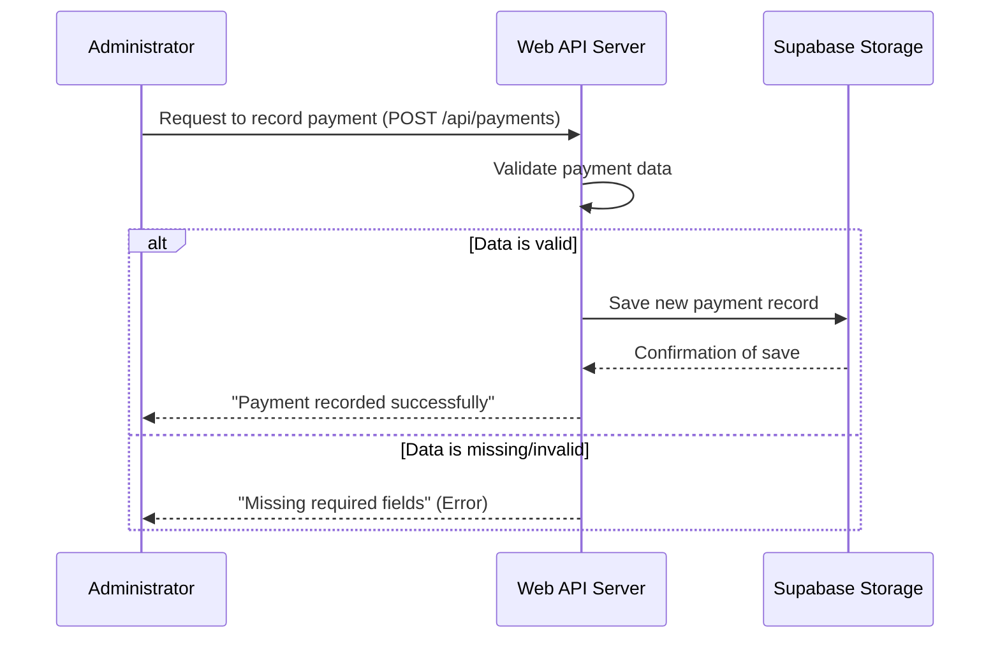

# Chapter 2: Payment Transaction Processing & API

Welcome back! In [Chapter 1: Student Data Model & API](01_student_data_model___api_.md), we built the foundation for our system by understanding how to store and manage basic student information. We learned how to add new students and retrieve their details. But a "fees management" system isn't complete without tracking the actual fees!

Imagine this: a student has been registered, and now it's time for them to pay. How do we record that payment so the system knows they've paid some money? This is exactly what **Payment Transaction Processing** is about. It's like the digital "treasury department" for our system, keeping a perfect record of every payment made.

### The Big Idea: Keeping Track of Every Dollar

The main goal of this chapter is to understand how we **record a payment** when a student pays their fees. Just like a physical receipt, our system needs to note down:
1.  Who paid? (Which student)
2.  How much did they pay?
3.  When did they pay it?

By accurately recording these transactions, our system can later add up all the payments made by a student to figure out their current fee status.

### What is a "Payment Transaction Record"?

Just like we had a "Student Data Model" for students, we need a "Payment Transaction Model" for payments. This model defines the specific pieces of information we'll store for *every single payment*:

*   **`student_id`**: This is crucial! It links the payment to a specific student (like `S001` for Alice Wonderland).
*   **`amount`**: The exact sum of money the student paid.
*   **`payment_date`**: The date when the payment was received.

These three pieces of information are the bare essentials for tracking payments.

### Using the API: Recording a New Payment

Now that we know what information a payment record needs, how do we actually tell our system about a new payment? We use an **API endpoint** designed specifically for this task.

Think back to our restaurant analogy:
*   You want to record a payment (like ordering a specific dish).
*   The system's payment processor is the kitchen.
*   The **API endpoint** is the waiter you tell your order to.

For adding a new payment, our system will have an endpoint that accepts the `student_id`, `amount`, and `payment_date`.

Let's say an administrator wants to record a payment of `$500` made by student `S001` on `2023-10-26`. They would send this information to our system in a structured format (JSON), similar to how we added a student:

```json
{
  "student_id": "S001",
  "amount": 500,
  "payment_date": "2023-10-26"
}
```

Our system's "payment clerk" (the API endpoint) would receive this information, record it, and then likely respond with a simple confirmation:

```json
{
  "message": "Payment recorded successfully"
}
```

### How Our System Records a Payment (Under the Hood)

Let's trace what happens step-by-step when an administrator records a payment using our system:

1.  **Administrator Sends Payment Details**: The administrator uses an interface (like a web form) to input the student ID, amount, and date, and then submits this information.
2.  **Web Server Receives Request**: Our web server has a specific "address" (the API endpoint for payments) that listens for these payment recording requests.
3.  **Data Validation**: The server quickly checks if all the necessary information (`student_id`, `amount`, `payment_date`) is present and correctly formatted. If anything is missing or incorrect, it sends an error back.
4.  **Store the Payment Record**: If everything looks good, the server then instructs our data storage system (which is [Storage as a Service (Supabase)](03_storage_as_a_service__supabase__.md) in our project) to save this new payment transaction.
5.  **Confirmation**: Once the payment is successfully saved, the server sends a success message back to the administrator.

Here's a simple diagram to visualize this flow:



### Looking at the Code (`server.js`)

Now, let's look at the actual code in our `server.js` file that handles recording payments. We'll focus on the `POST /api/payments` endpoint.

```javascript
// API: Add a payment (admin)
app.post('/api/payments', async (req, res) => {
  // 1. Get the payment details from the request
  const { student_id, amount, payment_date } = req.body;

  // 2. Data Validation: Check if all necessary fields are provided
  if (!student_id || !amount || !payment_date) {
    return res.status(400).json({ error: 'Missing required fields' });
  }

  // 3. Store the payment using Supabase
  // 'supabase' is our connection to the database
  const { error } = await supabase
    .from('payments') // We want to add this to the 'payments' table
    .insert([{ student_id, amount: parseFloat(amount), payment_date }]); // Insert the payment details

  // 4. Error Handling: If there's an issue with the database
  if (error) {
    console.error('Error adding payment:', error);
    return res.status(500).json({ error: error.message });
  }

  // 5. Confirmation: Send a success message back
  res.json({ message: 'Payment recorded successfully' });
});
```

**Explanation of the code snippet:**

*   `app.post('/api/payments', async (req, res) => { ... });`: This line defines our API endpoint for adding payments. `app.post` is used because we are *sending* new data to the server. `/api/payments` is the specific "address" for this action.
*   `const { student_id, amount, payment_date } = req.body;`: When the administrator sends payment data, it arrives in `req.body` (the "body" of the request). We extract the `student_id`, `amount`, and `payment_date` from it.
*   The `if (!student_id || ...)` block performs **data validation**. It ensures all required fields are present. If any are missing, it sends a `400 Bad Request` error.
*   `await supabase.from('payments').insert([...]);`: This is where we tell our database (Supabase) to save the payment. We specify that we want to insert a new row into the `payments` table with the provided data. The `parseFloat(amount)` ensures the amount is stored as a number. We'll dive much deeper into Supabase in [Chapter 3: Storage as a Service (Supabase)](03_storage_as_a_service__supabase__.md).
*   The next `if (error)` block checks if there was any problem while trying to save the data to the database. If so, it sends a `500 Internal Server Error`.
*   Finally, `res.json({ message: 'Payment recorded successfully' });` sends a success message back to the administrator.

### Conclusion

In this chapter, we've successfully added a crucial piece to our Student Fees Management System: the ability to process and record payments. We defined what information makes up a "payment transaction," saw how to use a dedicated API endpoint (`POST /api/payments`) to record new payments, and peeked under the hood to understand how our server handles these requests, validates data, and saves it.

Recording payments is the first step. The next exciting step is to understand *where* all this data is actually stored. We've mentioned Supabase a few times, and in the next chapter, we'll explore this powerful "Storage as a Service" solution!

Let's move on to [Chapter 3: Storage as a Service (Supabase)](03_storage_as_a_service__supabase__.md).

---

Generated by [AI Codebase Knowledge Builder]