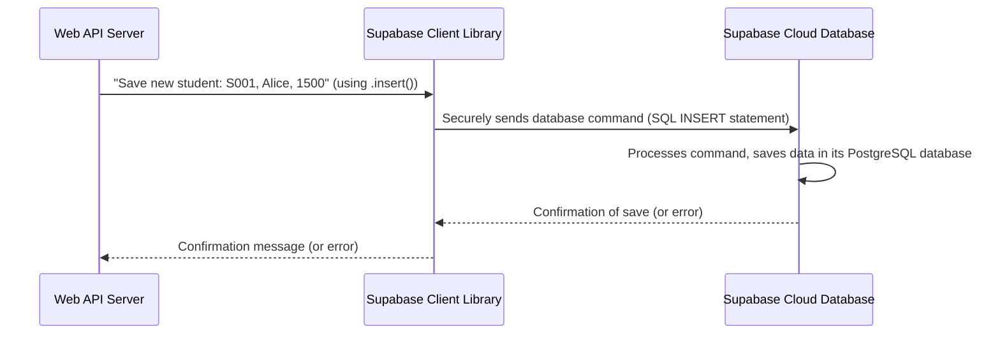

# Chapter 3: Storage as a Service (Supabase)

Welcome back, future cloud gurus! In [Chapter 1: Student Data Model & API](01_student_data_model___api_.md), we learned how to define student information and create API endpoints to add and retrieve it. Then, in [Chapter 2: Payment Transaction Processing & API](02_payment_transaction_processing___api_.md), we expanded our system to record payments made by students.

We've been talking about "saving" information and "retrieving" it, but you might be wondering: *where* exactly is all this precious student and payment data actually stored? Is it on our computer? In a magic box? This is where **Storage as a Service (Supabase)** comes in!

### The Big Idea: Your Digital Filing Cabinet in the Cloud

Imagine you have a physical office with lots of student files and payment receipts. You need a secure, organized filing cabinet to keep everything. What if this filing cabinet wasn't in your office, but in a super-secure, always-available data center somewhere far away, and you could access it from anywhere with a special key? That's the essence of Storage as a Service!

In our Student Fees Management System, we use **Supabase** as this "digital filing cabinet in the cloud." It's an external, cloud-based database service where all student details and payment records are securely stored. Our application uses Supabase to save new information and retrieve existing data without us needing to manage complex database servers ourselves.

This concept is called **Storage as a Service (STaaS)**.

### What is Storage as a Service (STaaS)?

Storage as a Service (STaaS) means that instead of setting up and maintaining your own physical storage devices (like hard drives) or database servers, you pay a provider (like Supabase, Amazon, or Google) to handle all of that for you.

Think of it like renting a storage unit:
*   You don't buy the land or build the unit.
*   You just put your stuff in it and pay a fee.
*   The storage company ensures it's secure, has electricity, and is accessible.

With STaaS, your application simply "tells" the cloud provider what data to save or retrieve, and the provider takes care of all the technical details behind the scenes. This is super helpful because it means we can focus on building our student fees system, not on becoming database experts!

### Supabase: Our Cloud Database Partner

Supabase is a fantastic example of a STaaS provider. It offers a powerful **PostgreSQL database** (a very popular type of database for storing structured data like student records) in the cloud, along with tools to interact with it easily.

**Why we use Supabase:**

*   **No Server Management**: We don't have to worry about installing database software, keeping it updated, or ensuring it's always running. Supabase handles all of that.
*   **Scalability**: If our school grows from 10 students to 10,000, Supabase can handle the increased data without us having to do anything special. It scales automatically.
*   **Accessibility**: Our application can connect to Supabase from anywhere on the internet (with the right credentials, of course!). This is perfect for our web application hosted on Render.
*   **Security**: Supabase provides secure connections and features to protect our sensitive student data.

In simple terms, Supabase gives us a ready-to-use, powerful database in the cloud.

### How Our Application Connects to Supabase

Before we can ask Supabase to save or retrieve anything, our application needs to "log in" or connect to it. We do this using a special library (`@supabase/supabase-js`) and some secret keys:

```javascript
const { createClient } = require('@supabase/supabase-js');

// These are like the "address" and "key" to our digital filing cabinet
const SUPABASE_URL = process.env.SUPABASE_URL; // e.g., 'https://your-project.supabase.co'
const SUPABASE_KEY = process.env.SUPABASE_KEY; // A secret key for access

// This line establishes the connection to Supabase
const supabase = createClient(SUPABASE_URL, SUPABASE_KEY);

// Now 'supabase' is ready to send commands!
```

**Explanation:**

*   `createClient`: This function from the Supabase library helps us set up the connection.
*   `SUPABASE_URL` and `SUPABASE_KEY`: These are like the unique address of our Supabase project and the secret key to access it. We store these securely as environment variables (we'll cover these in [Chapter 6: Environment Configuration](06_environment_configuration_.md)).
*   `supabase`: Once `createClient` runs, we get a `supabase` object. This object is our direct link to send commands (like "save this student" or "find that payment") to our cloud database.

### Use Case: Saving Student Data with Supabase

Let's revisit our core use case from [Chapter 1: Student Data Model & API](01_student_data_model___api_.md): **adding a new student**. This is a perfect example of our application using Supabase to store data.

When an administrator wants to add a student, our `server.js` code sends the student's details directly to Supabase.

**Example: Adding a Student**

Here’s how our code tells Supabase to save a new student record (simplified from `server.js`):

```javascript
// Inside our POST /api/students endpoint:
app.post('/api/students', async (req, res) => {
  const { student_id, name, email, total_fees } = req.body;

  // ... (data validation happens here) ...

  // This is where we tell Supabase to save the student!
  const { error } = await supabase
    .from('students') // Which "table" (like a filing cabinet drawer) to use
    .insert([{ student_id, name, email, total_fees }]); // The actual student information to put in

  // ... (error handling and response) ...
});
```

**Explanation:**

*   `supabase.from('students')`: This tells Supabase that we want to work with the "students" table in our database. Think of tables as different categories or drawers in your filing cabinet (e.g., one for "Students," another for "Payments").
*   `.insert([...])`: This is the command to add a *new* row of data to the `students` table. We pass an array of objects, where each object represents a student we want to add. Supabase then securely saves this information in its cloud database.

### Use Case: Retrieving Student Data with Supabase

Now, what about getting information back? For example, when we need to find a student's `total_fees` to calculate their outstanding balance (as seen in [Chapter 1](01_student_data_model___api_.md) and to be fully explored in [Chapter 4: Fee Status Calculation Logic](04_fee_status_calculation_logic_.md)).

**Example: Fetching Student Total Fees**

Here’s how our code tells Supabase to find a specific student's fee information:

```javascript
// Inside our GET /api/students/:student_id endpoint:
app.get('/api/students/:student_id', async (req, res) => {
  const { student_id } = req.params;

  // This is where we ask Supabase to find the student's total fees!
  const { data: student, error: studentError } = await supabase
    .from('students') // Look in the 'students' table
    .select('total_fees') // We only need the 'total_fees' column
    .eq('student_id', student_id) // Find the row where 'student_id' matches our input
    .single(); // We expect only one student with this ID

  // ... (error handling and response) ...
});
```

**Explanation:**

*   `supabase.from('students')`: Again, we specify the `students` table.
*   `.select('total_fees')`: This tells Supabase *which columns* we want to retrieve. In this case, just the `total_fees`.
*   `.eq('student_id', student_id)`: This is a filter! It means "only give me the data where the `student_id` column is equal to the `student_id` we're looking for."
*   `.single()`: We use this because `student_id` is unique, so we expect to find at most one student record.

Supabase then searches its cloud database, finds the matching student, and sends back the requested `total_fees` to our application.

### How Supabase Works Under the Hood

Let's visualize the process when our web server asks Supabase to save or retrieve data.

When our web server (the "Web API Server") makes a request to Supabase, here's a simplified sequence:



**Explanation:**

1.  **Web API Server to Supabase Client Library**: Our `server.js` code uses the `supabase` object (which comes from `createClient`) to issue commands like `.insert()` or `.select()`.
2.  **Supabase Client Library to Supabase Cloud Database**: The `supabase` client library takes our easy-to-understand commands (`.insert`, `.select`, `.eq`) and translates them into a language that the database understands (this language is called SQL). It then securely sends these SQL commands over the internet to the Supabase cloud database.
3.  **Supabase Cloud Database Processes**: The Supabase service receives the command, executes it on its powerful PostgreSQL servers, and either saves the data or fetches the requested information.
4.  **Response Back**: Supabase sends the result (success or the actual data) back to our `supabase` client library, which then passes it back to our `server.js` code.

All this happens in milliseconds, making it feel like the data is right there on our server!

### Conclusion

In this chapter, we unlocked the secret of where our application's data lives: in the cloud, managed by **Supabase**, our **Storage as a Service (STaaS)** provider. We learned:

*   What STaaS is and why it's beneficial (no server management, scalability, accessibility).
*   How our application connects to Supabase using secret keys.
*   How we use Supabase commands like `.from().insert()` to save new data.
*   How we use `.from().select().eq()` to retrieve specific data.

Understanding Supabase is key because it powers all the data operations in our system. Now that we know how to store and retrieve data, we can move on to using that data to perform important calculations, like figuring out how much a student still owes!

Let's proceed to the next chapter to see how we calculate the total fees, paid amounts, and outstanding balances: [Chapter 4: Fee Status Calculation Logic](04_fee_status_calculation_logic_.md).

---

Generated by [AI Codebase Knowledge Builder]