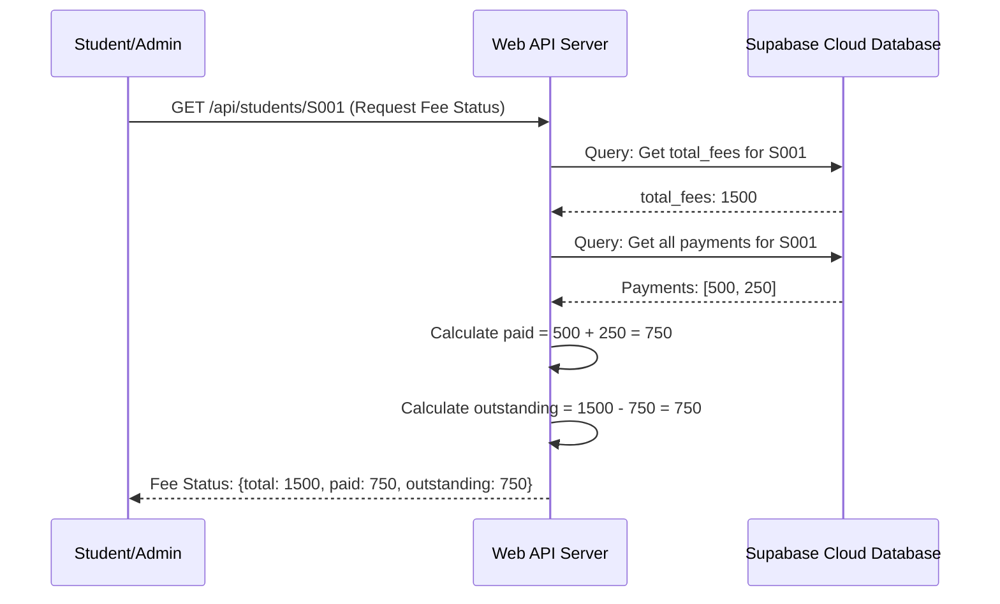

# Chapter 4: Fee Status Calculation Logic

Welcome back! In [Chapter 1: Student Data Model & API](01_student_data_model___api_.md), we learned how to register students and store their `total_fees`. In [Chapter 2: Payment Transaction Processing & API](02_payment_transaction_processing___api_.md), we added the ability to record individual payments. And in [Chapter 3: Storage as a Service (Supabase)](03_storage_as_a_service__supabase__.md), we understood how all this data is stored and retrieved from our cloud database.

Now, imagine you're a student or an administrator. You don't just want to know a student's total fees, and you don't want to manually add up a dozen payment receipts. You want the *full picture*: "How much do I owe? How much have I paid so far?" This is where the **Fee Status Calculation Logic** comes into play!

### The Big Idea: Being the "Accountant" of Your Application

Think of this chapter as building the "accountant" for our student fees system. Its job is to take all the pieces of financial information we have – a student's total required fees and all the individual payments they've made – and put them together to tell us:

1.  **Total Fees**: The original amount due.
2.  **Total Paid**: The sum of all payments made by the student.
3.  **Outstanding Balance**: How much is *still owed*.

This logic is crucial because it provides a comprehensive and up-to-date financial overview for any student, combining data from two different sources (student records and payment records).

### Central Use Case: Getting a Student's Full Fee Status

Our main goal in this chapter is to be able to answer the question: "What is the complete fee status for Student S001?"

To achieve this, our system needs to:
1.  Find the student's `total_fees` from their record.
2.  Find *all* payment records for that student.
3.  Add up all the `amount`s from those payment records to get the `total paid`.
4.  Subtract the `total paid` from the `total_fees` to get the `outstanding balance`.

### How Our API Provides the Fee Status

Our system already has an API endpoint that is perfect for this: `GET /api/students/:student_id`. While in Chapter 1 we saw it return only `total_fees` for simplicity, its true purpose is to perform these calculations and return the full fee status.

Let's say an administrator or student wants to check the status for student `S001`. They would make a request like this:

```
GET /api/students/S001
```

And our system, after doing its calculations, would respond with something like this:

```json
{
  "total": 1500,
  "paid": 750,
  "outstanding": 750
}
```

This single response gives a complete financial summary!

### How the Fee Status is Calculated (Under the Hood)

Let's trace the steps our `Web API Server` takes when it receives a request for a student's fee status:

1.  **Request for Fee Status**: A student or administrator asks for the fee status of a specific student (e.g., `S001`).
2.  **Get Student's Total Fees**: The `Web API Server` first asks Supabase: "What are the `total_fees` for this `student_id`?"
3.  **Get All Payments**: Next, the `Web API Server` asks Supabase: "Give me *all* the `amount`s of payments made by this `student_id`."
4.  **Calculate Total Paid**: The `Web API Server` receives a list of payment amounts (e.g., `[500, 250]`) and adds them all up.
5.  **Calculate Outstanding Balance**: The server then takes the `total_fees` (e.g., `1500`) and subtracts the `total paid` (e.g., `750`) to find the `outstanding` amount.
6.  **Send Back Results**: Finally, the `Web API Server` sends a neat package of `total`, `paid`, and `outstanding` amounts back to the requester.

Here's a simple diagram to visualize this process:



### Looking at the Code (`server.js`)

Let's dive into the `server.js` file and see the code that performs these calculations within the `GET /api/students/:student_id` endpoint.

```javascript
// API: Get student fees (student/admin)
app.get('/api/students/:student_id', async (req, res) => {
  const { student_id } = req.params; // Get the student_id from the URL

  // 1. Get the student's total fees from the 'students' table
  const { data: student, error: studentError } = await supabase
    .from('students')
    .select('total_fees') // We only need their total fees
    .eq('student_id', student_id)
    .single();

  if (studentError || !student) {
    return res.status(404).json({ error: 'Student not found' });
  }

  // 2. Get all payment records for this student from the 'payments' table
  const { data: payments, error: paymentError } = await supabase
    .from('payments')
    .select('amount') // We only need the payment amounts
    .eq('student_id', student_id);

  if (paymentError) {
    console.error('Error fetching payments:', paymentError);
    return res.status(500).json({ error: paymentError.message });
  }

  // 3. Calculate the total amount paid
  // 'payments' is an array like [{ amount: 500 }, { amount: 250 }]
  const paid = payments ? payments.reduce((sum, p) => sum + p.amount, 0) : 0;

  // 4. Calculate the outstanding balance
  const outstanding = student.total_fees - paid;

  // 5. Send back the calculated fee status
  res.json({ total: student.total_fees, paid, outstanding });
});
```

Let's break down this code piece by piece:

#### Step 1: Getting `total_fees`

```javascript
  // 1. Get the student's total fees from the 'students' table
  const { data: student, error: studentError } = await supabase
    .from('students')
    .select('total_fees') // We only need their total fees
    .eq('student_id', student_id)
    .single();

  if (studentError || !student) {
    return res.status(404).json({ error: 'Student not found' });
  }
```

*   `supabase.from('students').select('total_fees').eq('student_id', student_id).single()`: This line asks our [Storage as a Service (Supabase)](03_storage_as_a_service__supabase__.md) to find the student matching `student_id` in the `students` table and retrieve only their `total_fees`.
*   If the student isn't found (`studentError` or `!student`), we send a `404 Not Found` error.

#### Step 2: Getting all `payment` amounts

```javascript
  // 2. Get all payment records for this student from the 'payments' table
  const { data: payments, error: paymentError } = await supabase
    .from('payments')
    .select('amount') // We only need the payment amounts
    .eq('student_id', student_id);

  if (paymentError) {
    console.error('Error fetching payments:', paymentError);
    return res.status(500).json({ error: paymentError.message });
  }
```

*   `supabase.from('payments').select('amount').eq('student_id', student_id)`: Here, we ask Supabase to look in the `payments` table. We want all payment `amount`s where the `student_id` matches the one we're looking for. This will return an array of payment objects, like `[{ amount: 500 }, { amount: 250 }]`.
*   We also handle any potential errors during this database call.

#### Step 3: Calculating `total paid`

```javascript
  // 3. Calculate the total amount paid
  // 'payments' is an array like [{ amount: 500 }, { amount: 250 }]
  const paid = payments ? payments.reduce((sum, p) => sum + p.amount, 0) : 0;
```

*   `payments.reduce((sum, p) => sum + p.amount, 0)`: This is a clever JavaScript trick! The `reduce` method goes through each payment (`p`) in the `payments` array.
    *   `sum` starts at `0` (the last `0` in the function call).
    *   For each payment `p`, it adds `p.amount` to the `sum`.
    *   So, if `payments` is `[{ amount: 500 }, { amount: 250 }]`, it would do: `0 + 500 = 500`, then `500 + 250 = 750`.
    *   The final `sum` is `750`, which becomes our `paid` amount.
*   The `payments ? ... : 0` part ensures that if there are no payments recorded, `paid` defaults to `0` instead of causing an error.

#### Step 4: Calculating `outstanding balance`

```javascript
  // 4. Calculate the outstanding balance
  const outstanding = student.total_fees - paid;
```

*   This is the simplest part! We just subtract the `paid` amount (calculated in the previous step) from the `student.total_fees` we got in Step 1.

#### Step 5: Sending the `fee status` response

```javascript
  // 5. Send back the calculated fee status
  res.json({ total: student.total_fees, paid, outstanding });
```

*   `res.json(...)`: Finally, we package all three calculated values (`total`, `paid`, `outstanding`) into a JSON object and send it back as the response to the original request.

### Conclusion

In this chapter, we brought together everything we learned from previous chapters to create meaningful financial insights. We understood how our system acts as an "accountant," taking a student's `total_fees` from their record and combining it with all their individual `payment` transactions to calculate the `total paid` and `outstanding balance`. We walked through the `GET /api/students/:student_id` endpoint in `server.js` to see how it performs these critical calculations using data retrieved from [Storage as a Service (Supabase)](03_storage_as_a_service__supabase__.md).

Now that we have the core logic for managing students, payments, and fee status, we need to understand how this all comes together to form a full web application.

Let's move on to the next chapter to see how our web server is set up and handles all these API requests: [Chapter 5: Web API Server (Node.js/Express)](05_web_api_server__node_js_express__.md).

---

Generated by [AI Codebase Knowledge Builder]