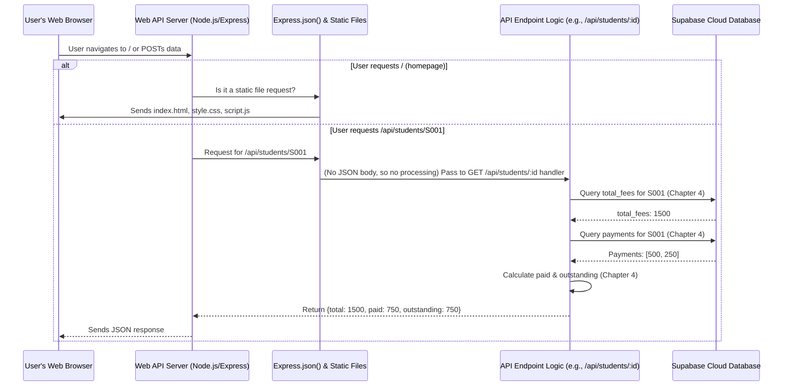

# Chapter 5: Web API Server (Node.js/Express)

Welcome back, architects of the cloud! In [Chapter 1: Student Data Model & API](01_student_data_model___api_.md), we defined what student information looks like. In [Chapter 2: Payment Transaction Processing & API](02_payment_transaction_processing___api_.md), we learned how to record payments. And in [Chapter 3: Storage as a Service (Supabase)](03_storage_as_a_service__supabase__.md), we understood where all that data is kept securely. Most recently, in [Chapter 4: Fee Status Calculation Logic](04_fee_status_calculation_logic_.md), we saw how our system acts as an "accountant" to calculate fees owed and paid.

All these pieces are amazing, but how does our application actually *use* them? When you open a website and click a button, or when an administrator adds a new student, how does that action reach our data and logic? This is where the **Web API Server** comes in!

### The Big Idea: Your Application's Central Reception Desk

Imagine our student fees system as a big office building. We have filing cabinets ([Supabase](03_storage_as_a_service__supabase__.md)), accountants ([Fee Status Calculation Logic](04_fee_status_calculation_logic_.md)), and clerks (our [API endpoints](01_student_data_model___api_.md), [payment processing](02_payment_transaction_processing___api_.md)). But who greets visitors, directs them to the right department, and ensures their requests are handled? That's the **Web API Server**!

Our Web API Server, built using **Node.js** and **Express**, is the "reception desk" of our application. It constantly listens for requests from anyone using our app (like your web browser). When a request comes in (e.g., "I want to add a student" or "Show me student S001's fees"), the server:

1.  **Receives** the request.
2.  **Understands** what the request is asking for.
3.  **Directs** it to the correct piece of our application's logic.
4.  **Gets** the information or performs the action.
5.  **Sends** a response back to the user.

Without this server, our application would be like a building with all the departments but no one to guide visitors!

#### Central Use Case: A Student Checks Their Fee Status

Let's stick with our example from Chapter 4: A student (or admin) wants to check the fee status for student "S001".

*   **Before**: We understood the logic to calculate this.
*   **Now**: We'll see how the Web API Server is the one that receives the request to do this, runs the calculation, and sends the result back.

### Key Concepts: Node.js and Express

Let's break down the two main technologies that power our server:

#### 1. Node.js: JavaScript for Your Server!

You're probably familiar with JavaScript running in your web browser (making websites interactive). **Node.js** is like giving JavaScript superpowers! It allows JavaScript to run *outside* a web browser, directly on a computer server.

*   **Analogy**: If your web browser is a car that runs on JavaScript fuel, Node.js is like a special engine that lets you put that same JavaScript fuel into a powerful truck (your server) to carry heavy loads and perform tasks behind the scenes.

This means we can use the same programming language (JavaScript) for both the frontend (what you see in the browser) and the backend (our server logic), which makes development more consistent.

#### 2. Express: Making Server Building Easy

While Node.js gives us the ability to run JavaScript on a server, **Express** is a popular framework that makes building web servers with Node.js much, much easier. It provides a set of tools and features that streamline common server tasks.

*   **Analogy**: If Node.js is the engine of our server truck, Express is the dashboard, steering wheel, and navigation system. It provides all the controls and shortcuts to quickly build a reliable server without having to reinvent the wheel every time.

Express helps us define our API endpoints, handle different types of requests (GET, POST), and manage what happens when those requests arrive.

### How Our Server Handles Requests (The `server.js` File)

Our entire Web API Server is defined in a file called `server.js`. Let's look at some key parts:

#### Setting Up the Server

First, we need to "import" Express and create our server application:

```javascript
const express = require('express'); // Bring in the Express library
const app = express(); // Create our Express application (our 'reception desk')

// ... (other setup for Supabase connection, explained in Chapter 3) ...
```

*   `const express = require('express');`: This line tells Node.js to load the Express library so we can use its features.
*   `const app = express();`: This creates an "instance" of our Express application. Think of `app` as our main server object, ready to listen for requests.

#### The "Bouncers" or "Pre-Checkers": Middleware

Before any specific request goes to its final destination (our API endpoints), we often want to do some general processing. This is handled by **middleware**. In our project, we use two important ones:

```javascript
app.use(express.json()); // Allows our server to understand JSON data in requests
app.use(express.static(path.join(__dirname, 'public'))); // Serves static files (like HTML, CSS)
```

*   `app.use(express.json());`: This is crucial! When a browser sends data to our server (e.g., when adding a student or recording a payment), it often sends it in a format called JSON. This middleware automatically takes that JSON data from the incoming request and converts it into a JavaScript object that our server can easily work with.
*   `app.use(express.static(...));`: This middleware tells our server to automatically serve files (like `index.html`, `style.css`, `script.js`) from our `public` folder. This is how our simple user interface gets displayed in the browser!

#### Defining Our "Pathways": API Endpoints

We've talked about API endpoints in previous chapters. With Express, we define these pathways using `app.get()`, `app.post()`, etc.

**1. Getting Student Fee Status (`GET /api/students/:student_id`)**

This is how our server handles requests to retrieve a student's fee status, combining data from [Chapter 1](01_student_data_model___api_.md), [Chapter 3](03_storage_as_a_service__supabase__.md), and the logic from [Chapter 4](04_fee_status_calculation_logic_.md).

```javascript
// API: Get student fees (student/admin)
app.get('/api/students/:student_id', async (req, res) => {
  const { student_id } = req.params; // Get ID from the URL

  // ... (Chapter 4 logic: fetch total_fees from Supabase) ...
  // ... (Chapter 4 logic: fetch payments from Supabase) ...
  // ... (Chapter 4 logic: calculate paid and outstanding) ...

  // Send back the calculated fee status
  res.json({ total: student.total_fees, paid, outstanding });
});
```

*   `app.get('/api/students/:student_id', ...)`: This line tells Express: "If you receive a `GET` request to `/api/students/` followed by *any* student ID, use the code inside this function to handle it."
*   `req.params`: This object contains the parts of the URL that are dynamic, like our `student_id`.
*   `res.json(...)`: This is how our server sends a response back to the browser or client, formatted as JSON. The browser then displays this information.

**2. Adding a New Student (`POST /api/students`)**

When an administrator wants to add a new student, they send a `POST` request to our server.

```javascript
// API: Add a student (admin)
app.post('/api/students', async (req, res) => {
  const { student_id, name, email, total_fees } = req.body; // Data from the request body

  // ... (Chapter 1 logic: validate data, save to Supabase) ...

  res.json({ message: 'Student added successfully' });
});
```

*   `app.post('/api/students', ...)`: This listens for `POST` requests to `/api/students`. `POST` is used when you're sending new data to be created on the server.
*   `req.body`: Thanks to `express.json()` middleware, all the student details sent by the admin are neatly available here as a JavaScript object.
*   `res.json(...)`: Sends a success message back.

**3. Recording a Payment (`POST /api/payments`)**

Similarly, for recording a payment:

```javascript
// API: Add a payment (admin)
app.post('/api/payments', async (req, res) => {
  const { student_id, amount, payment_date } = req.body; // Payment data

  // ... (Chapter 2 logic: validate data, save to Supabase) ...

  res.json({ message: 'Payment recorded successfully' });
});
```

This works just like adding a student, but it's a separate endpoint specifically for payments, as discussed in [Chapter 2](02_payment_transaction_processing___api_.md).

#### Starting the Engine: Listening for Requests

Finally, our server needs to start "listening" for incoming requests on a specific "port" (like a channel number).

```javascript
const PORT = process.env.PORT || 3000; // Use port from environment or default to 3000
app.listen(PORT, () => {
  console.log(`Server running on port ${PORT}`);
});
```

*   `app.listen(PORT, ...)`: This is the command that starts our Express server. It tells the server to sit and wait for incoming connections on the specified `PORT`. When a request arrives, Express routes it to the correct `app.get` or `app.post` handler.
*   The `console.log` message just confirms that our server has successfully started up!

### How the Web API Server Orchestrates Everything (Under the Hood)

Let's put it all together and visualize the journey of a request:



**Explanation of the flow:**

1.  **User's Web Browser**: The user types a URL or clicks a button.
2.  **Web API Server (Node.js/Express)**: Our server, running on Node.js and using Express, receives this incoming request.
3.  **Middleware**: The request first passes through our middleware (like `express.json()` or `express.static()`).
    *   If the request is for an HTML page, CSS file, or JavaScript file, `express.static()` handles it directly, sending the file back to the browser.
    *   If it's an API request (like `/api/students/S001`), `express.json()` checks if there's any JSON data to parse (for GET requests, usually not; for POST requests, yes).
4.  **Route Handler**: Express then matches the request's URL and type (GET, POST) to the correct `app.get()` or `app.post()` function (our "API Endpoint Logic").
5.  **Supabase Cloud Database**: Inside the route handler, our code interacts with Supabase to save or retrieve data, as we saw in [Chapter 3](03_storage_as_a_service__supabase__.md).
6.  **Route Handler (Logic)**: After getting data from Supabase, the handler performs any necessary calculations (like our [Fee Status Calculation Logic](04_fee_status_calculation_logic_.md)).
7.  **Web API Server to Browser**: Finally, the route handler sends its result back to the `WebServer` object, which then sends the appropriate response (JSON data or a success message) back to the user's browser.

This entire process happens incredibly fast, allowing our application to feel responsive and powerful!

### Conclusion

In this chapter, we've brought all the pieces of our Student Fees Management System together by understanding the role of the **Web API Server** built with **Node.js** and **Express**. We learned:

*   Node.js allows us to run JavaScript on the server.
*   Express provides the framework to easily define routes and handle requests.
*   Our `server.js` file acts as the central "reception desk," listening for requests, processing them with middleware, directing them to the correct API endpoints, interacting with [Supabase](03_storage_as_a_service__supabase__.md) for data, and applying our [fee calculation logic](04_fee_status_calculation_logic_.md), before sending back responses.

The server is the glue that connects our user interface to our data and logic. Now that our server is fully functional, there's one last crucial detail to make it secure and flexible: how to manage sensitive information like our Supabase keys.

Let's move on to the next chapter to learn about keeping our secrets safe: [Chapter 6: Environment Configuration](06_environment_configuration_.md).

---

Generated by [AI Codebase Knowledge Builder]