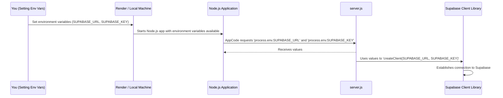

# Chapter 6: Environment Configuration

Welcome to the final chapter of our Student Fees Management System tutorial! In [Chapter 5: Web API Server (Node.js/Express)](05_web_api_server__node_js_express__.md), we learned how our `server.js` acts as the central hub, bringing together all the pieces – student data, payments, calculations, and Supabase interactions.

But there's one super important question we haven't fully answered: How does our server know the *exact* address and secret key for our [Storage as a Service (Supabase)](03_storage_as_a_service__supabase__.md) without putting that sensitive information directly into our public code? That's where **Environment Configuration** comes in!

### The Big Idea: Keeping Your Application's Secrets Safe and Sound

Imagine your application is a secret agent. This agent needs special tools and passwords (like the Supabase URL and API key) to do its job. If you write these passwords directly on the agent's uniform, anyone can see them! That's a huge security risk.

Instead, our application uses a "secret decoder ring" (which is the concept of **Environment Configuration**) that fetches these confidential details from a "hidden safe" (called **environment variables**) *only* when the application starts up. This ensures that:

1.  **Security**: Sensitive information (like database passwords, API keys) is never directly written into the code that might be shared publicly (e.g., on GitHub).
2.  **Flexibility**: You can easily change these settings for different situations. For example, you might have a "test" Supabase project when developing, and a "live" Supabase project when your application is used by real students. Environment variables let you switch between these without changing any code.

#### Central Use Case: Securely Connecting to Supabase

Our most important use case for environment configuration is connecting to Supabase. Our `server.js` needs two pieces of information:

*   The `SUPABASE_URL`: The internet address of our Supabase project.
*   The `SUPABASE_KEY`: The secret password to access our Supabase project.

How does our code get these without hardcoding them? Through environment variables!

### What are "Environment Variables"?

Think of **environment variables** as tiny, hidden sticky notes attached to your computer or server. Each sticky note has a name (like `SUPABASE_URL`) and a value (like `https://your-project.supabase.co`).

*   They are "hidden" because they are not part of your application's code files.
*   They are "variables" because their values can change depending on where your application is running (your local machine, a testing server, or a live production server).

When your Node.js application starts, it automatically gets access to these sticky notes.

### How Our Code Reads Environment Variables

In Node.js, we can access environment variables through a special object called `process.env`. It's like our application asking, "Hey Node.js runtime, what sticky notes do you have for me?"

Let's look at the relevant lines in our `server.js` file:

```javascript
// Load environment variables
const SUPABASE_URL = process.env.SUPABASE_URL || '';
const SUPABASE_KEY = process.env.SUPABASE_KEY || '';

if (!SUPABASE_URL || !SUPABASE_KEY) {
  throw new Error('Supabase URL and Key must be provided');
}
```

**Explanation of the code snippet:**

*   `const SUPABASE_URL = process.env.SUPABASE_URL || '';`:
    *   `process.env.SUPABASE_URL` is the magic part! It tells Node.js to look for an environment variable named `SUPABASE_URL`.
    *   The `|| ''` (which means "OR an empty string") is a fallback. If, for some reason, `SUPABASE_URL` isn't found, it will default to an empty string. This prevents errors if the variable is accidentally missing.
*   `const SUPABASE_KEY = process.env.SUPABASE_KEY || '';`: Does the same thing for our `SUPABASE_KEY`.
*   `if (!SUPABASE_URL || !SUPABASE_KEY) { ... }`: This is an important **safety check**. If either the URL or key is still empty after trying to load it (meaning they were never set in the environment), our application will stop and show an error. This prevents our app from trying to connect to Supabase without the necessary credentials, which would definitely fail.

### Using the Loaded Variables to Connect to Supabase

Once we've safely loaded the `SUPABASE_URL` and `SUPABASE_KEY` into our JavaScript variables, we can use them to establish the connection to Supabase, just as we discussed in [Chapter 3: Storage as a Service (Supabase)](03_storage_as_a_service__supabase__.md).

```javascript
// This line uses the securely loaded variables to connect to Supabase
const supabase = createClient(SUPABASE_URL, SUPABASE_KEY);
```

*   `createClient(SUPABASE_URL, SUPABASE_KEY)`: This function from the Supabase library now gets the correct URL and key from our safely loaded environment variables. It doesn't know (or care) *how* we got them, only that it has them.

### How Environment Variables Work (Under the Hood)

Let's visualize how your application gets its secrets:



**Explanation:**

1.  **Setting Environment Variables**: You, the developer, manually set these variables.
    *   **Locally**: You might create a special file (often named `.env`) in your project's root folder and put `SUPABASE_URL=...` and `SUPABASE_KEY=...` inside it. When you run your app locally (e.g., `npm start`), tools can load these from the `.env` file into `process.env`.
    *   **On a Hosting Platform (like Render)**: When you deploy your application, platforms like Render provide a secure dashboard where you can input these key-value pairs. They then make these variables available to your running Node.js application.
2.  **Node.js Application Starts**: When Node.js starts your `server.js` file, it checks the environment for any variables that have been set.
3.  **Accessing `process.env`**: Our `server.js` code then uses `process.env.VARIABLE_NAME` to read those values.
4.  **Connecting to Supabase**: The `createClient` function then uses these retrieved values to securely connect to our Supabase database.

Crucially, the actual *values* of `SUPABASE_URL` and `SUPABASE_KEY` are never written directly into `server.js` or committed to your GitHub repository. Only the *names* of the variables are in the code, keeping your secrets safe!

### Conclusion

In this chapter, we learned about the vital concept of **Environment Configuration**. We discovered how our application uses **environment variables** to securely load sensitive settings like our Supabase URL and API key, keeping them separate from our codebase. This approach ensures both the security of our confidential details and the flexibility to deploy our application in various environments without code changes.

This brings us to the end of our tutorial on the Student Fees Management System! We've covered everything from defining student data and processing payments to storing data in the cloud with Supabase, calculating fee statuses, building a Web API server with Node.js/Express, and finally, securely configuring our application. You now have a solid foundation for understanding how modern cloud-native applications are built and managed!

---

Generated by [AI Codebase Knowledge Builder]