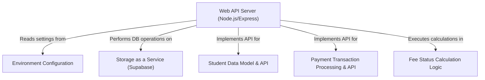

# Tutorial: student-fees-management

This project is a web-based **Student Fees Management System** that allows administrators to *easily add new students and record their payments*. Students can also use it to *conveniently check their current fee status*, including total fees, amount paid, and outstanding balance. It uses **Node.js with Express** for the server logic and relies on **Supabase** as a cloud-based *Storage as a Service* for all student and payment data.

**Source Repository:** [http://github.com/Prathamesh282/student-fees-management](http://github.com/Prathamesh282/student-fees-management)

## Chapters

1. [Student Data Model & API
](01_student_data_model___api_.md)
2. [Payment Transaction Processing & API
](02_payment_transaction_processing___api_.md)
3. [Storage as a Service (Supabase)
](03_storage_as_a_service__supabase__.md)
4. [Fee Status Calculation Logic
](04_fee_status_calculation_logic_.md)
5. [Web API Server (Node.js/Express)
](05_web_api_server__node_js_express__.md)
6. [Environment Configuration
](06_environment_configuration_.md)

---

Generated by [AI Codebase Knowledge Builder]